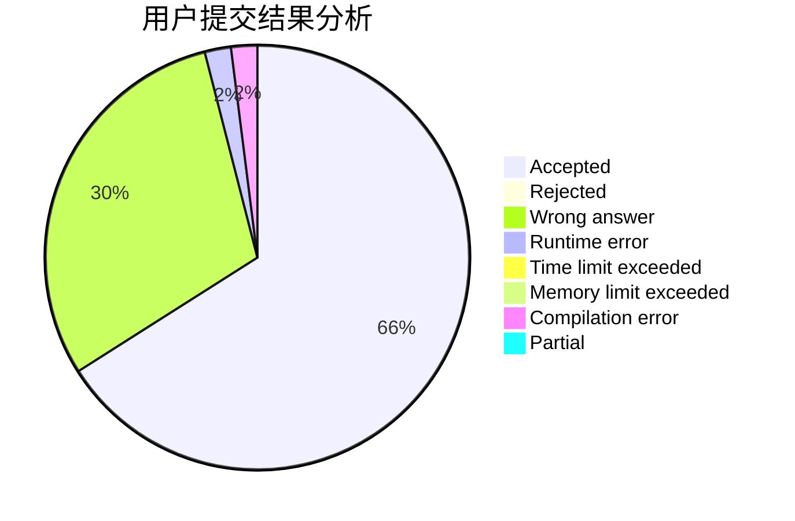
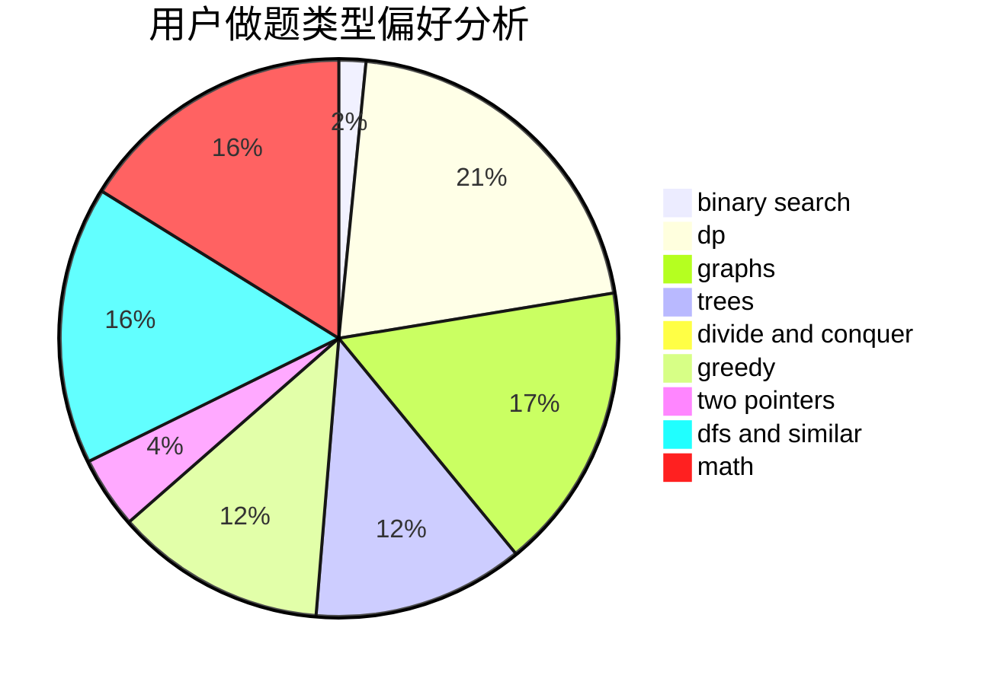

# litangxingxing

<!-- tabs:start -->

#### **用户提交结果分析**

#### **用户做题类型偏好分析**

<!-- tabs:end -->
# 推荐题目
[1392B](https://codeforces.com/contest/1392/problem/B)
[870A](https://codeforces.com/contest/870/problem/A)
[1214E](https://codeforces.com/contest/1214/problem/E)
[1009E](https://codeforces.com/contest/1009/problem/E)
[45G](https://codeforces.com/contest/45/problem/G)
[725B](https://codeforces.com/contest/725/problem/B)
[1424M](https://codeforces.com/contest/1424/problem/M)
[807C](https://codeforces.com/contest/807/problem/C)
[284E](https://codeforces.com/contest/284/problem/E)
[317A](https://codeforces.com/contest/317/problem/A)
