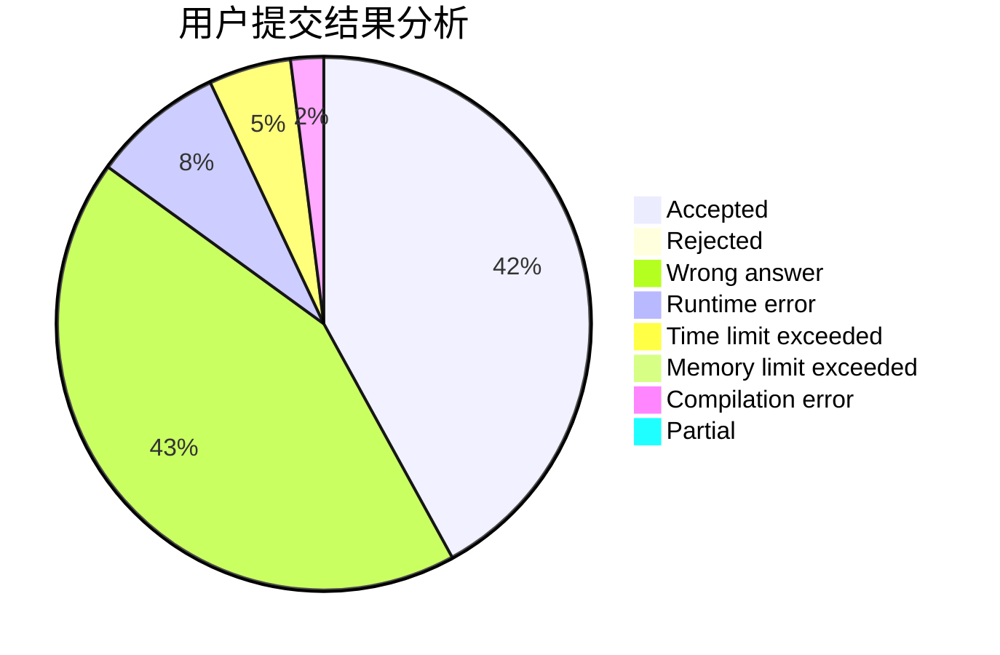
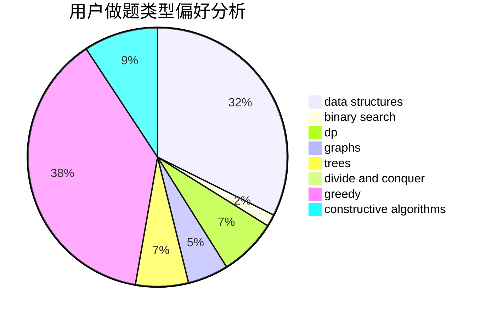
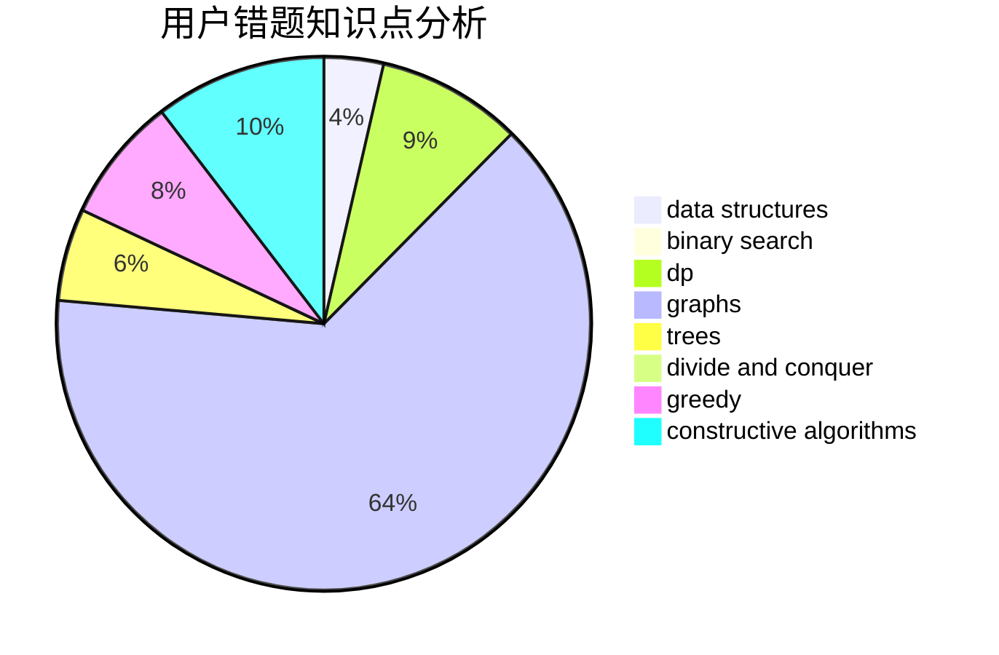

# little_ge

<!-- tabs:start -->

#### **用户提交结果分析**

#### **用户做题类型偏好分析**

#### **用户错题知识点分析**

<!-- tabs:end -->
# 推荐题目
[1428C](https://codeforces.com/contest/1428/problem/C)		brute force,
                        data structures,
                        greedy,
                        strings		  
[745A](https://codeforces.com/contest/745/problem/A)		implementation,
                        strings		  
[814D](https://codeforces.com/contest/814/problem/D)		dfs and similar,
                        dp,
                        geometry,
                        greedy,
                        trees		  
[291E](https://codeforces.com/contest/291/problem/E)		*special problem,
                        dfs and similar,
                        hashing,
                        strings		  
[1210E](https://codeforces.com/contest/1210/problem/E)		math		  
[44G](https://codeforces.com/contest/44/problem/G)		data structures,
                        implementation		  
[49A](https://codeforces.com/contest/49/problem/A)		implementation		  
[15D](https://codeforces.com/contest/15/problem/D)		data structures,
                        implementation,
                        sortings		  
[11732](https://codeforces.com/contest/1173/problem/2)		dsu,graphs,sortings,trees		  
[609A](https://codeforces.com/contest/609/problem/A)		greedy,
                        implementation,
                        sortings		  
