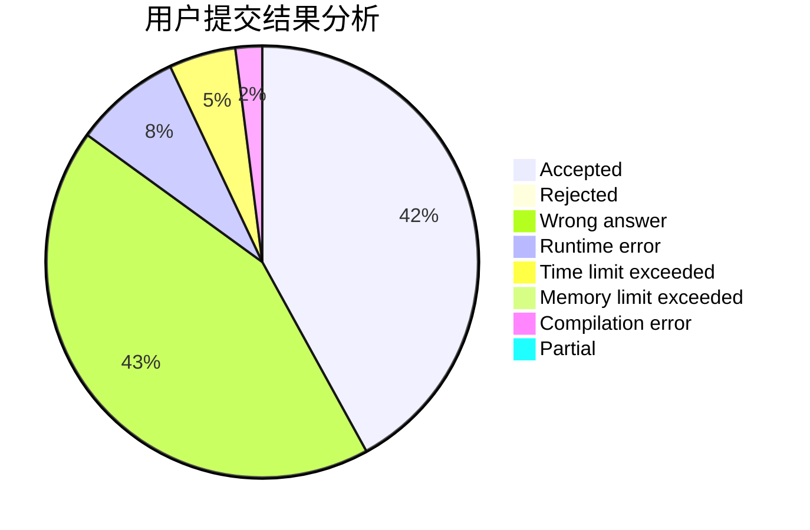
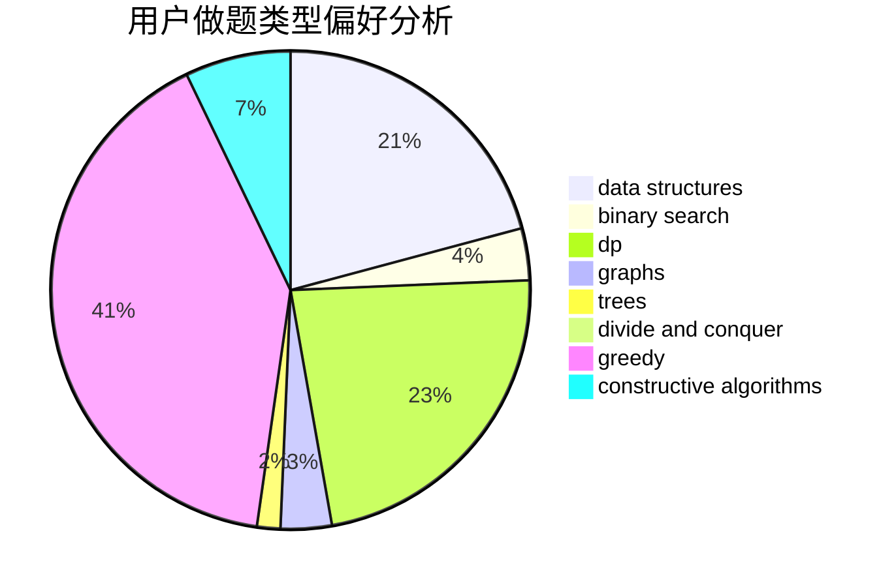

# little_ge

<!-- tabs:start -->

#### **用户提交结果分析**

#### **用户做题类型偏好分析**

#### **用户错题知识点分析**

<!-- tabs:end -->
# 推荐题目
[1420E](https://codeforces.com/contest/1420/problem/E)		dp,
                        greedy		  
[727E](https://codeforces.com/contest/727/problem/E)		data structures,
                        hashing,
                        string suffix structures,
                        strings		  
[7C](https://codeforces.com/contest/7/problem/C)		math,
                        number theory		  
[277A](https://codeforces.com/contest/277/problem/A)		dfs and similar,
                        dsu		  
[1206D](https://codeforces.com/contest/1206/problem/D)		dsu,graphs,sortings,trees		  
[429B](https://codeforces.com/contest/429/problem/B)		dp		  
[479B](https://codeforces.com/contest/479/problem/B)		brute force,
                        constructive algorithms,
                        greedy,
                        implementation,
                        sortings		  
[1509B](https://codeforces.com/contest/1509/problem/B)		greedy		  
[1168C](https://codeforces.com/contest/1168/problem/C)		bitmasks,
                        dp		  
[588C](https://codeforces.com/contest/588/problem/C)		dsu,graphs,sortings,trees		  
