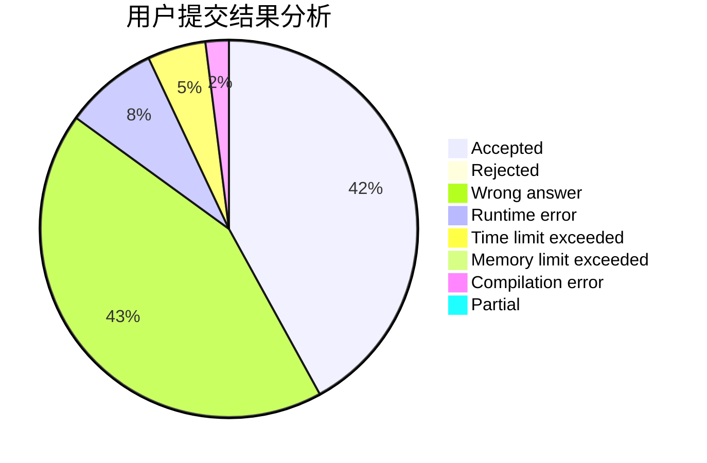
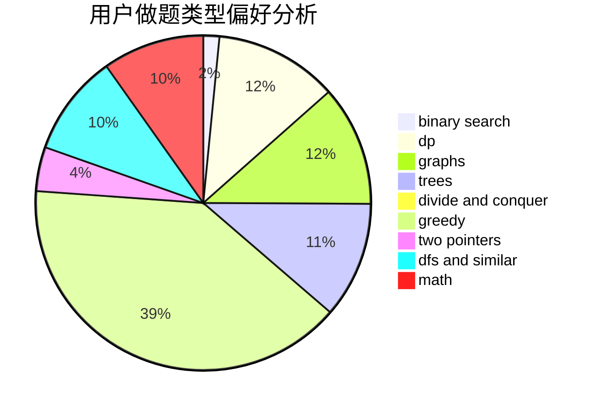

# little_ge

<!-- tabs:start -->

#### **用户提交结果分析**

#### **用户做题类型偏好分析**

<!-- tabs:end -->
# 推荐题目
[1428C](https://codeforces.com/contest/1428/problem/C)
[745A](https://codeforces.com/contest/745/problem/A)
[814D](https://codeforces.com/contest/814/problem/D)
[291E](https://codeforces.com/contest/291/problem/E)
[1210E](https://codeforces.com/contest/1210/problem/E)
[44G](https://codeforces.com/contest/44/problem/G)
[49A](https://codeforces.com/contest/49/problem/A)
[15D](https://codeforces.com/contest/15/problem/D)
[11732](https://codeforces.com/contest/1173/problem/2)
[609A](https://codeforces.com/contest/609/problem/A)
