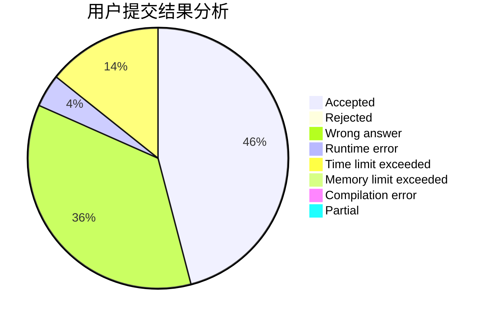
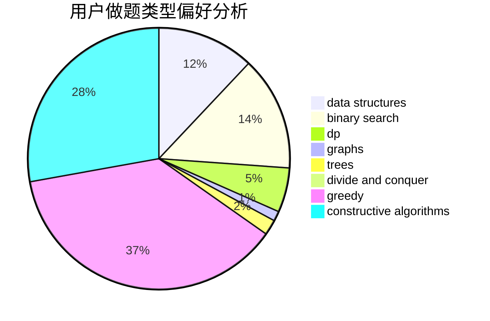
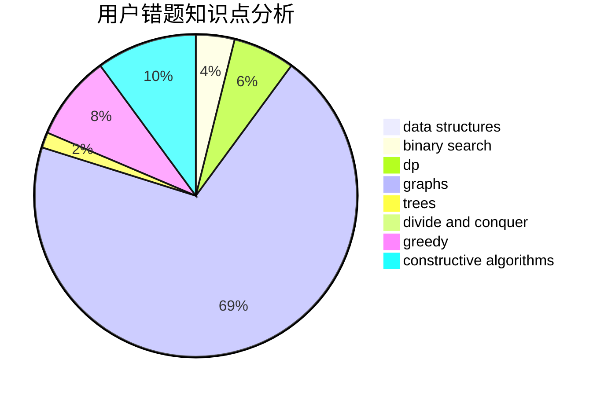

# 13048047792

<!-- tabs:start -->

#### **用户提交结果分析**

#### **用户做题类型偏好分析**

#### **用户错题知识点分析**

<!-- tabs:end -->
# 推荐题目
[1137D](https://codeforces.com/contest/1137/problem/D)		constructive algorithms,
                        interactive,
                        number theory		  
[1132G](https://codeforces.com/contest/1132/problem/G)		data structures,
                        dp,
                        trees		  
[1133A](https://codeforces.com/contest/1133/problem/A)		implementation		  
[1132A](https://codeforces.com/contest/1132/problem/A)		greedy,
                        implementation		  
[1013B](https://codeforces.com/contest/1013/problem/B)		greedy		  
[1131A](https://codeforces.com/contest/1131/problem/A)		math		  
[1132F](https://codeforces.com/contest/1132/problem/F)		dp		  
[1132D](https://codeforces.com/contest/1132/problem/D)		binary search,
                        greedy		  
[1139A](https://codeforces.com/contest/1139/problem/A)		implementation,
                        strings		  
[1131D](https://codeforces.com/contest/1131/problem/D)		dfs and similar,
                        dp,
                        dsu,
                        graphs,
                        greedy		  
