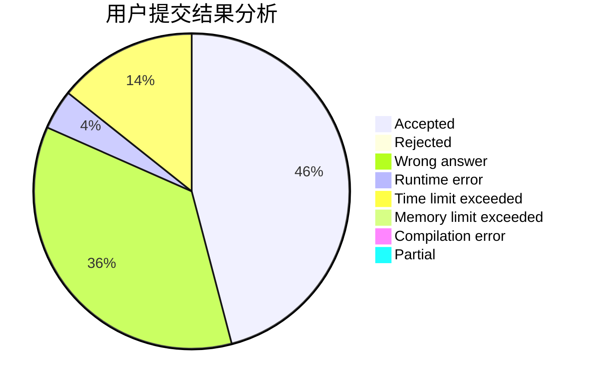
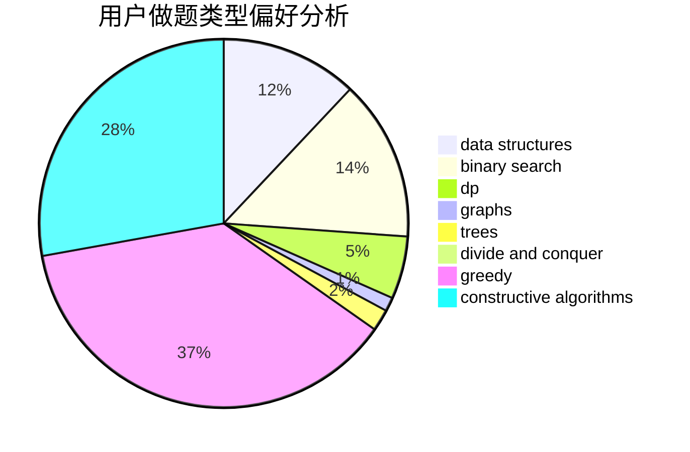
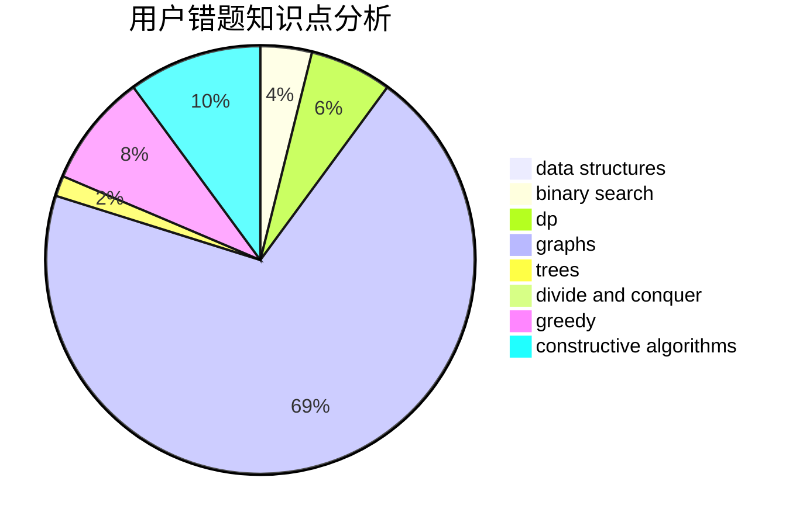

# 13048047792
<!-- tabs:start -->
#### **用户提交结果分析**

#### **用户做题类型偏好分析**

#### **用户错题知识点分析**

<!-- tabs:end -->
# 推荐题目
[And](http://codeforces.com/problemset/problem/1013/B)		greedy		  
[Asya And Kittens](http://codeforces.com/problemset/problem/1131/F)		constructive algorithms,
                        dsu		  
[Greedy Subsequences](http://codeforces.com/problemset/problem/1132/G)		data structures,
                        dp,
                        trees		  
[Cooperative Game](https://codeforces.com/contest/1138/problem/F)		constructive algorithms,
                        interactive,
                        number theory		  
[Nastya Hasn't Written a Legend](http://codeforces.com/problemset/problem/1136/E)		binary search,
                        data structures		  
[Middle of the Contest](http://codeforces.com/problemset/problem/1133/A)		implementation		  
[Gourmet choice](http://codeforces.com/problemset/problem/1131/D)		dfs and similar,
                        dp,
                        dsu,
                        graphs,
                        greedy		  
[Nastya Is Buying Lunch](http://codeforces.com/problemset/problem/1136/D)		greedy		  
[Knapsack](http://codeforces.com/problemset/problem/1132/E)		dfs and similar,
                        dp,
                        greedy		  
[Stressful Training](http://codeforces.com/problemset/problem/1132/D)		binary search,
                        greedy		  
<!-- tabs:start -->
#### **data structures**
[And](http://codeforces.com/problemset/problem/1132/G)		data structures,
                        dp,
                        trees		  
[Asya And Kittens](http://codeforces.com/problemset/problem/1136/E)		binary search,
                        data structures		  
[Greedy Subsequences](http://codeforces.com/problemset/problem/1137/F)		data structures,
                        trees		  
[Cooperative Game](http://codeforces.com/problemset/problem/1131/G)		data structures,
                        dp,
                        two pointers		  
[Nastya Hasn't Written a Legend](http://codeforces.com/problemset/problem/1137/E)		data structures,
                        greedy		  
[Middle of the Contest](http://codeforces.com/problemset/problem/1492/C)		binary search,
                        data structures,
                        dp,
                        greedy,
                        two pointers		  
[Gourmet choice](http://codeforces.com/problemset/problem/1490/G)		binary search,
                        data structures,
                        math		  
[Nastya Is Buying Lunch](http://codeforces.com/problemset/problem/1479/D)		binary search,
                        bitmasks,
                        brute force,
                        data structures,
                        probabilities,
                        trees		  
[Knapsack](http://codeforces.com/problemset/problem/1497/A)		brute force,
                        data structures,
                        greedy,
                        sortings		  
[Stressful Training](http://codeforces.com/problemset/problem/1491/C)		brute force,
                        data structures,
                        dp,
                        greedy,
                        implementation		  
#### **binary search**
[And](http://codeforces.com/problemset/problem/1136/E)		binary search,
                        data structures		  
[Asya And Kittens](http://codeforces.com/problemset/problem/1132/D)		binary search,
                        greedy		  
[Greedy Subsequences](http://codeforces.com/problemset/problem/1138/A)		binary search,
                        greedy,
                        implementation		  
[Cooperative Game](http://codeforces.com/problemset/problem/1131/C)		binary search,
                        greedy,
                        sortings		  
[Nastya Hasn't Written a Legend](http://codeforces.com/problemset/problem/1492/C)		binary search,
                        data structures,
                        dp,
                        greedy,
                        two pointers		  
[Middle of the Contest](http://codeforces.com/problemset/problem/1463/D)		binary search,
                        constructive algorithms,
                        greedy,
                        two pointers		  
[Gourmet choice](http://codeforces.com/problemset/problem/1490/G)		binary search,
                        data structures,
                        math		  
[Nastya Is Buying Lunch](http://codeforces.com/problemset/problem/1479/D)		binary search,
                        bitmasks,
                        brute force,
                        data structures,
                        probabilities,
                        trees		  
[Knapsack](http://codeforces.com/problemset/problem/1436/E)		binary search,
                        data structures,
                        two pointers		  
[Stressful Training](http://codeforces.com/problemset/problem/1461/D)		binary search,
                        brute force,
                        data structures,
                        divide and conquer,
                        implementation,
                        sortings		  
#### **dp**
[And](http://codeforces.com/problemset/problem/1132/G)		data structures,
                        dp,
                        trees		  
[Asya And Kittens](http://codeforces.com/problemset/problem/1131/D)		dfs and similar,
                        dp,
                        dsu,
                        graphs,
                        greedy		  
[Greedy Subsequences](http://codeforces.com/problemset/problem/1132/E)		dfs and similar,
                        dp,
                        greedy		  
[Cooperative Game](https://codeforces.com/contest/1138/problem/E)		dp,
                        graphs,
                        implementation		  
[Nastya Hasn't Written a Legend](http://codeforces.com/problemset/problem/1131/E)		dp,
                        greedy,
                        strings		  
[Middle of the Contest](http://codeforces.com/problemset/problem/1133/E)		dp,
                        sortings,
                        two pointers		  
[Gourmet choice](http://codeforces.com/problemset/problem/1131/G)		data structures,
                        dp,
                        two pointers		  
[Nastya Is Buying Lunch](http://codeforces.com/problemset/problem/1137/C)		dp,
                        graphs,
                        implementation		  
[Knapsack](http://codeforces.com/problemset/problem/1103/D)		bitmasks,
                        dp		  
[Stressful Training](http://codeforces.com/problemset/problem/1132/F)		dp		  
#### **graph**
[And](http://codeforces.com/problemset/problem/1131/D)		dfs and similar,
                        dp,
                        dsu,
                        graphs,
                        greedy		  
[Asya And Kittens](https://codeforces.com/contest/1138/problem/E)		dp,
                        graphs,
                        implementation		  
[Greedy Subsequences](http://codeforces.com/problemset/problem/1133/F1)		graphs		  
[Cooperative Game](http://codeforces.com/problemset/problem/1137/C)		dp,
                        graphs,
                        implementation		  
[Nastya Hasn't Written a Legend](http://codeforces.com/problemset/problem/1133/F2)		constructive algorithms,
                        dfs and similar,
                        dsu,
                        graphs,
                        greedy		  
[Middle of the Contest](http://codeforces.com/problemset/problem/1487/C)		brute force,
                        constructive algorithms,
                        dfs and similar,
                        graphs,
                        greedy,
                        implementation,
                        math		  
[Gourmet choice](http://codeforces.com/problemset/problem/1437/C)		dp,
                        flows,
                        graph matchings,
                        greedy,
                        math,
                        sortings		  
[Nastya Is Buying Lunch](http://codeforces.com/problemset/problem/1470/D)		constructive algorithms,
                        dfs and similar,
                        graph matchings,
                        graphs,
                        greedy		  
[Knapsack](http://codeforces.com/problemset/problem/1476/C)		dp,
                        graphs,
                        greedy		  
[Stressful Training](http://codeforces.com/problemset/problem/1304/D)		constructive algorithms,
                        graphs,
                        greedy,
                        two pointers		  
#### **trees**
[And](http://codeforces.com/problemset/problem/1132/G)		data structures,
                        dp,
                        trees		  
[Asya And Kittens](http://codeforces.com/problemset/problem/1137/F)		data structures,
                        trees		  
[Greedy Subsequences](http://codeforces.com/problemset/problem/1479/D)		binary search,
                        bitmasks,
                        brute force,
                        data structures,
                        probabilities,
                        trees		  
[Cooperative Game](http://codeforces.com/problemset/problem/1511/C)		brute force,
                        data structures,
                        implementation,
                        trees		  
[Nastya Hasn't Written a Legend](http://codeforces.com/problemset/problem/1499/F)		combinatorics,
                        dfs and similar,
                        dp,
                        trees		  
[Middle of the Contest](http://codeforces.com/problemset/problem/1491/E)		brute force,
                        dfs and similar,
                        divide and conquer,
                        number theory,
                        trees		  
[Gourmet choice](http://codeforces.com/problemset/problem/1466/D)		data structures,
                        greedy,
                        sortings,
                        trees		  
[Nastya Is Buying Lunch](http://codeforces.com/problemset/problem/1495/D)		combinatorics,
                        dfs and similar,
                        graphs,
                        math,
                        shortest paths,
                        trees		  
[Knapsack](http://codeforces.com/problemset/problem/1303/G)		data structures,
                        divide and conquer,
                        geometry,
                        trees		  
[Stressful Training](http://codeforces.com/problemset/problem/1454/E)		combinatorics,
                        dfs and similar,
                        graphs,
                        trees		  
#### **divide and conquer**
[And](http://codeforces.com/problemset/problem/1461/D)		binary search,
                        brute force,
                        data structures,
                        divide and conquer,
                        implementation,
                        sortings		  
[Asya And Kittens](http://codeforces.com/problemset/problem/1466/G)		combinatorics,
                        divide and conquer,
                        hashing,
                        math,
                        string suffix structures,
                        strings		  
[Greedy Subsequences](http://codeforces.com/problemset/problem/1490/D)		dfs and similar,
                        divide and conquer,
                        implementation		  
[Cooperative Game](https://codeforces.com/contest/1483/problem/C)		data structures,
                        divide and conquer,
                        dp		  
[Nastya Hasn't Written a Legend](http://codeforces.com/problemset/problem/1491/E)		brute force,
                        dfs and similar,
                        divide and conquer,
                        number theory,
                        trees		  
[Middle of the Contest](http://codeforces.com/problemset/problem/1303/G)		data structures,
                        divide and conquer,
                        geometry,
                        trees		  
[Gourmet choice](http://codeforces.com/problemset/problem/1494/D)		constructive algorithms,
                        data structures,
                        dfs and similar,
                        divide and conquer,
                        dsu,
                        greedy,
                        sortings,
                        trees		  
[Nastya Is Buying Lunch](http://codeforces.com/problemset/problem/1482/E)		data structures,
                        divide and conquer,
                        dp		  
[Knapsack](http://codeforces.com/problemset/problem/566/C)		dfs and similar,
                        divide and conquer,
                        trees		  
[Stressful Training](http://codeforces.com/problemset/problem/1428/F)		binary search,
                        data structures,
                        divide and conquer,
                        dp,
                        two pointers		  
#### **greedy**
[And](http://codeforces.com/problemset/problem/1013/B)		greedy		  
[Asya And Kittens](http://codeforces.com/problemset/problem/1131/D)		dfs and similar,
                        dp,
                        dsu,
                        graphs,
                        greedy		  
[Greedy Subsequences](http://codeforces.com/problemset/problem/1136/D)		greedy		  
[Cooperative Game](http://codeforces.com/problemset/problem/1132/E)		dfs and similar,
                        dp,
                        greedy		  
[Nastya Hasn't Written a Legend](http://codeforces.com/problemset/problem/1132/D)		binary search,
                        greedy		  
[Middle of the Contest](http://codeforces.com/problemset/problem/1131/E)		dp,
                        greedy,
                        strings		  
[Gourmet choice](http://codeforces.com/problemset/problem/1132/A)		greedy,
                        implementation		  
[Nastya Is Buying Lunch](http://codeforces.com/problemset/problem/1138/A)		binary search,
                        greedy,
                        implementation		  
[Knapsack](http://codeforces.com/problemset/problem/1139/B)		greedy,
                        implementation		  
[Stressful Training](http://codeforces.com/problemset/problem/1137/E)		data structures,
                        greedy		  
#### **constructive algorithms**
[And](http://codeforces.com/problemset/problem/1131/F)		constructive algorithms,
                        dsu		  
[Asya And Kittens](https://codeforces.com/contest/1138/problem/F)		constructive algorithms,
                        interactive,
                        number theory		  
[Greedy Subsequences](http://codeforces.com/problemset/problem/1136/C)		constructive algorithms,
                        sortings		  
[Cooperative Game](http://codeforces.com/problemset/problem/1137/D)		constructive algorithms,
                        interactive,
                        number theory		  
[Nastya Hasn't Written a Legend](http://codeforces.com/problemset/problem/1133/F2)		constructive algorithms,
                        dfs and similar,
                        dsu,
                        graphs,
                        greedy		  
[Middle of the Contest](http://codeforces.com/problemset/problem/1136/B)		constructive algorithms,
                        math		  
[Gourmet choice](http://codeforces.com/problemset/problem/1493/A)		constructive algorithms,
                        greedy		  
[Nastya Is Buying Lunch](http://codeforces.com/problemset/problem/1463/D)		binary search,
                        constructive algorithms,
                        greedy,
                        two pointers		  
[Knapsack](https://codeforces.com/contest/1456/problem/B)		bitmasks,
                        brute force,
                        constructive algorithms		  
[Stressful Training](http://codeforces.com/problemset/problem/1492/D)		bitmasks,
                        constructive algorithms,
                        greedy,
                        math		  
#### **sortings**
[And](http://codeforces.com/problemset/problem/1133/E)		dp,
                        sortings,
                        two pointers		  
[Asya And Kittens](http://codeforces.com/problemset/problem/1136/C)		constructive algorithms,
                        sortings		  
[Greedy Subsequences](https://codeforces.com/contest/1138/problem/C)		implementation,
                        sortings		  
[Cooperative Game](http://codeforces.com/problemset/problem/1133/C)		sortings,
                        two pointers		  
[Nastya Hasn't Written a Legend](http://codeforces.com/problemset/problem/1137/A)		implementation,
                        sortings		  
[Middle of the Contest](http://codeforces.com/problemset/problem/1132/B)		greedy,
                        sortings		  
[Gourmet choice](http://codeforces.com/problemset/problem/1131/C)		binary search,
                        greedy,
                        sortings		  
[Nastya Is Buying Lunch](https://codeforces.com/contest/1496/problem/C)		geometry,
                        greedy,
                        math,
                        sortings		  
[Knapsack](http://codeforces.com/problemset/problem/1495/A)		geometry,
                        greedy,
                        math,
                        sortings		  
[Stressful Training](http://codeforces.com/problemset/problem/1497/A)		brute force,
                        data structures,
                        greedy,
                        sortings		  
<!-- tabs:end -->
