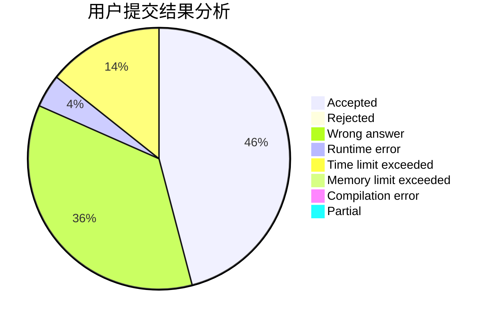
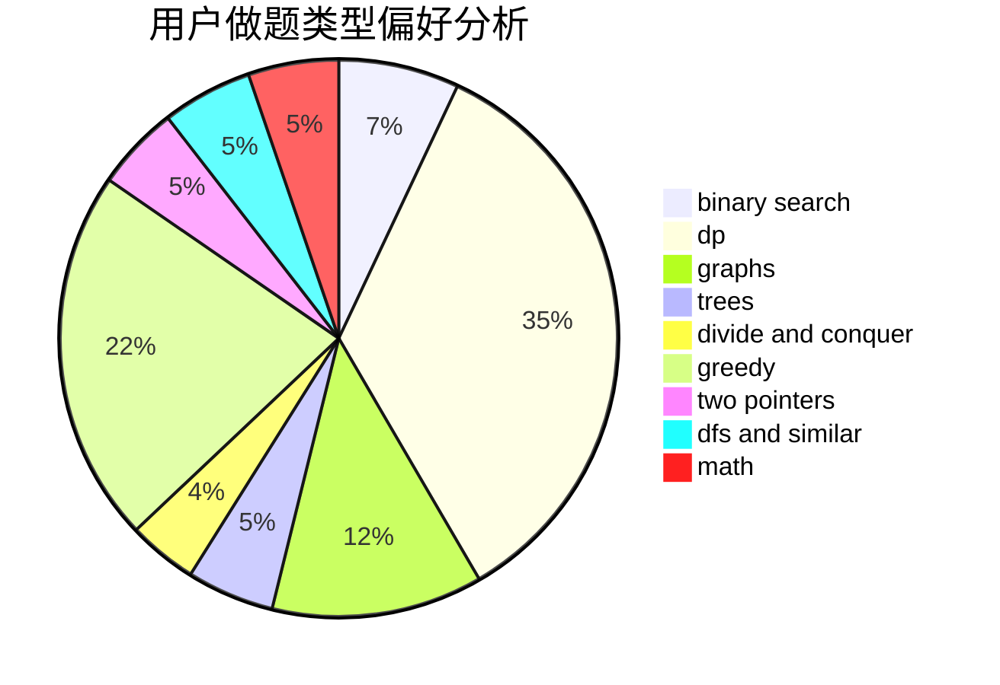

# 13048047792

<!-- tabs:start -->

#### **用户提交结果分析**

#### **用户做题类型偏好分析**

<!-- tabs:end -->
# 推荐题目
[1139E](https://codeforces.com/contest/1139/problem/E)
[1137A](https://codeforces.com/contest/1137/problem/A)
[1137B](https://codeforces.com/contest/1137/problem/B)
[1133E](https://codeforces.com/contest/1133/problem/E)
[1013E](https://codeforces.com/contest/1013/problem/E)
[1132G](https://codeforces.com/contest/1132/problem/G)
[1136E](https://codeforces.com/contest/1136/problem/E)
[1136C](https://codeforces.com/contest/1136/problem/C)
[1140E](https://codeforces.com/contest/1140/problem/E)
[1133A](https://codeforces.com/contest/1133/problem/A)
