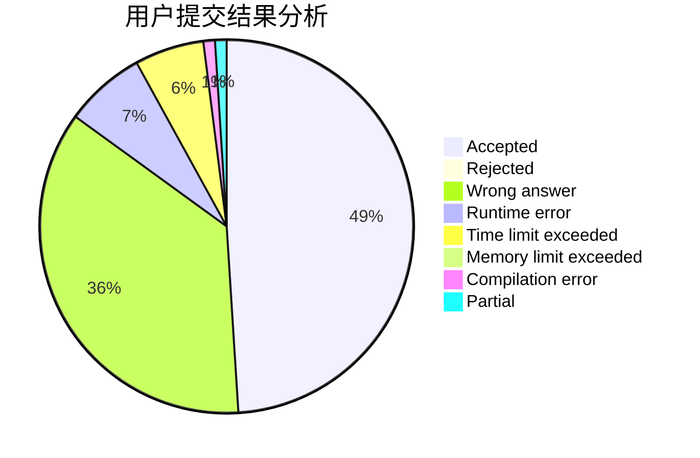
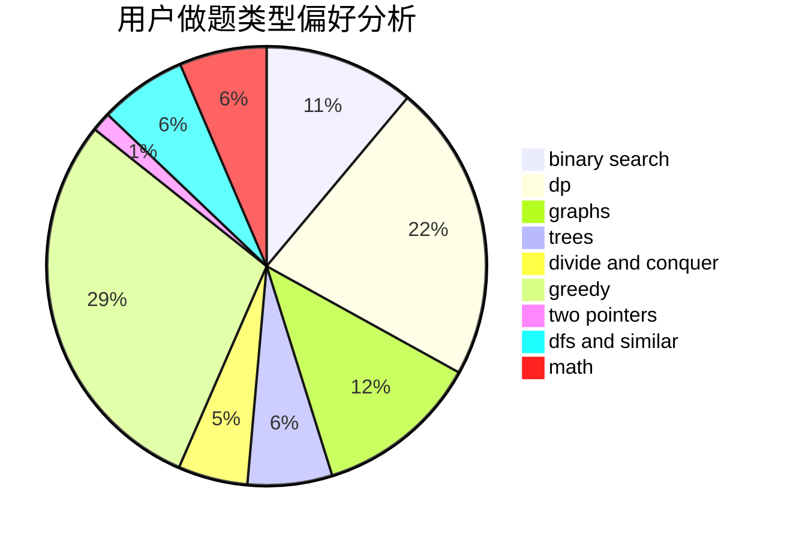

# BilyHurington

<!-- tabs:start -->

#### **用户提交结果分析**

#### **用户做题类型偏好分析**

<!-- tabs:end -->
# 推荐题目
[1490C](https://codeforces.com/contest/1490/problem/C)
[559A](https://codeforces.com/contest/559/problem/A)
[1365B](https://codeforces.com/contest/1365/problem/B)
[557B](https://codeforces.com/contest/557/problem/B)
[558A](https://codeforces.com/contest/558/problem/A)
[292A](https://codeforces.com/contest/292/problem/A)
[148E](https://codeforces.com/contest/148/problem/E)
[351C](https://codeforces.com/contest/351/problem/C)
[1335F](https://codeforces.com/contest/1335/problem/F)
[11571](https://codeforces.com/contest/1157/problem/1)
