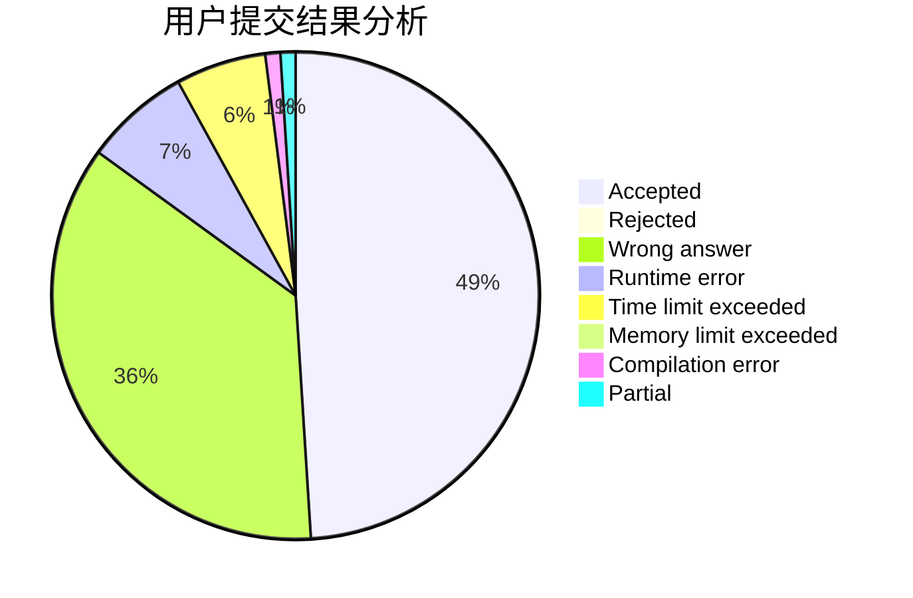
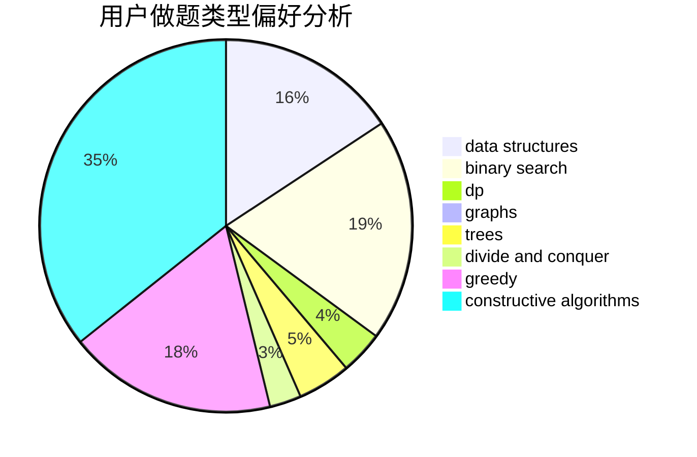

# BilyHurington

<!-- tabs:start -->

#### **用户提交结果分析**

#### **用户做题类型偏好分析**

#### **用户错题知识点分析**

<!-- tabs:end -->
# 推荐题目
[1482E](https://codeforces.com/contest/1482/problem/E)		data structures,
                        divide and conquer,
                        dp		  
[536D](https://codeforces.com/contest/536/problem/D)		dp,
                        games		  
[1357C2](https://codeforces.com/contest/1357C/problem/2)		nan		  
[534F](https://codeforces.com/contest/534/problem/F)		bitmasks,
                        dp,
                        hashing,
                        meet-in-the-middle		  
[535C](https://codeforces.com/contest/535/problem/C)		binary search,
                        greedy,
                        math		  
[277B](https://codeforces.com/contest/277/problem/B)		constructive algorithms,
                        geometry		  
[1482B](https://codeforces.com/contest/1482/problem/B)		implementation,
                        math		  
[320B](https://codeforces.com/contest/320/problem/B)		dfs and similar,
                        graphs		  
[1329E](https://codeforces.com/contest/1329/problem/E)		binary search,
                        greedy		  
[1155A](https://codeforces.com/contest/1155/problem/A)		implementation,
                        sortings,
                        strings		  
