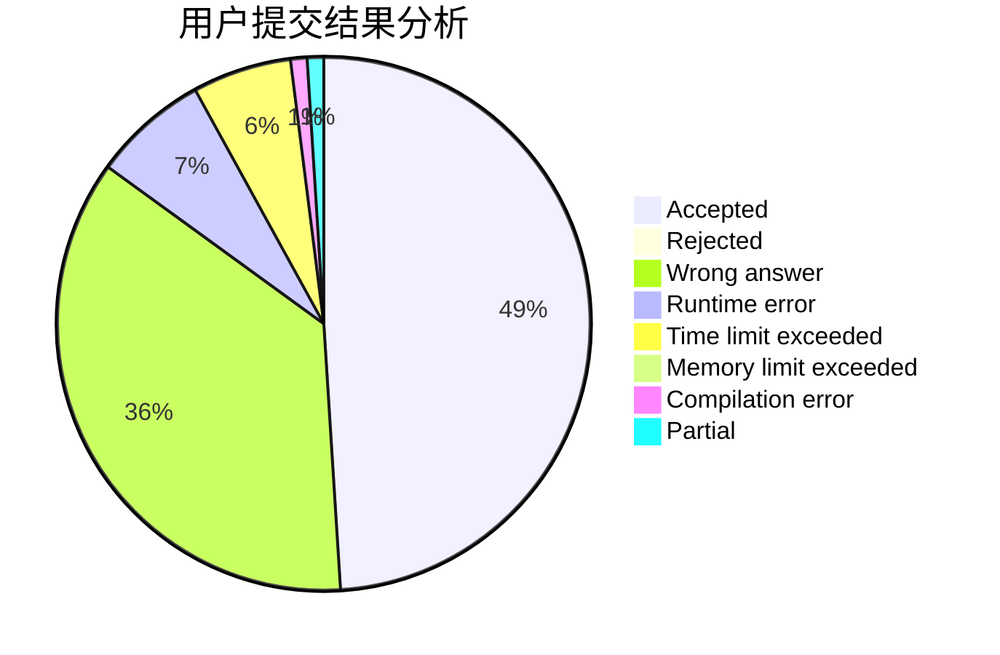
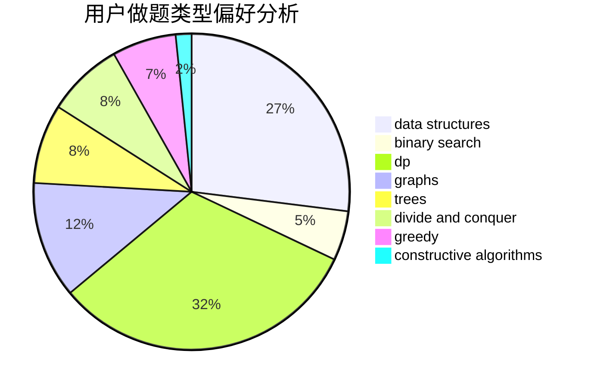
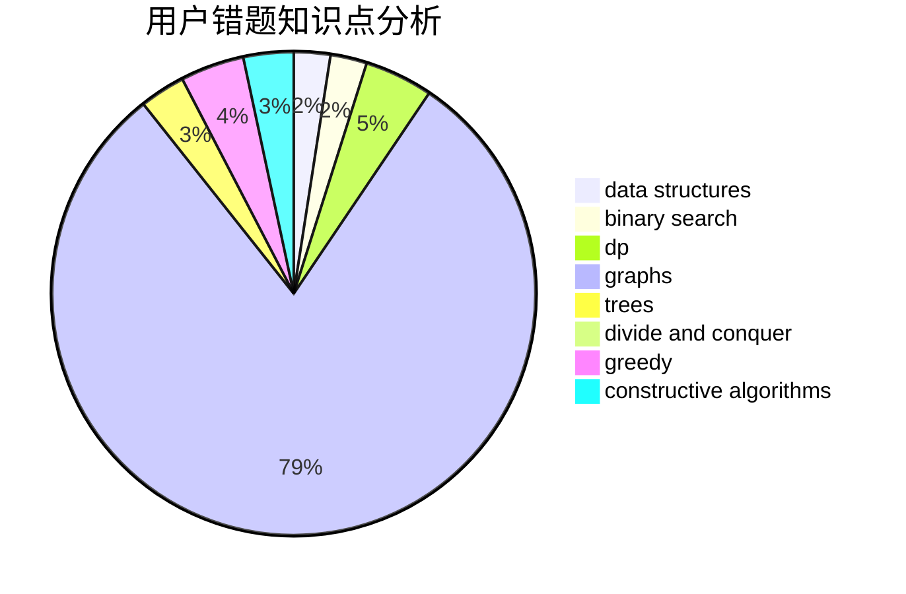

# BilyHurington

<!-- tabs:start -->

#### **用户提交结果分析**

#### **用户做题类型偏好分析**

#### **用户错题知识点分析**

<!-- tabs:end -->
# 推荐题目
[1490C](https://codeforces.com/contest/1490/problem/C)		binary search,
                        brute force,
                        brute force,
                        math		  
[559A](https://codeforces.com/contest/559/problem/A)		brute force,
                        geometry,
                        math		  
[1365B](https://codeforces.com/contest/1365/problem/B)		constructive algorithms,
                        implementation		  
[557B](https://codeforces.com/contest/557/problem/B)		constructive algorithms,
                        implementation,
                        math,
                        sortings		  
[558A](https://codeforces.com/contest/558/problem/A)		brute force,
                        implementation,
                        sortings		  
[292A](https://codeforces.com/contest/292/problem/A)		implementation		  
[148E](https://codeforces.com/contest/148/problem/E)		dp		  
[351C](https://codeforces.com/contest/351/problem/C)		dp,
                        matrices		  
[1335F](https://codeforces.com/contest/1335/problem/F)		data structures,
                        dfs and similar,
                        dsu,
                        graphs,
                        greedy,
                        matrices		  
[11571](https://codeforces.com/contest/1157/problem/1)		dsu,graphs,sortings,trees		  
