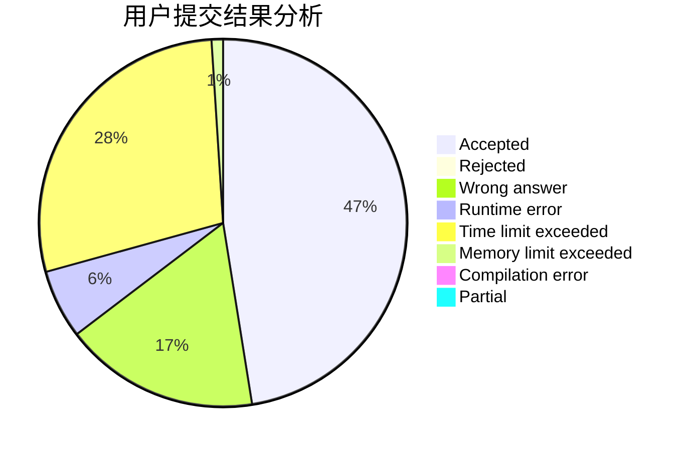
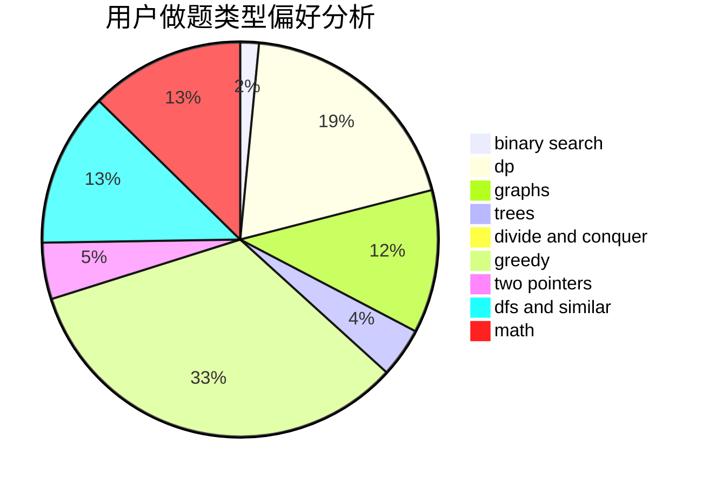

# littlelittlehorse

<!-- tabs:start -->

#### **用户提交结果分析**

#### **用户做题类型偏好分析**

<!-- tabs:end -->
# 推荐题目
[919D](https://codeforces.com/contest/919/problem/D)
[601B](https://codeforces.com/contest/601/problem/B)
[acmsguru4](https://codeforces.com/contest/acmsguru/problem/4)
[377E](https://codeforces.com/contest/377/problem/E)
[1153B](https://codeforces.com/contest/1153/problem/B)
[513C](https://codeforces.com/contest/513/problem/C)
[33D](https://codeforces.com/contest/33/problem/D)
[264E](https://codeforces.com/contest/264/problem/E)
[518B](https://codeforces.com/contest/518/problem/B)
[317B](https://codeforces.com/contest/317/problem/B)
