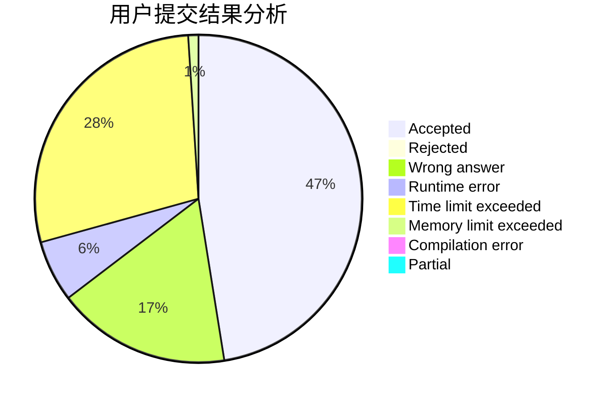
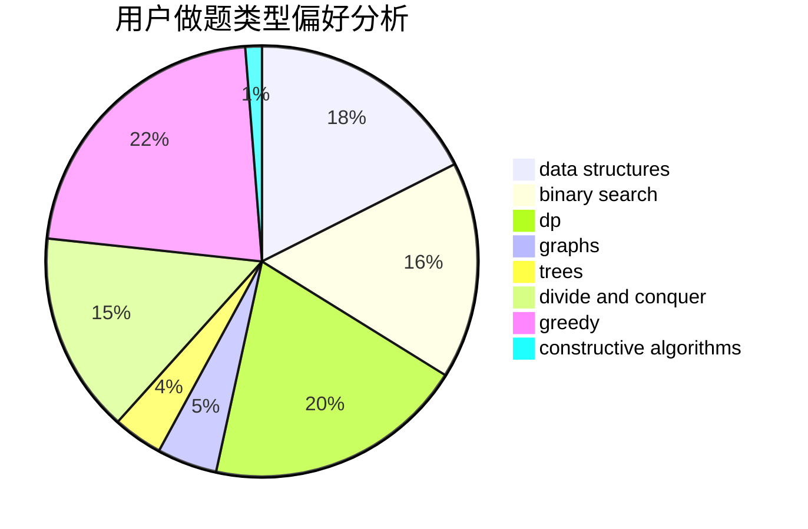
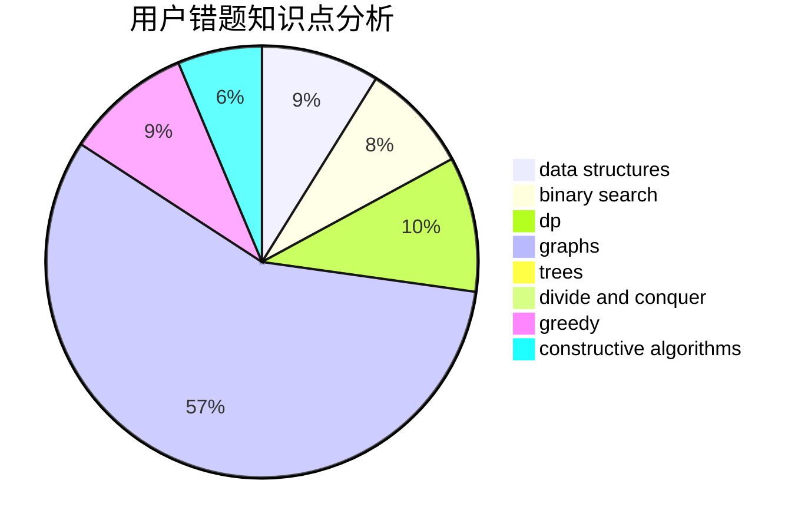

# littlelittlehorse

<!-- tabs:start -->

#### **用户提交结果分析**

#### **用户做题类型偏好分析**

#### **用户错题知识点分析**

<!-- tabs:end -->
# 推荐题目
[903D](https://codeforces.com/contest/903/problem/D)		data structures,
                        math		  
[581A](https://codeforces.com/contest/581/problem/A)		implementation,
                        math		  
[986B](https://codeforces.com/contest/986/problem/B)		combinatorics,
                        math		  
[351C](https://codeforces.com/contest/351/problem/C)		dp,
                        matrices		  
[1151B](https://codeforces.com/contest/1151/problem/B)		bitmasks,
                        brute force,
                        constructive algorithms,
                        dp		  
[493E](https://codeforces.com/contest/493/problem/E)		math		  
[316B2](https://codeforces.com/contest/316B/problem/2)		dfs and similar,
                        dp		  
[243D](https://codeforces.com/contest/243/problem/D)		data structures,
                        dp,
                        geometry,
                        two pointers		  
[497E](https://codeforces.com/contest/497/problem/E)		dp,
                        matrices		  
[29C](https://codeforces.com/contest/29/problem/C)		data structures,
                        dfs and similar,
                        graphs,
                        implementation		  
