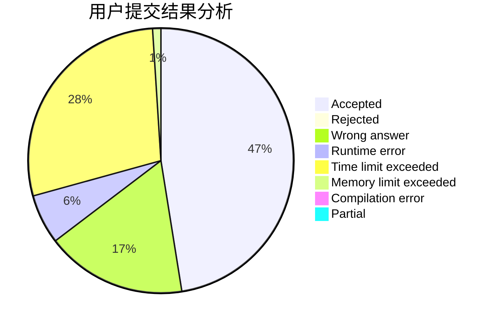
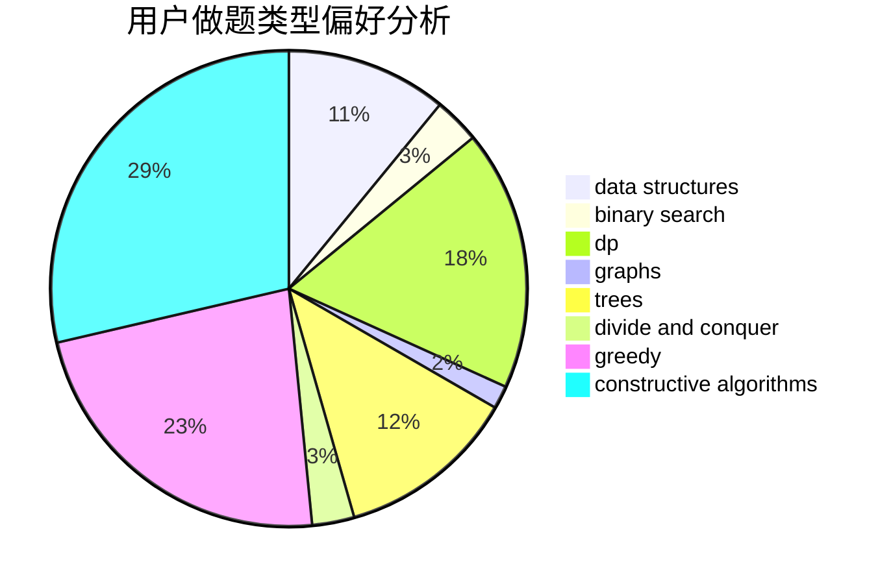
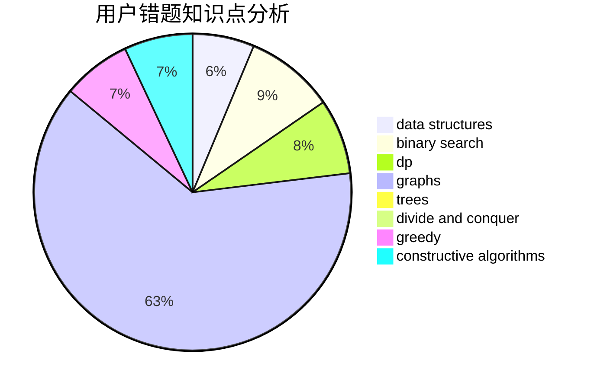

# littlelittlehorse

<!-- tabs:start -->

#### **用户提交结果分析**

#### **用户做题类型偏好分析**

#### **用户错题知识点分析**

<!-- tabs:end -->
# 推荐题目
[919D](https://codeforces.com/contest/919/problem/D)		dfs and similar,
                        dp,
                        graphs		  
[601B](https://codeforces.com/contest/601/problem/B)		data structures,
                        math		  
[acmsguru4](https://codeforces.com/contest/acmsguru/problem/4)		dsu,graphs,sortings,trees		  
[377E](https://codeforces.com/contest/377/problem/E)		dp,
                        geometry		  
[1153B](https://codeforces.com/contest/1153/problem/B)		constructive algorithms,
                        greedy		  
[513C](https://codeforces.com/contest/513/problem/C)		bitmasks,
                        probabilities		  
[33D](https://codeforces.com/contest/33/problem/D)		geometry,
                        graphs,
                        shortest paths,
                        sortings		  
[264E](https://codeforces.com/contest/264/problem/E)		data structures,
                        dp		  
[518B](https://codeforces.com/contest/518/problem/B)		greedy,
                        implementation,
                        strings		  
[317B](https://codeforces.com/contest/317/problem/B)		brute force,
                        implementation		  
