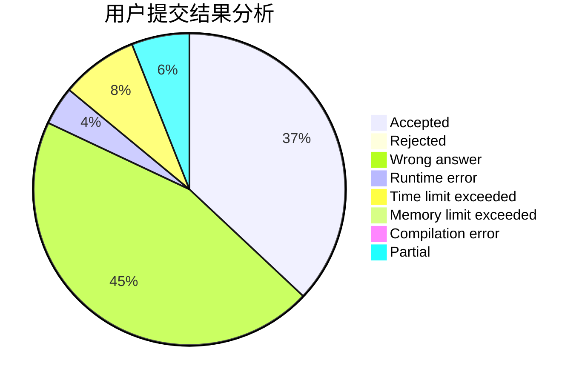
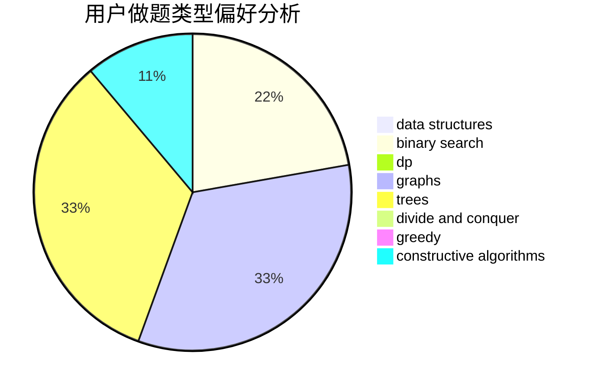
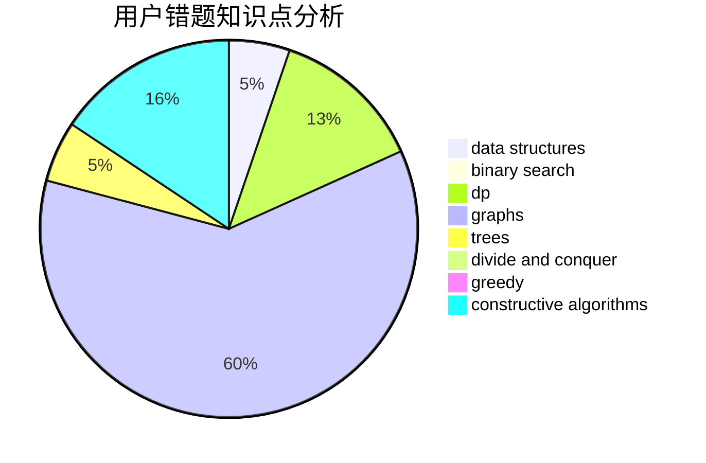

# liuhanwen

<!-- tabs:start -->

#### **用户提交结果分析**

#### **用户做题类型偏好分析**

#### **用户错题知识点分析**

<!-- tabs:end -->
# 推荐题目
[628C](https://codeforces.com/contest/628/problem/C)		greedy,
                        strings		  
[990D](https://codeforces.com/contest/990/problem/D)		constructive algorithms,
                        graphs,
                        implementation		  
[1067D](https://codeforces.com/contest/1067/problem/D)		dp,
                        greedy,
                        math,
                        probabilities		  
[1120F](https://codeforces.com/contest/1120/problem/F)		data structures,
                        dp,
                        greedy		  
[85E](https://codeforces.com/contest/85/problem/E)		binary search,
                        dsu,
                        geometry,
                        graphs,
                        sortings		  
[825B](https://codeforces.com/contest/825/problem/B)		brute force,
                        implementation		  
[1239C](https://codeforces.com/contest/1239/problem/C)		data structures,
                        greedy,
                        implementation		  
[11721](https://codeforces.com/contest/1172/problem/1)		dsu,graphs,sortings,trees		  
[1354G](https://codeforces.com/contest/1354/problem/G)		binary search,
                        interactive,
                        probabilities		  
[189A](https://codeforces.com/contest/189/problem/A)		brute force,
                        dp		  
