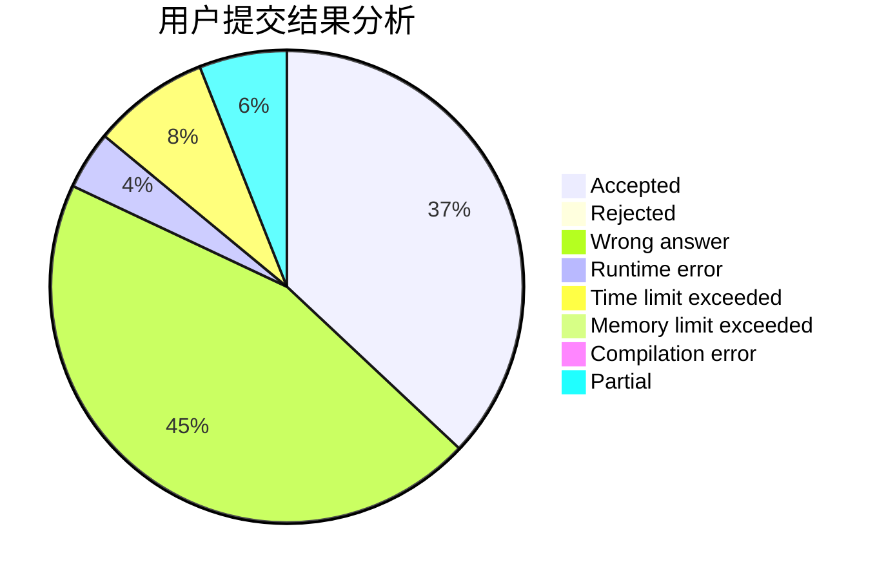
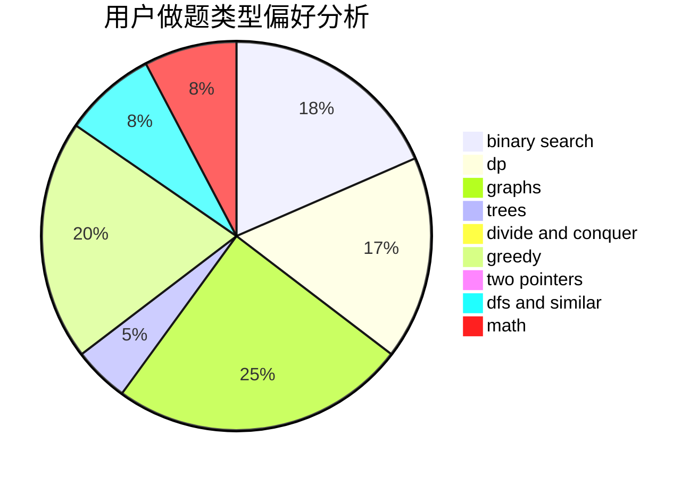

# liuhanwen

<!-- tabs:start -->

#### **用户提交结果分析**

#### **用户做题类型偏好分析**

<!-- tabs:end -->
# 推荐题目
[628C](https://codeforces.com/contest/628/problem/C)
[990D](https://codeforces.com/contest/990/problem/D)
[1067D](https://codeforces.com/contest/1067/problem/D)
[1120F](https://codeforces.com/contest/1120/problem/F)
[85E](https://codeforces.com/contest/85/problem/E)
[825B](https://codeforces.com/contest/825/problem/B)
[1239C](https://codeforces.com/contest/1239/problem/C)
[11721](https://codeforces.com/contest/1172/problem/1)
[1354G](https://codeforces.com/contest/1354/problem/G)
[189A](https://codeforces.com/contest/189/problem/A)
