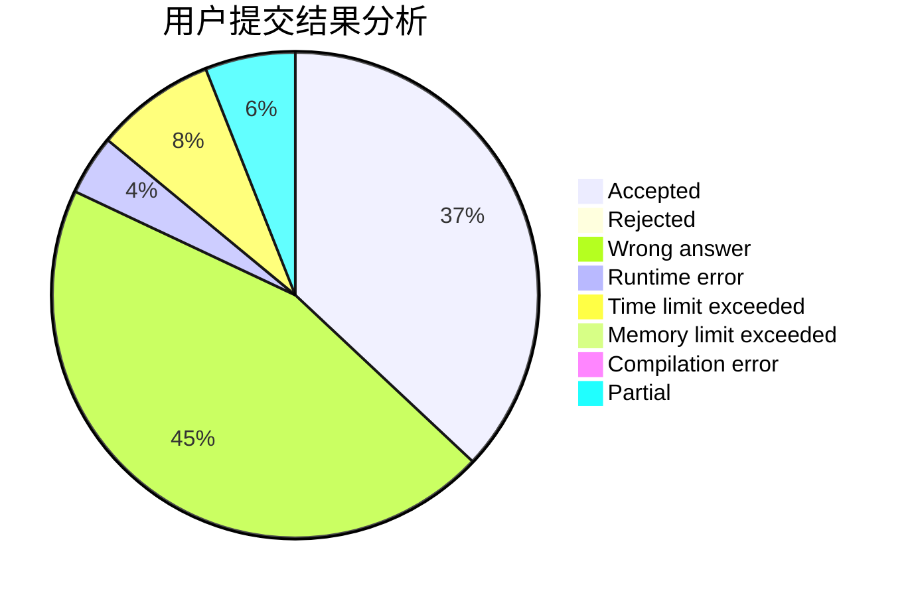
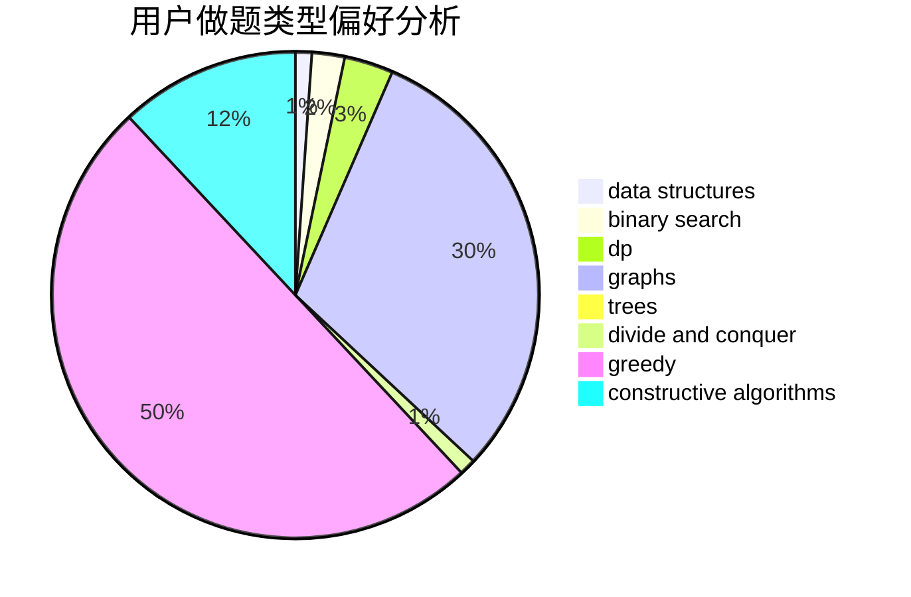
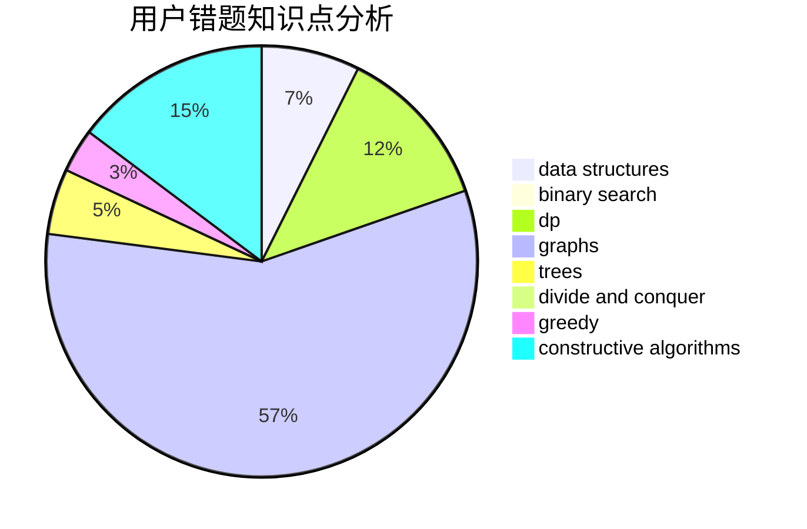

# liuhanwen

<!-- tabs:start -->

#### **用户提交结果分析**

#### **用户做题类型偏好分析**

#### **用户错题知识点分析**

<!-- tabs:end -->
# 推荐题目
[609C](https://codeforces.com/contest/609/problem/C)		implementation,
                        math		  
[976E](https://codeforces.com/contest/976/problem/E)		greedy,
                        sortings		  
[1067A](https://codeforces.com/contest/1067/problem/A)		dp		  
[1118F2](https://codeforces.com/contest/1118F/problem/2)		combinatorics,
                        dfs and similar,
                        dp,
                        trees		  
[840E](https://codeforces.com/contest/840/problem/E)		trees		  
[808C](https://codeforces.com/contest/808/problem/C)		constructive algorithms,
                        greedy,
                        sortings		  
[1230F](https://codeforces.com/contest/1230/problem/F)		dsu,graphs,sortings,trees		  
[1167B](https://codeforces.com/contest/1167/problem/B)		brute force,
                        divide and conquer,
                        interactive,
                        math		  
[1348B](https://codeforces.com/contest/1348/problem/B)		constructive algorithms,
                        data structures,
                        greedy,
                        sortings		  
[163A](https://codeforces.com/contest/163/problem/A)		dp		  
