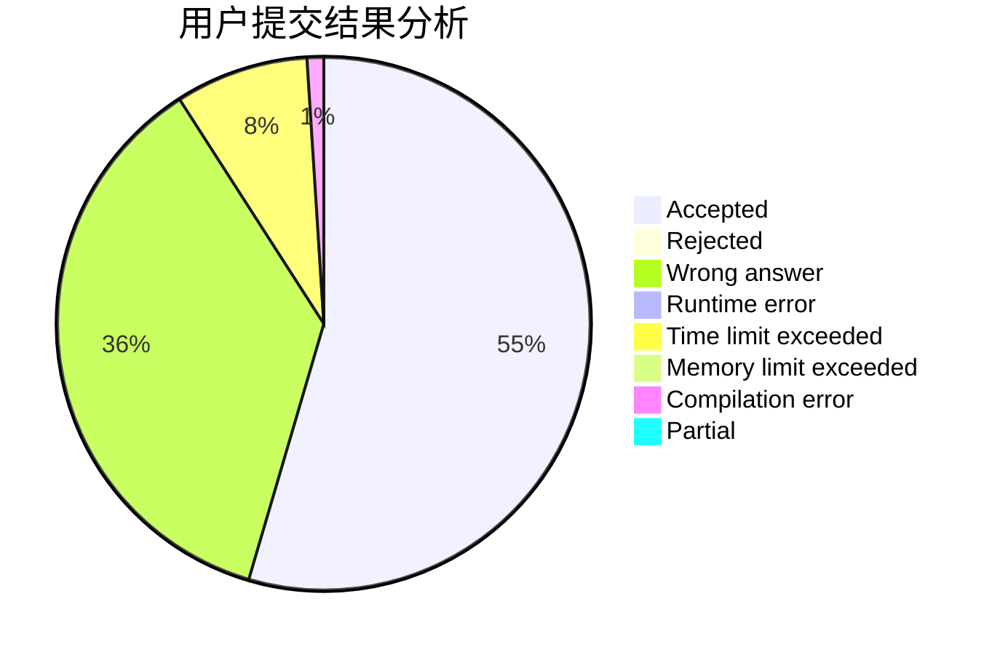
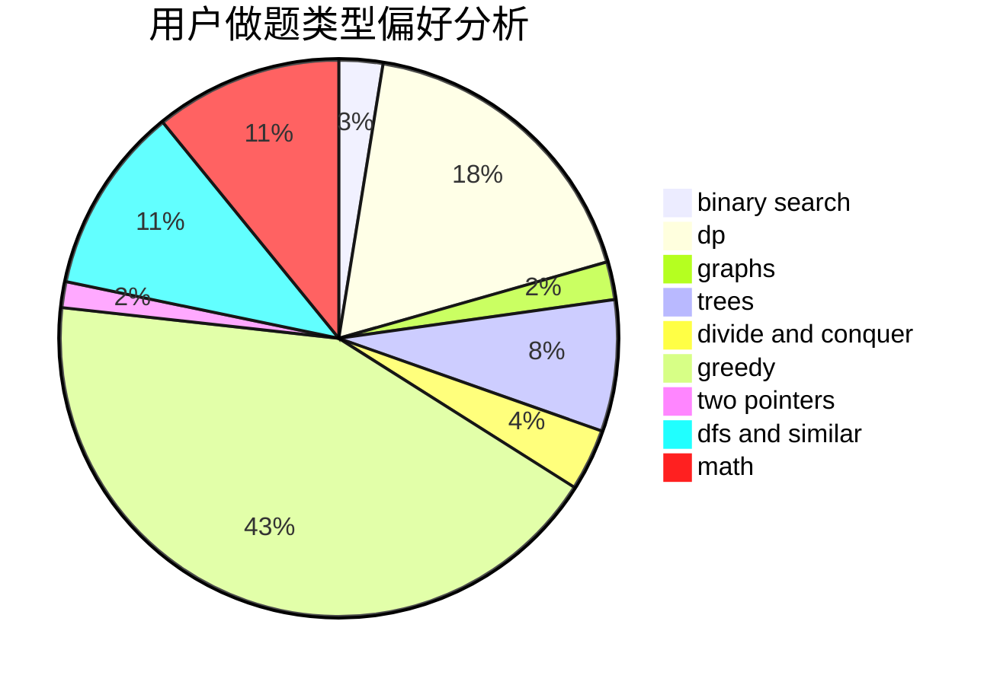

# liuhengxi

<!-- tabs:start -->

#### **用户提交结果分析**

#### **用户做题类型偏好分析**

<!-- tabs:end -->
# 推荐题目
[1389E](https://codeforces.com/contest/1389/problem/E)
[691C](https://codeforces.com/contest/691/problem/C)
[185A](https://codeforces.com/contest/185/problem/A)
[429B](https://codeforces.com/contest/429/problem/B)
[871E](https://codeforces.com/contest/871/problem/E)
[526F](https://codeforces.com/contest/526/problem/F)
[44E](https://codeforces.com/contest/44/problem/E)
[6701](https://codeforces.com/contest/670/problem/1)
[1175D](https://codeforces.com/contest/1175/problem/D)
[1369F](https://codeforces.com/contest/1369/problem/F)
