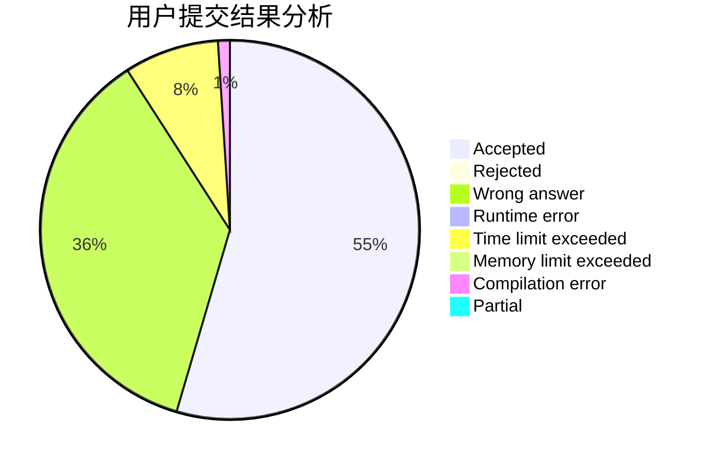
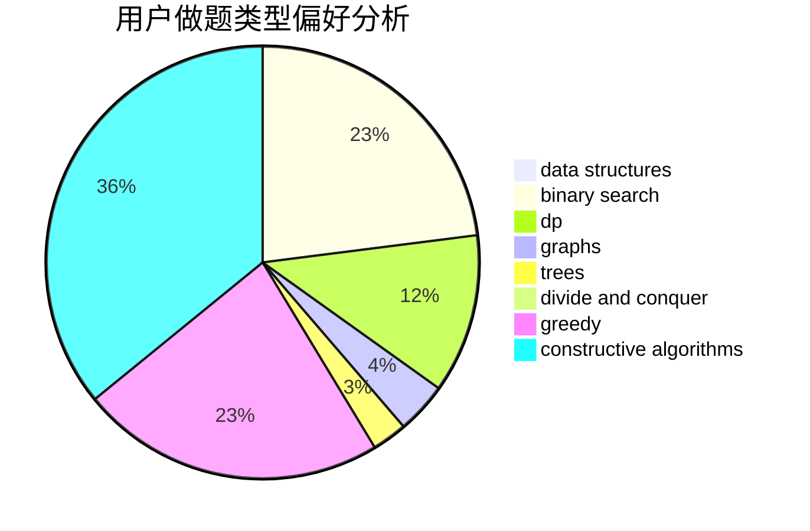
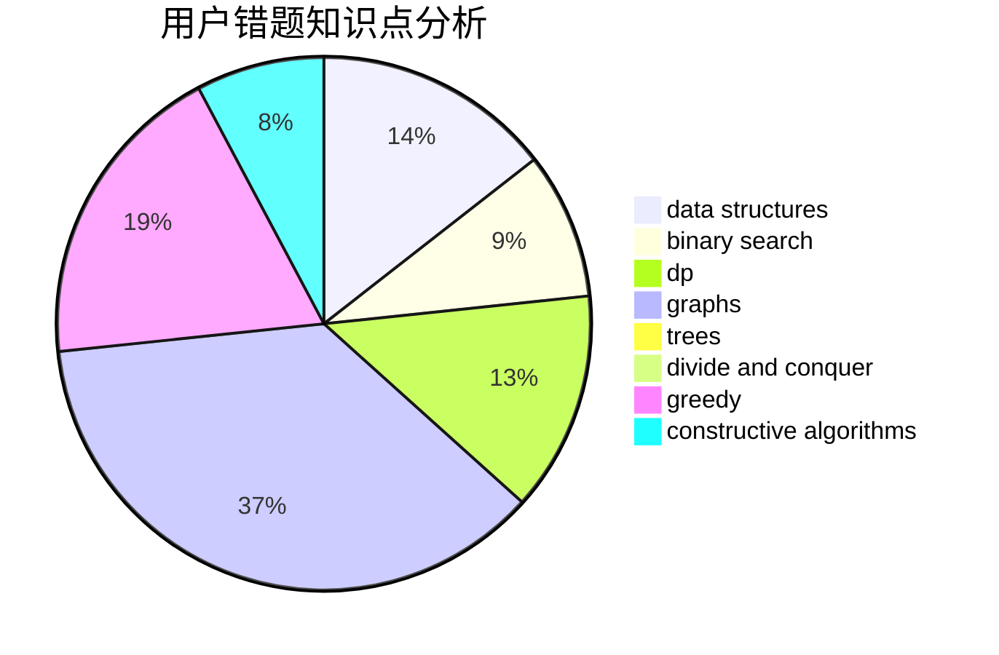

# liuhengxi

<!-- tabs:start -->

#### **用户提交结果分析**

#### **用户做题类型偏好分析**

#### **用户错题知识点分析**

<!-- tabs:end -->
# 推荐题目
[1380B](https://codeforces.com/contest/1380/problem/B)		greedy		  
[669C](https://codeforces.com/contest/669/problem/C)		dsu,graphs,sortings,trees		  
[160B](https://codeforces.com/contest/160/problem/B)		greedy,
                        sortings		  
[3A](https://codeforces.com/contest/3/problem/A)		greedy,
                        shortest paths		  
[853C](https://codeforces.com/contest/853/problem/C)		data structures		  
[506C](https://codeforces.com/contest/506/problem/C)		dsu,graphs,sortings,trees		  
[429A](https://codeforces.com/contest/429/problem/A)		dfs and similar,
                        trees		  
[63C](https://codeforces.com/contest/63/problem/C)		brute force,
                        implementation		  
[1173A](https://codeforces.com/contest/1173/problem/A)		greedy		  
[1362A](https://codeforces.com/contest/1362/problem/A)		implementation		  
