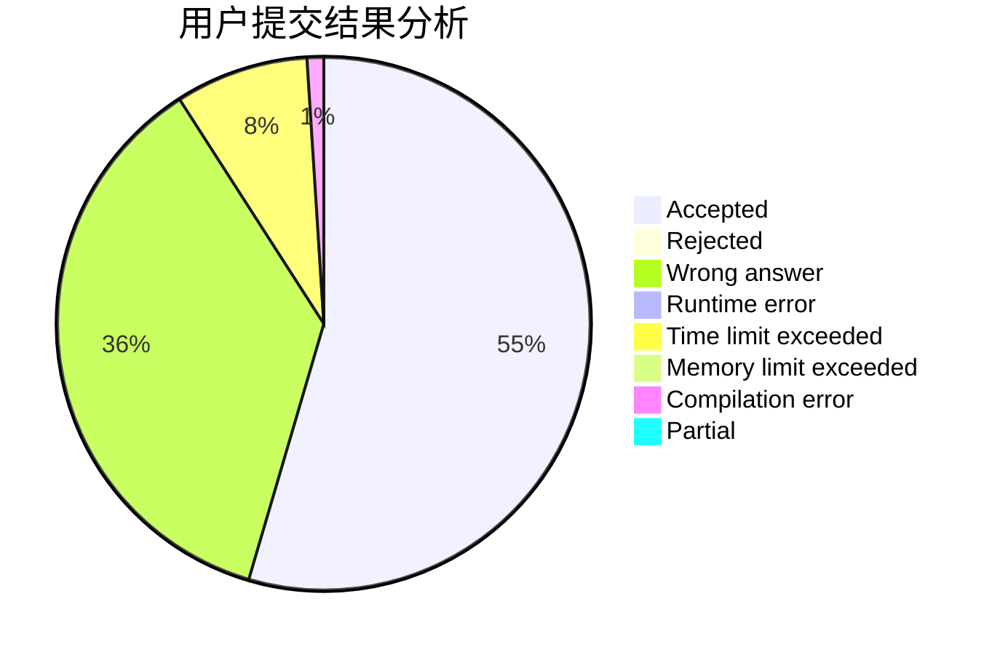
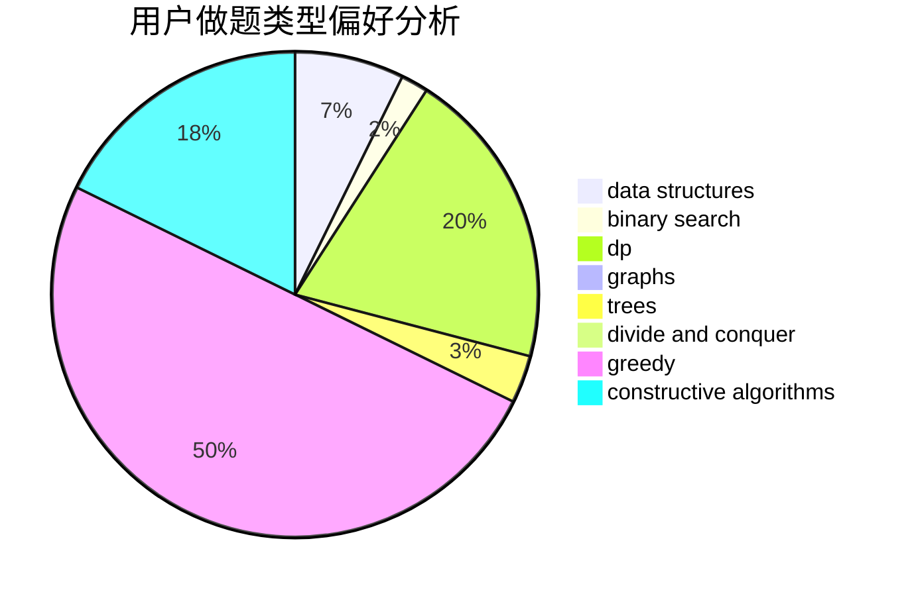
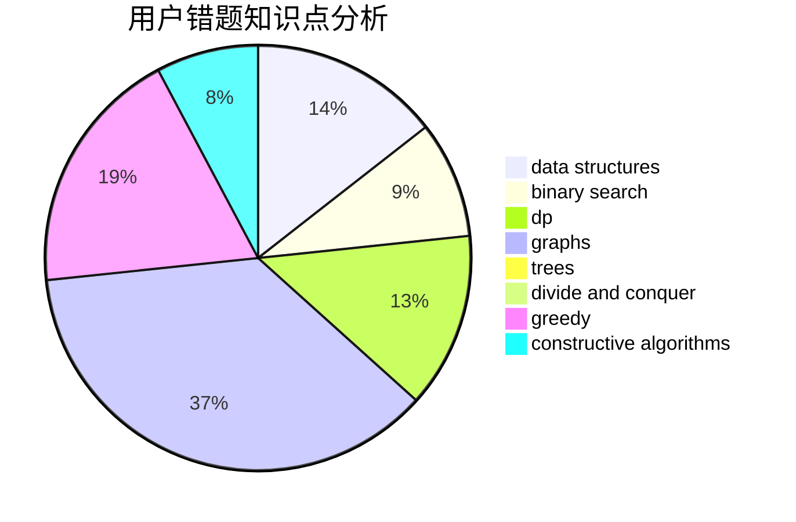

# liuhengxi

<!-- tabs:start -->

#### **用户提交结果分析**

#### **用户做题类型偏好分析**

#### **用户错题知识点分析**

<!-- tabs:end -->
# 推荐题目
[1389E](https://codeforces.com/contest/1389/problem/E)		math,
                        number theory		  
[691C](https://codeforces.com/contest/691/problem/C)		implementation,
                        strings		  
[185A](https://codeforces.com/contest/185/problem/A)		math		  
[429B](https://codeforces.com/contest/429/problem/B)		dp		  
[871E](https://codeforces.com/contest/871/problem/E)		graphs,
                        greedy,
                        trees		  
[526F](https://codeforces.com/contest/526/problem/F)		data structures,
                        divide and conquer		  
[44E](https://codeforces.com/contest/44/problem/E)		dp		  
[6701](https://codeforces.com/contest/670/problem/1)		dsu,graphs,sortings,trees		  
[1175D](https://codeforces.com/contest/1175/problem/D)		greedy,
                        sortings		  
[1369F](https://codeforces.com/contest/1369/problem/F)		dfs and similar,
                        dp,
                        games		  
