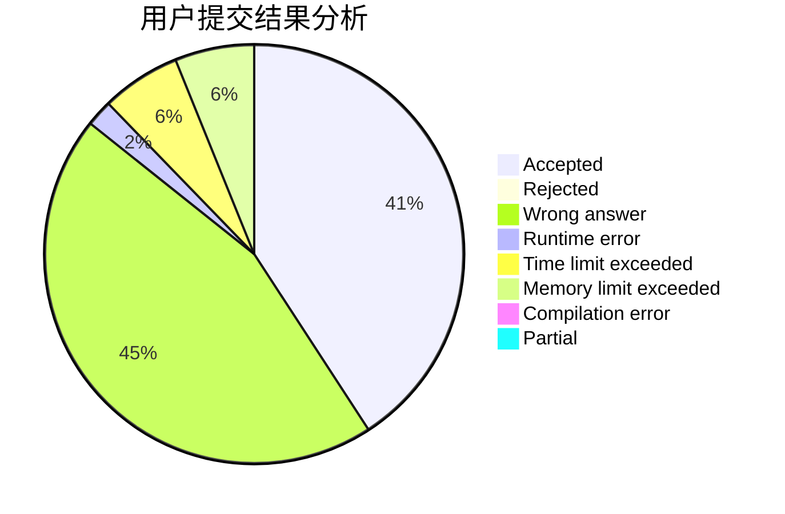
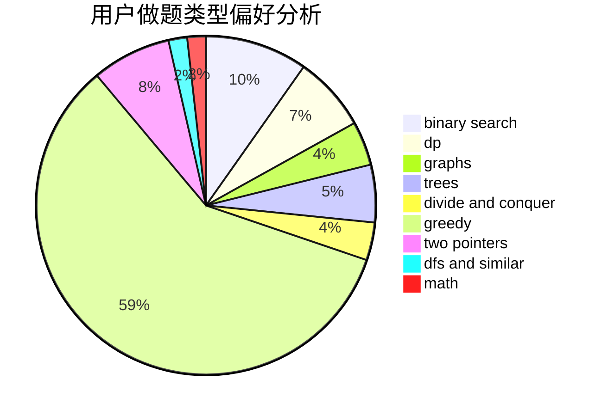

# liujingming

<!-- tabs:start -->

#### **用户提交结果分析**

#### **用户做题类型偏好分析**

<!-- tabs:end -->
# 推荐题目
[1497B](https://codeforces.com/contest/1497/problem/B)
[1469E](https://codeforces.com/contest/1469/problem/E)
[13681](https://codeforces.com/contest/1368/problem/1)
[1446E](https://codeforces.com/contest/1446/problem/E)
[1416D](https://codeforces.com/contest/1416/problem/D)
[1290F](https://codeforces.com/contest/1290/problem/F)
[546D](https://codeforces.com/contest/546/problem/D)
[727A](https://codeforces.com/contest/727/problem/A)
[1362D](https://codeforces.com/contest/1362/problem/D)
[1150C](https://codeforces.com/contest/1150/problem/C)
