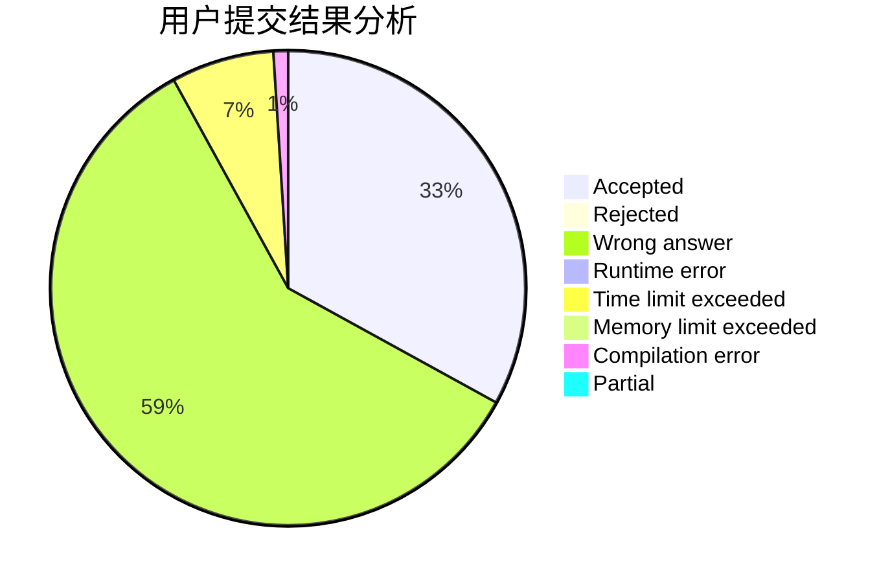
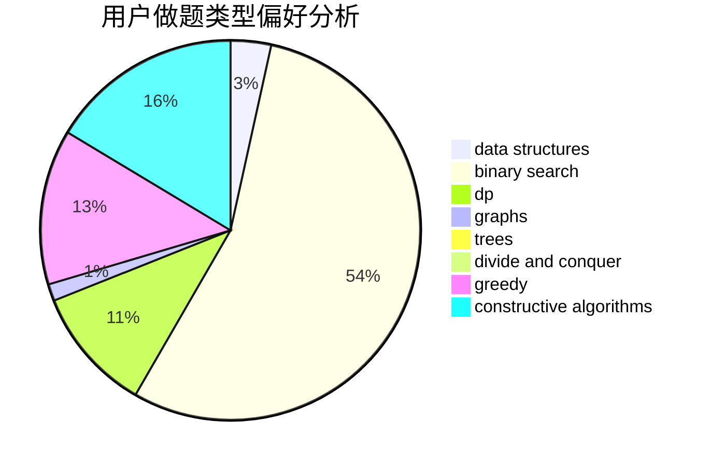

# liutao

<!-- tabs:start -->

#### **用户提交结果分析**

#### **用户做题类型偏好分析**

#### **用户错题知识点分析**

<!-- tabs:end -->
# 推荐题目
[569A](https://codeforces.com/contest/569/problem/A)		implementation,
                        math		  
[348B](https://codeforces.com/contest/348/problem/B)		dfs and similar,
                        number theory,
                        trees		  
[1215B](https://codeforces.com/contest/1215/problem/B)		combinatorics,
                        dp,
                        implementation		  
[755C](https://codeforces.com/contest/755/problem/C)		dfs and similar,
                        dsu,
                        graphs,
                        interactive,
                        trees		  
[1130E](https://codeforces.com/contest/1130/problem/E)		dsu,graphs,sortings,trees		  
[847B](https://codeforces.com/contest/847/problem/B)		binary search,
                        data structures		  
[9581](https://codeforces.com/contest/958/problem/1)		dsu,graphs,sortings,trees		  
[1169B](https://codeforces.com/contest/1169/problem/B)		graphs,
                        implementation		  
[12871](https://codeforces.com/contest/1287/problem/1)		dsu,graphs,sortings,trees		  
[1198E](https://codeforces.com/contest/1198/problem/E)		flows,
                        graph matchings,
                        graphs		  
