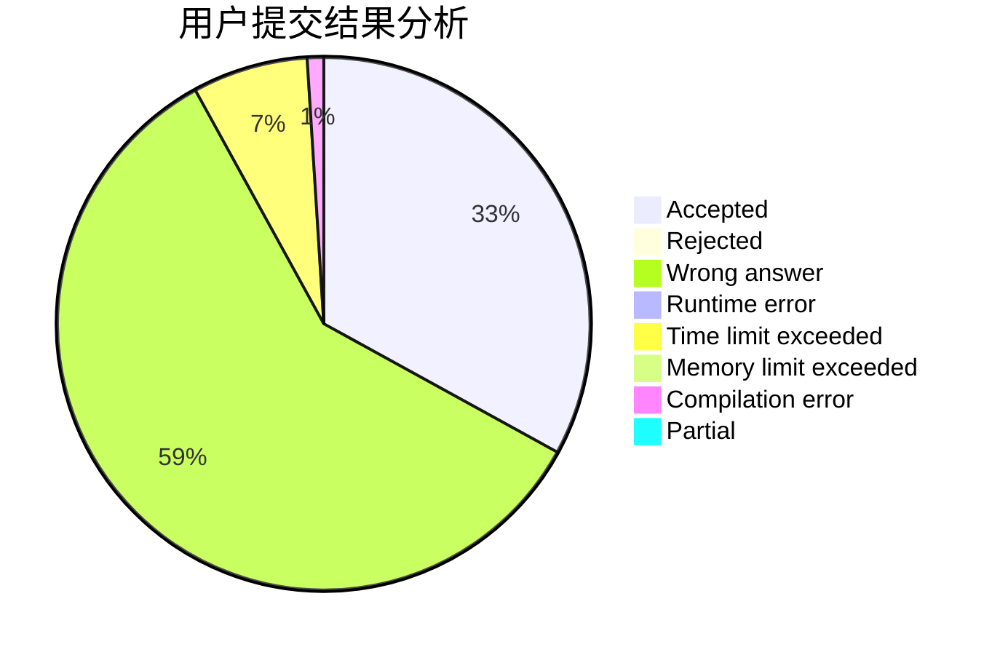
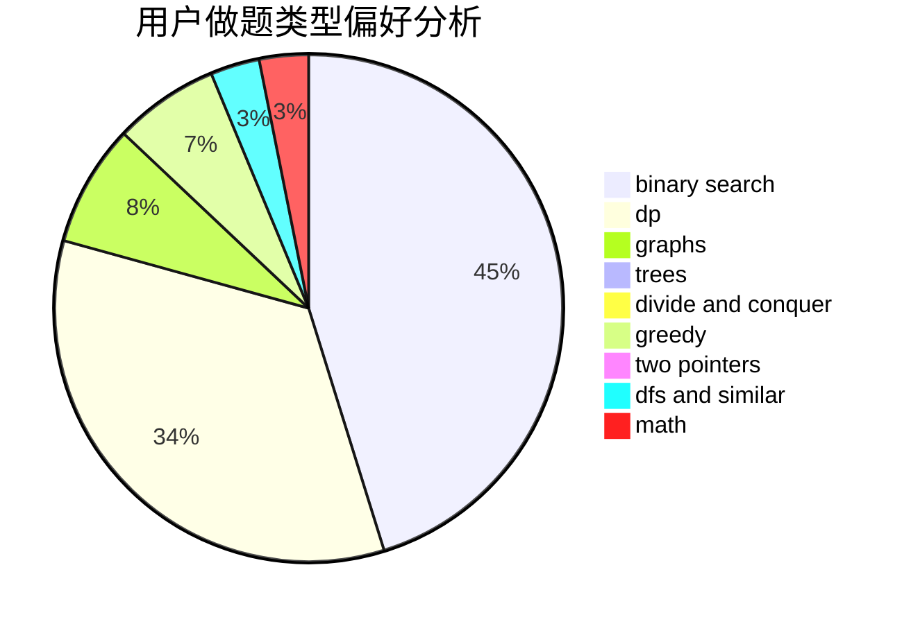

# liutao

<!-- tabs:start -->

#### **用户提交结果分析**

#### **用户做题类型偏好分析**

<!-- tabs:end -->
# 推荐题目
[569A](https://codeforces.com/contest/569/problem/A)
[348B](https://codeforces.com/contest/348/problem/B)
[1215B](https://codeforces.com/contest/1215/problem/B)
[755C](https://codeforces.com/contest/755/problem/C)
[1130E](https://codeforces.com/contest/1130/problem/E)
[847B](https://codeforces.com/contest/847/problem/B)
[9581](https://codeforces.com/contest/958/problem/1)
[1169B](https://codeforces.com/contest/1169/problem/B)
[12871](https://codeforces.com/contest/1287/problem/1)
[1198E](https://codeforces.com/contest/1198/problem/E)
