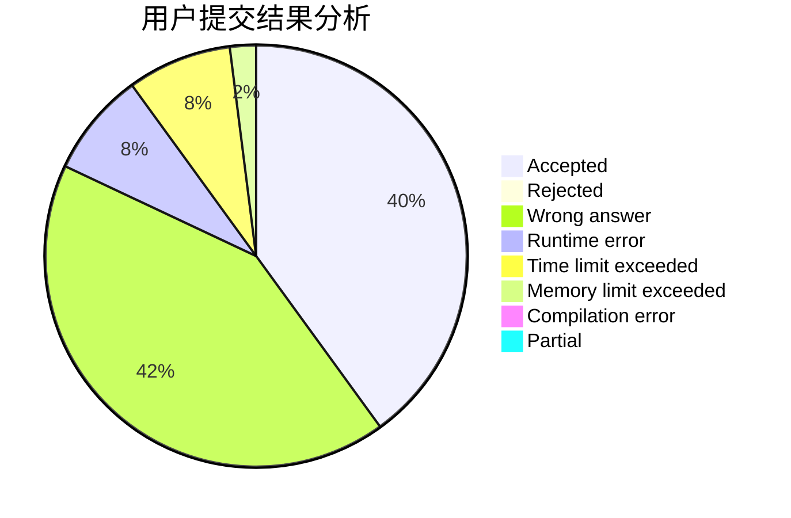
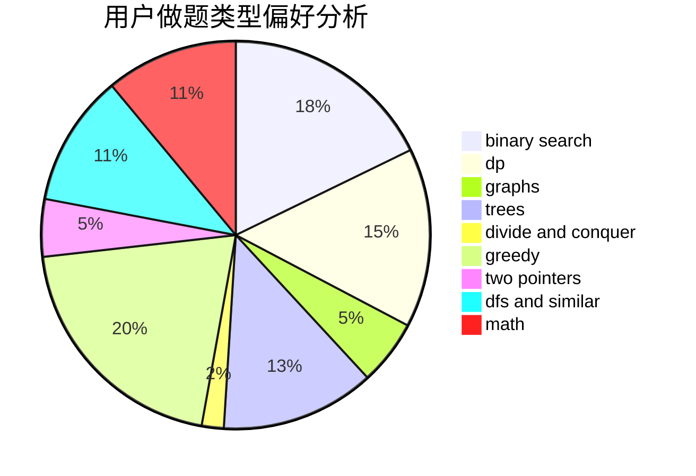

# liuxiang

<!-- tabs:start -->

#### **用户提交结果分析**

#### **用户做题类型偏好分析**

<!-- tabs:end -->
# 推荐题目
[282C](https://codeforces.com/contest/282/problem/C)
[676D](https://codeforces.com/contest/676/problem/D)
[551E](https://codeforces.com/contest/551/problem/E)
[516C](https://codeforces.com/contest/516/problem/C)
[963B](https://codeforces.com/contest/963/problem/B)
[827A](https://codeforces.com/contest/827/problem/A)
[611A](https://codeforces.com/contest/611/problem/A)
[1246C](https://codeforces.com/contest/1246/problem/C)
[1136C](https://codeforces.com/contest/1136/problem/C)
[418B](https://codeforces.com/contest/418/problem/B)
