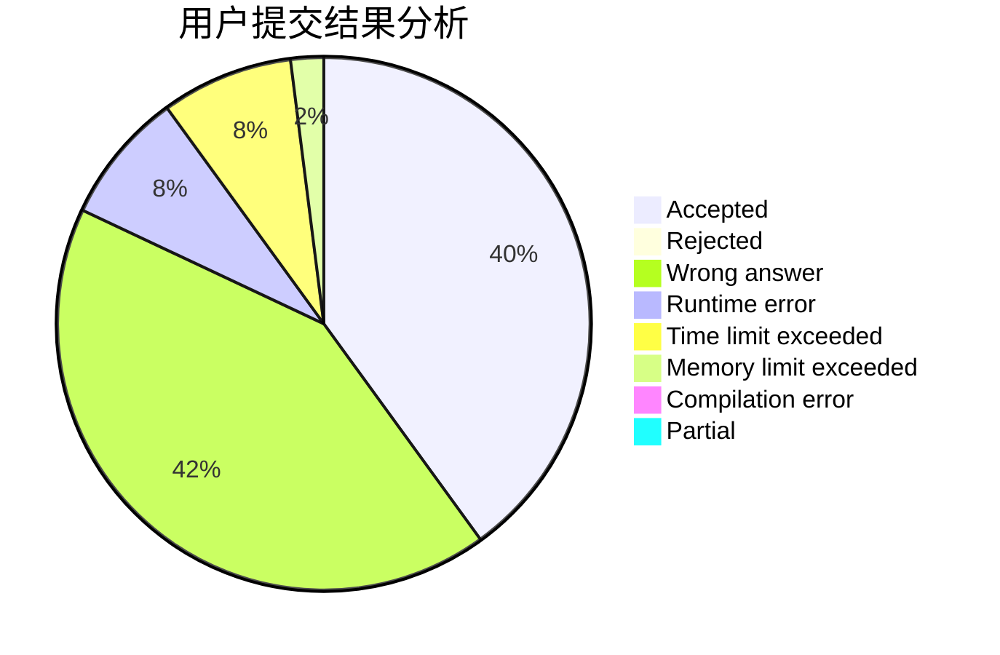
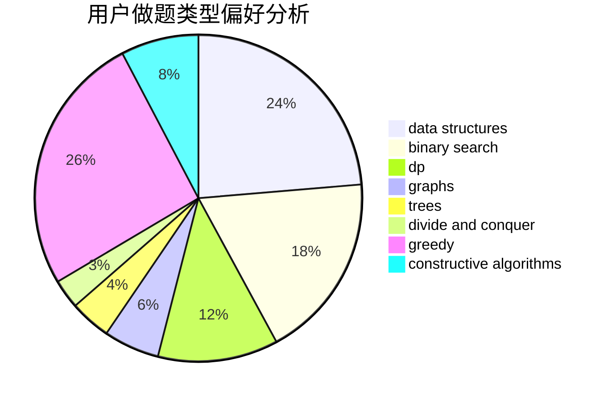
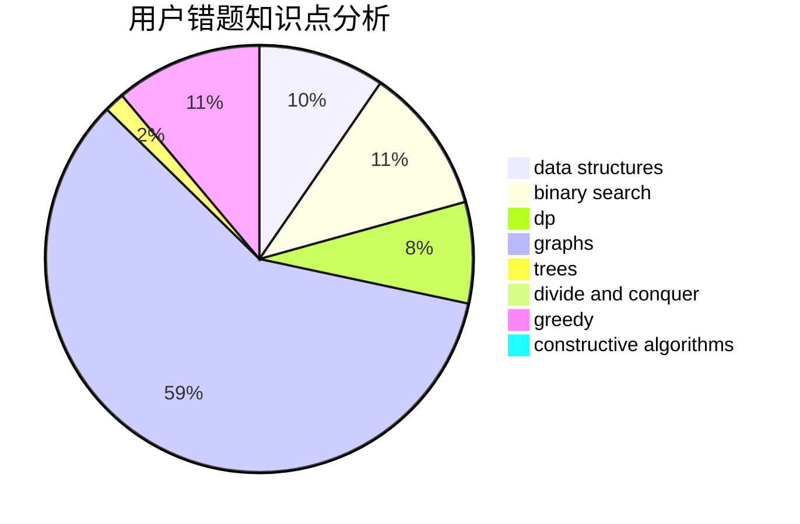

# liuxiang
<!-- tabs:start -->
#### **用户提交结果分析**

#### **用户做题类型偏好分析**

#### **用户错题知识点分析**

<!-- tabs:end -->
# 推荐题目
[Pursuit For Artifacts](http://codeforces.com/problemset/problem/652/E)		dfs and similar,
                        dsu,
                        graphs,
                        trees		  
[BerDonalds](http://codeforces.com/problemset/problem/266/D)		graphs,
                        math,
                        shortest paths		  
[Lucky Numbers (Hard Version)](http://codeforces.com/problemset/problem/1428/G2)		dp,
                        greedy		  
[Median Smoothing](https://codeforces.com/contest/591/problem/C)		implementation		  
[Vanya and Table](http://codeforces.com/problemset/problem/552/A)		implementation,
                        math		  
[Acyclic Organic Compounds](http://codeforces.com/problemset/problem/601/D)		data structures,
                        dfs and similar,
                        dsu,
                        hashing,
                        strings,
                        trees		  
[Soldier and Cards](http://codeforces.com/problemset/problem/546/C)		brute force,
                        dfs and similar,
                        games		  
[Largest Beautiful Number](http://codeforces.com/problemset/problem/946/E)		greedy,
                        implementation		  
[Happy Birthday, Polycarp!](http://codeforces.com/problemset/problem/1277/A)		implementation		  
[So Mean](http://codeforces.com/problemset/problem/1299/E)		interactive,
                        math		  
<!-- tabs:start -->
#### **data structures**
[Pursuit For Artifacts](http://codeforces.com/problemset/problem/601/D)		data structures,
                        dfs and similar,
                        dsu,
                        hashing,
                        strings,
                        trees		  
[BerDonalds](http://codeforces.com/problemset/problem/29/C)		data structures,
                        dfs and similar,
                        graphs,
                        implementation		  
[Lucky Numbers (Hard Version)](http://codeforces.com/problemset/problem/1458/D)		data structures,
                        graphs,
                        greedy		  
[Median Smoothing](http://codeforces.com/problemset/problem/707/E)		data structures		  
[Vanya and Table](http://codeforces.com/problemset/problem/1088/F)		data structures,
                        trees		  
[Acyclic Organic Compounds](http://codeforces.com/problemset/problem/749/E)		data structures,
                        probabilities		  
[Soldier and Cards](http://codeforces.com/problemset/problem/1220/F)		binary search,
                        data structures		  
[Largest Beautiful Number](http://codeforces.com/problemset/problem/1234/B2)		data structures,
                        implementation		  
[Happy Birthday, Polycarp!](https://codeforces.com/contest/947/problem/B)		binary search,
                        data structures		  
[So Mean](http://codeforces.com/problemset/problem/817/F)		binary search,
                        data structures,
                        trees		  
#### **binary search**
[Pursuit For Artifacts](https://codeforces.com/contest/497/problem/B)		binary search		  
[BerDonalds](http://codeforces.com/problemset/problem/830/A)		binary search,
                        brute force,
                        dp,
                        greedy,
                        sortings		  
[Lucky Numbers (Hard Version)](http://codeforces.com/problemset/problem/961/F)		binary search,
                        hashing,
                        string suffix structures		  
[Median Smoothing](http://codeforces.com/problemset/problem/1220/F)		binary search,
                        data structures		  
[Vanya and Table](http://codeforces.com/problemset/problem/1132/D)		binary search,
                        greedy		  
[Acyclic Organic Compounds](https://codeforces.com/contest/947/problem/B)		binary search,
                        data structures		  
[Soldier and Cards](http://codeforces.com/problemset/problem/817/F)		binary search,
                        data structures,
                        trees		  
[Largest Beautiful Number](http://codeforces.com/problemset/problem/809/B)		binary search,
                        interactive		  
[Happy Birthday, Polycarp!](https://codeforces.com/contest/1337/problem/D)		binary search,
                        greedy,
                        math,
                        sortings,
                        two pointers		  
[So Mean](http://codeforces.com/problemset/problem/1492/C)		binary search,
                        data structures,
                        dp,
                        greedy,
                        two pointers		  
#### **dp**
[Pursuit For Artifacts](http://codeforces.com/problemset/problem/1428/G2)		dp,
                        greedy		  
[BerDonalds](http://codeforces.com/problemset/problem/13/D)		dp,
                        geometry		  
[Lucky Numbers (Hard Version)](http://codeforces.com/problemset/problem/1346/E)		*special problem,
                        dp,
                        graphs		  
[Median Smoothing](http://codeforces.com/problemset/problem/830/A)		binary search,
                        brute force,
                        dp,
                        greedy,
                        sortings		  
[Vanya and Table](http://codeforces.com/problemset/problem/601/C)		dp,
                        math,
                        probabilities		  
[Acyclic Organic Compounds](http://codeforces.com/problemset/problem/855/C)		dp,
                        trees		  
[Soldier and Cards](http://codeforces.com/problemset/problem/803/E)		dp,
                        graphs		  
[Largest Beautiful Number](https://codeforces.com/contest/1287/problem/C)		dp,
                        greedy,
                        sortings		  
[Happy Birthday, Polycarp!](http://codeforces.com/problemset/problem/1492/C)		binary search,
                        data structures,
                        dp,
                        greedy,
                        two pointers		  
[So Mean](https://codeforces.com/contest/1457/problem/C)		brute force,
                        dp,
                        implementation		  
#### **graph**
[Pursuit For Artifacts](http://codeforces.com/problemset/problem/652/E)		dfs and similar,
                        dsu,
                        graphs,
                        trees		  
[BerDonalds](http://codeforces.com/problemset/problem/266/D)		graphs,
                        math,
                        shortest paths		  
[Lucky Numbers (Hard Version)](http://codeforces.com/problemset/problem/29/C)		data structures,
                        dfs and similar,
                        graphs,
                        implementation		  
[Median Smoothing](http://codeforces.com/problemset/problem/1301/F)		dfs and similar,
                        graphs,
                        implementation,
                        shortest paths		  
[Vanya and Table](http://codeforces.com/problemset/problem/1346/E)		*special problem,
                        dp,
                        graphs		  
[Acyclic Organic Compounds](http://codeforces.com/problemset/problem/1240/F)		graphs		  
[Soldier and Cards](http://codeforces.com/problemset/problem/1458/D)		data structures,
                        graphs,
                        greedy		  
[Largest Beautiful Number](http://codeforces.com/problemset/problem/246/D)		brute force,
                        dfs and similar,
                        graphs		  
[Happy Birthday, Polycarp!](http://codeforces.com/problemset/problem/803/E)		dp,
                        graphs		  
[So Mean](http://codeforces.com/problemset/problem/1263/D)		dfs and similar,
                        dsu,
                        graphs		  
#### **trees**
[Pursuit For Artifacts](http://codeforces.com/problemset/problem/652/E)		dfs and similar,
                        dsu,
                        graphs,
                        trees		  
[BerDonalds](http://codeforces.com/problemset/problem/601/D)		data structures,
                        dfs and similar,
                        dsu,
                        hashing,
                        strings,
                        trees		  
[Lucky Numbers (Hard Version)](http://codeforces.com/problemset/problem/1088/F)		data structures,
                        trees		  
[Median Smoothing](http://codeforces.com/problemset/problem/855/C)		dp,
                        trees		  
[Vanya and Table](http://codeforces.com/problemset/problem/817/F)		binary search,
                        data structures,
                        trees		  
[Acyclic Organic Compounds](http://codeforces.com/problemset/problem/1213/G)		divide and conquer,
                        dsu,
                        graphs,
                        sortings,
                        trees		  
[Soldier and Cards](http://codeforces.com/problemset/problem/1479/D)		binary search,
                        bitmasks,
                        brute force,
                        data structures,
                        probabilities,
                        trees		  
[Largest Beautiful Number](http://codeforces.com/problemset/problem/1511/C)		brute force,
                        data structures,
                        implementation,
                        trees		  
[Happy Birthday, Polycarp!](http://codeforces.com/problemset/problem/1499/F)		combinatorics,
                        dfs and similar,
                        dp,
                        trees		  
[So Mean](http://codeforces.com/problemset/problem/1491/E)		brute force,
                        dfs and similar,
                        divide and conquer,
                        number theory,
                        trees		  
#### **divide and conquer**
[Pursuit For Artifacts](http://codeforces.com/problemset/problem/1213/G)		divide and conquer,
                        dsu,
                        graphs,
                        sortings,
                        trees		  
[BerDonalds](http://codeforces.com/problemset/problem/1461/D)		binary search,
                        brute force,
                        data structures,
                        divide and conquer,
                        implementation,
                        sortings		  
[Lucky Numbers (Hard Version)](http://codeforces.com/problemset/problem/1466/G)		combinatorics,
                        divide and conquer,
                        hashing,
                        math,
                        string suffix structures,
                        strings		  
[Median Smoothing](http://codeforces.com/problemset/problem/1490/D)		dfs and similar,
                        divide and conquer,
                        implementation		  
[Vanya and Table](https://codeforces.com/contest/1483/problem/C)		data structures,
                        divide and conquer,
                        dp		  
[Acyclic Organic Compounds](http://codeforces.com/problemset/problem/1491/E)		brute force,
                        dfs and similar,
                        divide and conquer,
                        number theory,
                        trees		  
[Soldier and Cards](http://codeforces.com/problemset/problem/1303/G)		data structures,
                        divide and conquer,
                        geometry,
                        trees		  
[Largest Beautiful Number](http://codeforces.com/problemset/problem/1494/D)		constructive algorithms,
                        data structures,
                        dfs and similar,
                        divide and conquer,
                        dsu,
                        greedy,
                        sortings,
                        trees		  
[Happy Birthday, Polycarp!](http://codeforces.com/problemset/problem/1482/E)		data structures,
                        divide and conquer,
                        dp		  
[So Mean](http://codeforces.com/problemset/problem/566/C)		dfs and similar,
                        divide and conquer,
                        trees		  
#### **greedy**
[Pursuit For Artifacts](http://codeforces.com/problemset/problem/1428/G2)		dp,
                        greedy		  
[BerDonalds](http://codeforces.com/problemset/problem/946/E)		greedy,
                        implementation		  
[Lucky Numbers (Hard Version)](http://codeforces.com/problemset/problem/830/A)		binary search,
                        brute force,
                        dp,
                        greedy,
                        sortings		  
[Median Smoothing](http://codeforces.com/problemset/problem/1458/D)		data structures,
                        graphs,
                        greedy		  
[Vanya and Table](http://codeforces.com/problemset/problem/526/B)		dfs and similar,
                        greedy,
                        implementation		  
[Acyclic Organic Compounds](http://codeforces.com/problemset/problem/266/C)		constructive algorithms,
                        greedy,
                        math		  
[Soldier and Cards](http://codeforces.com/problemset/problem/1132/D)		binary search,
                        greedy		  
[Largest Beautiful Number](http://codeforces.com/problemset/problem/1468/N)		greedy,
                        implementation		  
[Happy Birthday, Polycarp!](https://codeforces.com/contest/1287/problem/C)		dp,
                        greedy,
                        sortings		  
[So Mean](https://codeforces.com/contest/1337/problem/D)		binary search,
                        greedy,
                        math,
                        sortings,
                        two pointers		  
#### **constructive algorithms**
[Pursuit For Artifacts](http://codeforces.com/problemset/problem/720/C)		constructive algorithms		  
[BerDonalds](http://codeforces.com/problemset/problem/266/C)		constructive algorithms,
                        greedy,
                        math		  
[Lucky Numbers (Hard Version)](http://codeforces.com/problemset/problem/459/C)		combinatorics,
                        constructive algorithms,
                        math		  
[Median Smoothing](http://codeforces.com/problemset/problem/1404/D)		constructive algorithms,
                        dfs and similar,
                        interactive,
                        math,
                        number theory		  
[Vanya and Table](http://codeforces.com/problemset/problem/1513/E)		combinatorics,
                        constructive algorithms,
                        math,
                        sortings		  
[Acyclic Organic Compounds](http://codeforces.com/problemset/problem/1254/B2)		constructive algorithms,
                        greedy,
                        math,
                        number theory,
                        ternary search,
                        two pointers		  
[Soldier and Cards](http://codeforces.com/problemset/problem/1446/A)		constructive algorithms,
                        greedy,
                        sortings		  
[Largest Beautiful Number](http://codeforces.com/problemset/problem/1493/A)		constructive algorithms,
                        greedy		  
[Happy Birthday, Polycarp!](http://codeforces.com/problemset/problem/1463/D)		binary search,
                        constructive algorithms,
                        greedy,
                        two pointers		  
[So Mean](https://codeforces.com/contest/1456/problem/B)		bitmasks,
                        brute force,
                        constructive algorithms		  
#### **sortings**
[Pursuit For Artifacts](http://codeforces.com/problemset/problem/830/A)		binary search,
                        brute force,
                        dp,
                        greedy,
                        sortings		  
[BerDonalds](http://codeforces.com/problemset/problem/1213/G)		divide and conquer,
                        dsu,
                        graphs,
                        sortings,
                        trees		  
[Lucky Numbers (Hard Version)](https://codeforces.com/contest/1287/problem/C)		dp,
                        greedy,
                        sortings		  
[Median Smoothing](https://codeforces.com/contest/1337/problem/D)		binary search,
                        greedy,
                        math,
                        sortings,
                        two pointers		  
[Vanya and Table](http://codeforces.com/problemset/problem/1513/E)		combinatorics,
                        constructive algorithms,
                        math,
                        sortings		  
[Acyclic Organic Compounds](http://codeforces.com/problemset/problem/1446/A)		constructive algorithms,
                        greedy,
                        sortings		  
[Soldier and Cards](https://codeforces.com/contest/1496/problem/C)		geometry,
                        greedy,
                        math,
                        sortings		  
[Largest Beautiful Number](http://codeforces.com/problemset/problem/1495/A)		geometry,
                        greedy,
                        math,
                        sortings		  
[Happy Birthday, Polycarp!](http://codeforces.com/problemset/problem/1497/A)		brute force,
                        data structures,
                        greedy,
                        sortings		  
[So Mean](http://codeforces.com/problemset/problem/1427/A)		math,
                        sortings		  
<!-- tabs:end -->
