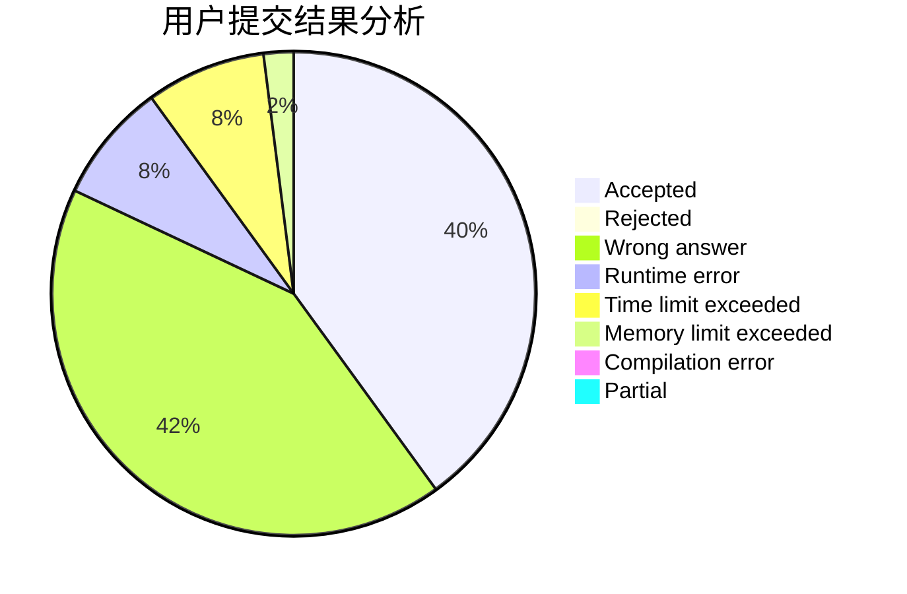
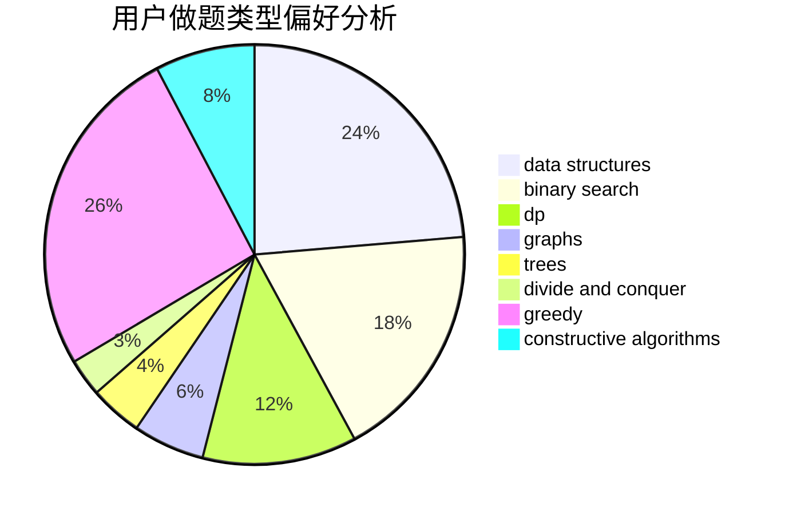
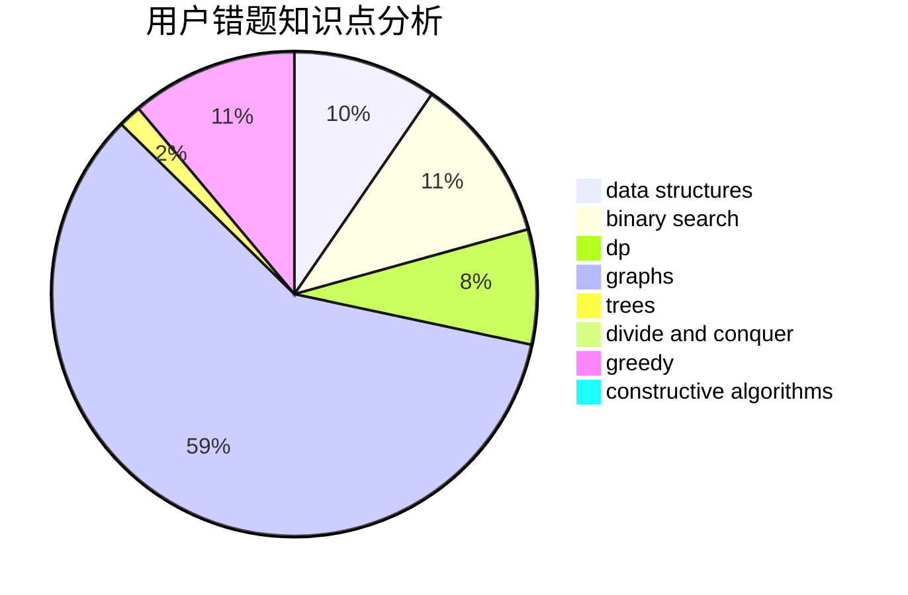

# liuxiang

<!-- tabs:start -->

#### **用户提交结果分析**

#### **用户做题类型偏好分析**

#### **用户错题知识点分析**

<!-- tabs:end -->
# 推荐题目
[266D](https://codeforces.com/contest/266/problem/D)		graphs,
                        math,
                        shortest paths		  
[652E](https://codeforces.com/contest/652/problem/E)		dfs and similar,
                        dsu,
                        graphs,
                        trees		  
[527E](https://codeforces.com/contest/527/problem/E)		dfs and similar,
                        graphs		  
[497B](https://codeforces.com/contest/497/problem/B)		dsu,graphs,sortings,trees		  
[946E](https://codeforces.com/contest/946/problem/E)		greedy,
                        implementation		  
[809B](https://codeforces.com/contest/809/problem/B)		binary search,
                        interactive		  
[591C](https://codeforces.com/contest/591/problem/C)		dsu,graphs,sortings,trees		  
[1240F](https://codeforces.com/contest/1240/problem/F)		graphs		  
[1132D](https://codeforces.com/contest/1132/problem/D)		binary search,
                        greedy		  
[388E](https://codeforces.com/contest/388/problem/E)		geometry		  
