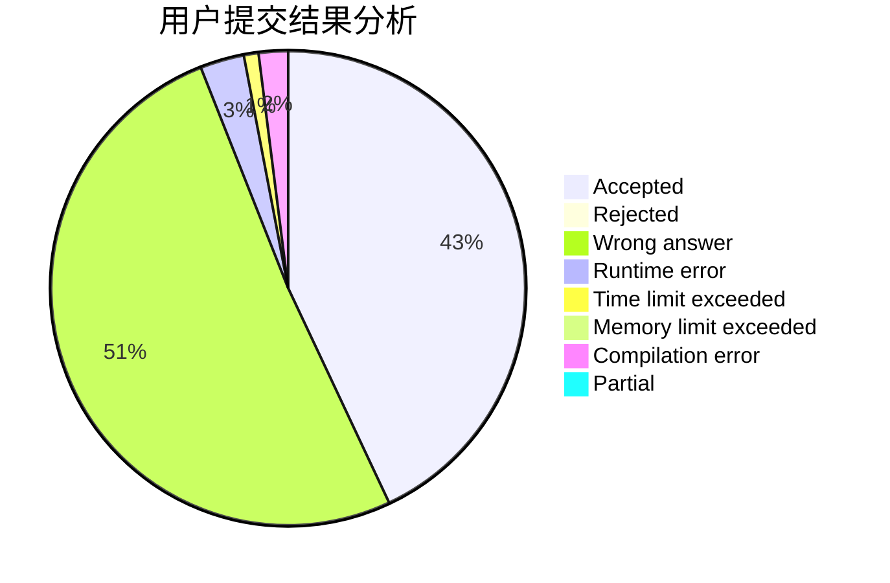
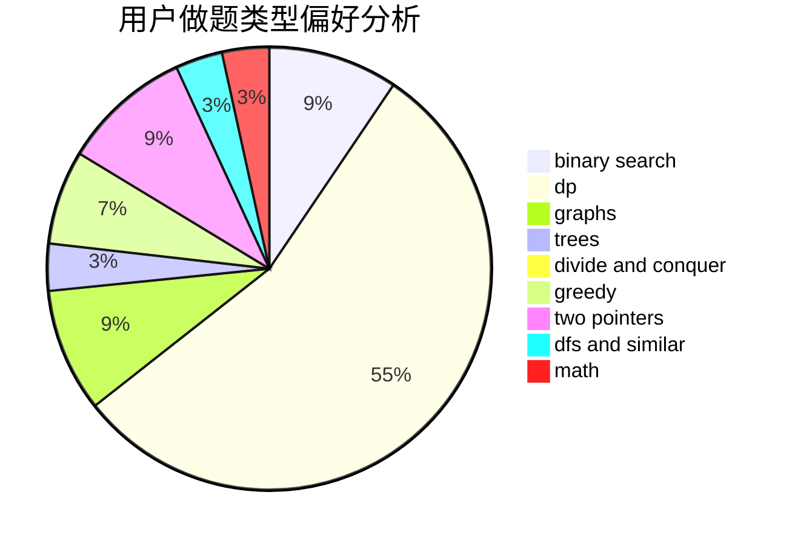

# liuxinyu

<!-- tabs:start -->

#### **用户提交结果分析**

#### **用户做题类型偏好分析**

<!-- tabs:end -->
# 推荐题目
[1141D](https://codeforces.com/contest/1141/problem/D)
[1148B](https://codeforces.com/contest/1148/problem/B)
[1374F](https://codeforces.com/contest/1374/problem/F)
[605B](https://codeforces.com/contest/605/problem/B)
[1162B](https://codeforces.com/contest/1162/problem/B)
[438B](https://codeforces.com/contest/438/problem/B)
[609A](https://codeforces.com/contest/609/problem/A)
[1230A](https://codeforces.com/contest/1230/problem/A)
[701B](https://codeforces.com/contest/701/problem/B)
[167B](https://codeforces.com/contest/167/problem/B)
