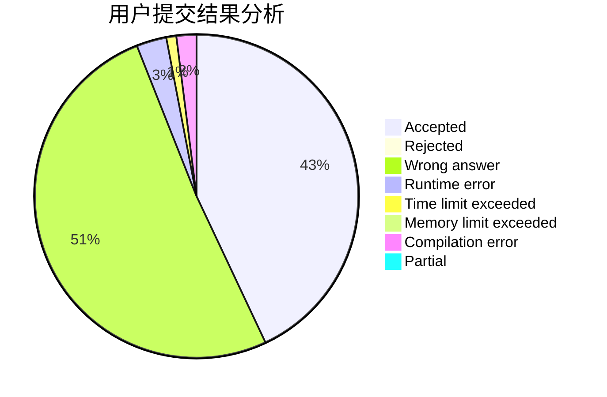
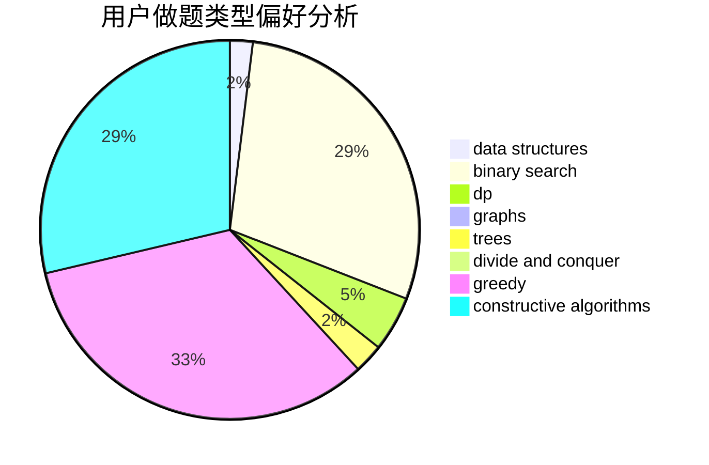
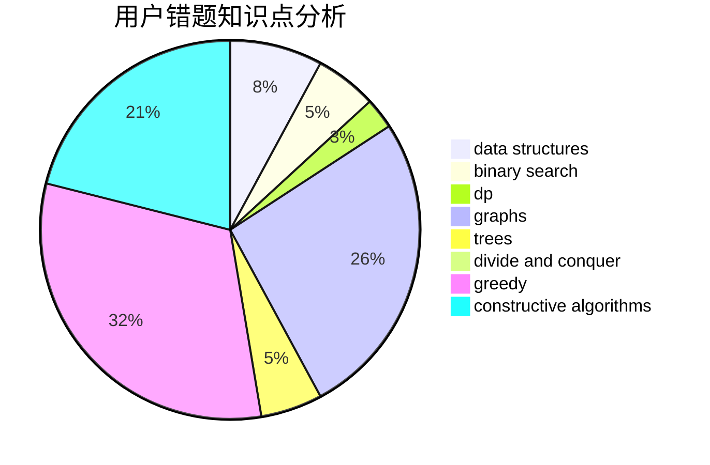

# liuxinyu

<!-- tabs:start -->

#### **用户提交结果分析**

#### **用户做题类型偏好分析**

#### **用户错题知识点分析**

<!-- tabs:end -->
# 推荐题目
[113D](https://codeforces.com/contest/113/problem/D)		math,
                        matrices,
                        probabilities		  
[1146B](https://codeforces.com/contest/1146/problem/B)		implementation,
                        strings		  
[1368A](https://codeforces.com/contest/1368/problem/A)		brute force,
                        greedy,
                        implementation,
                        math		  
[584E](https://codeforces.com/contest/584/problem/E)		constructive algorithms,
                        greedy,
                        math		  
[1159C](https://codeforces.com/contest/1159/problem/C)		dsu,graphs,sortings,trees		  
[412C](https://codeforces.com/contest/412/problem/C)		implementation,
                        strings		  
[588C](https://codeforces.com/contest/588/problem/C)		dsu,graphs,sortings,trees		  
[1223A](https://codeforces.com/contest/1223/problem/A)		math		  
[677B](https://codeforces.com/contest/677/problem/B)		implementation,
                        math		  
[1511A](https://codeforces.com/contest/1511/problem/A)		greedy		  
