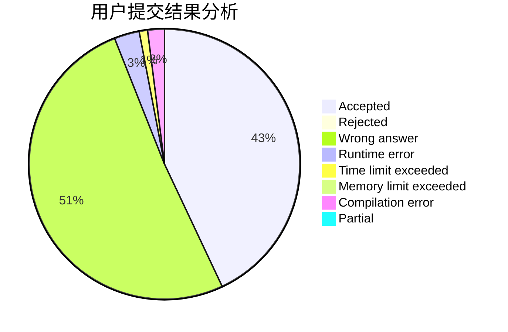
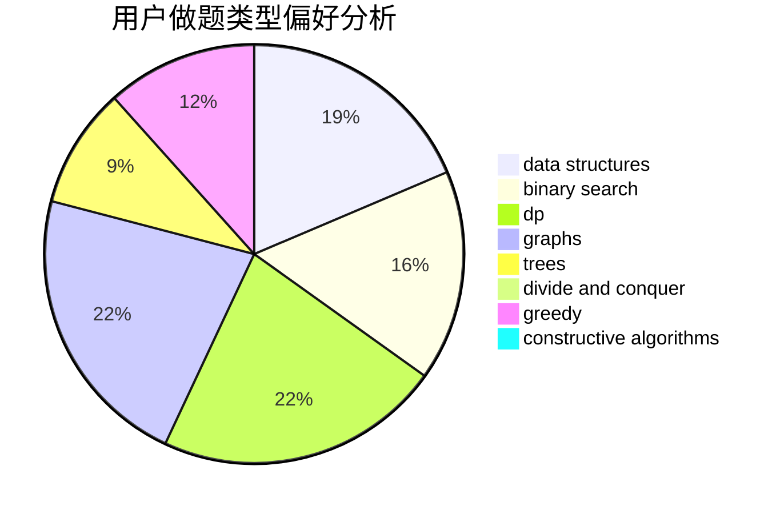
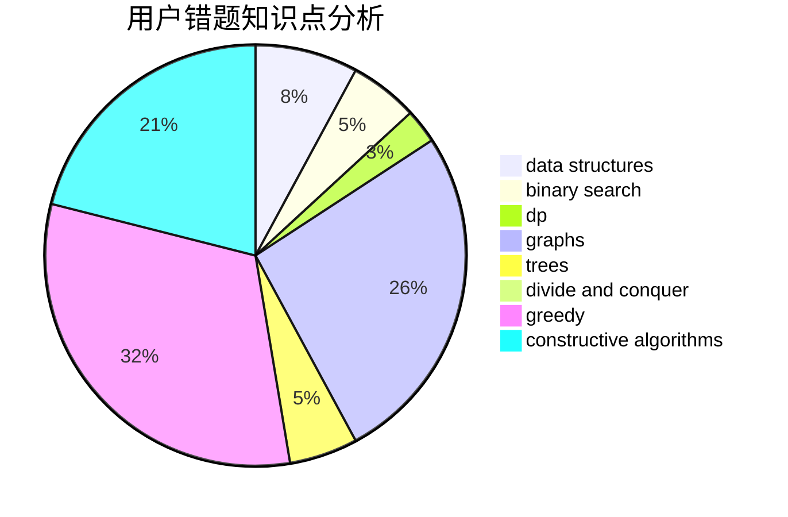

# liuxinyu

<!-- tabs:start -->

#### **用户提交结果分析**

#### **用户做题类型偏好分析**

#### **用户错题知识点分析**

<!-- tabs:end -->
# 推荐题目
[1141D](https://codeforces.com/contest/1141/problem/D)		greedy,
                        implementation		  
[1148B](https://codeforces.com/contest/1148/problem/B)		binary search,
                        brute force,
                        two pointers		  
[1374F](https://codeforces.com/contest/1374/problem/F)		brute force,
                        constructive algorithms,
                        implementation,
                        sortings		  
[605B](https://codeforces.com/contest/605/problem/B)		constructive algorithms,
                        data structures,
                        graphs		  
[1162B](https://codeforces.com/contest/1162/problem/B)		brute force,
                        greedy		  
[438B](https://codeforces.com/contest/438/problem/B)		dsu,graphs,sortings,trees		  
[609A](https://codeforces.com/contest/609/problem/A)		greedy,
                        implementation,
                        sortings		  
[1230A](https://codeforces.com/contest/1230/problem/A)		brute force,
                        implementation		  
[701B](https://codeforces.com/contest/701/problem/B)		data structures,
                        math		  
[167B](https://codeforces.com/contest/167/problem/B)		dp,
                        math,
                        probabilities		  
