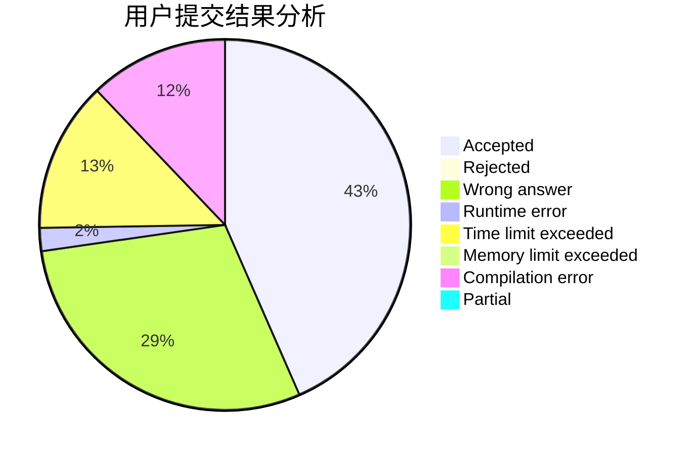
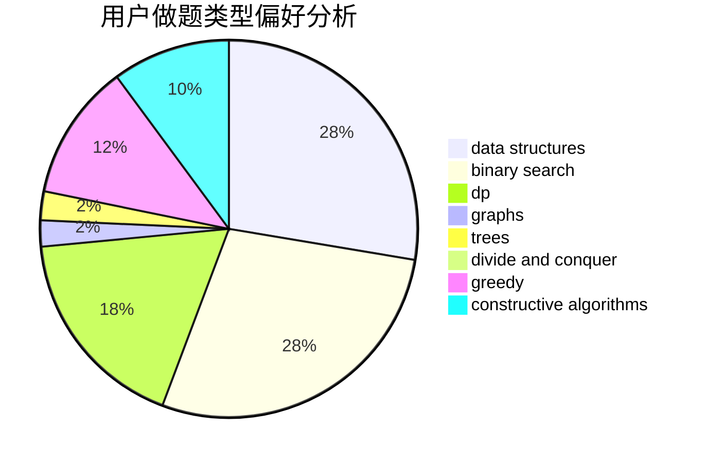
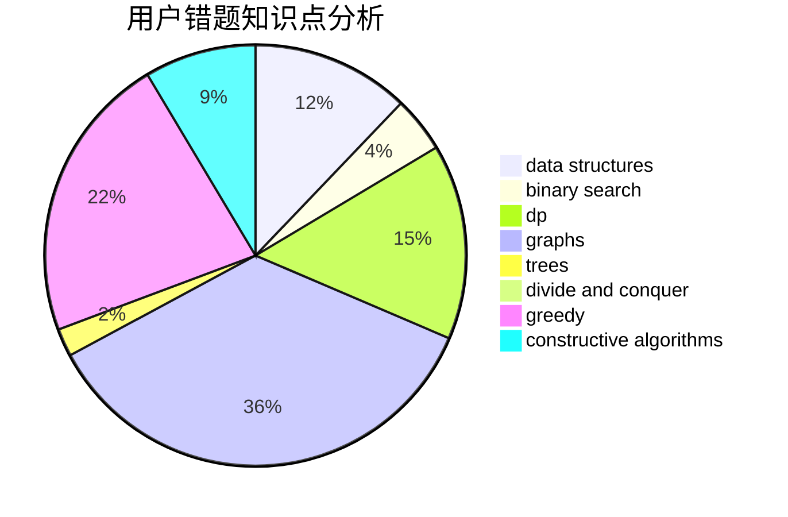

# liuyubobobo

<!-- tabs:start -->

#### **用户提交结果分析**

#### **用户做题类型偏好分析**

#### **用户错题知识点分析**

<!-- tabs:end -->
# 推荐题目
[669C](https://codeforces.com/contest/669/problem/C)		dsu,graphs,sortings,trees		  
[699C](https://codeforces.com/contest/699/problem/C)		dsu,graphs,sortings,trees		  
[733C](https://codeforces.com/contest/733/problem/C)		constructive algorithms,
                        dp,
                        greedy,
                        two pointers		  
[611H](https://codeforces.com/contest/611/problem/H)		constructive algorithms,
                        flows,
                        graphs		  
[723C](https://codeforces.com/contest/723/problem/C)		greedy		  
[1330D](https://codeforces.com/contest/1330/problem/D)		dsu,graphs,sortings,trees		  
[607E](https://codeforces.com/contest/607/problem/E)		binary search,
                        geometry		  
[934B](https://codeforces.com/contest/934/problem/B)		constructive algorithms,
                        implementation		  
[1315C](https://codeforces.com/contest/1315/problem/C)		greedy		  
[1093D](https://codeforces.com/contest/1093/problem/D)		dfs and similar,
                        graphs		  
