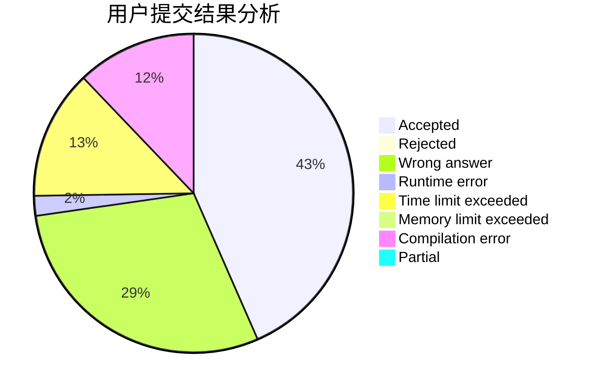
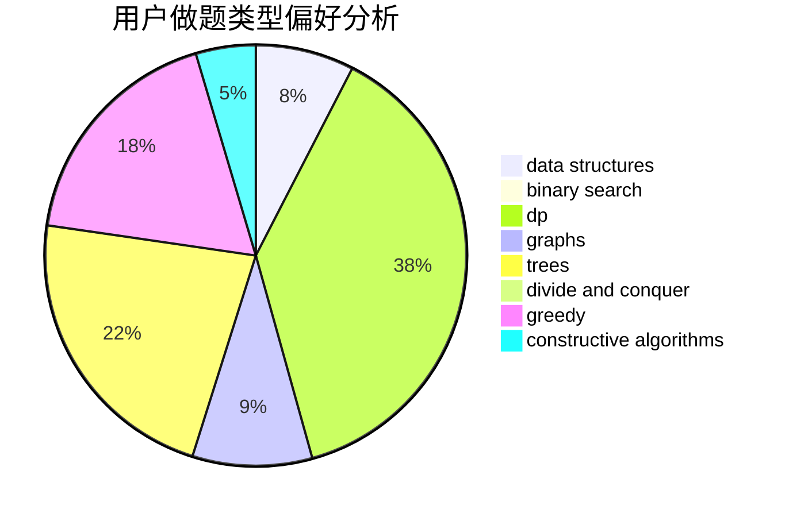
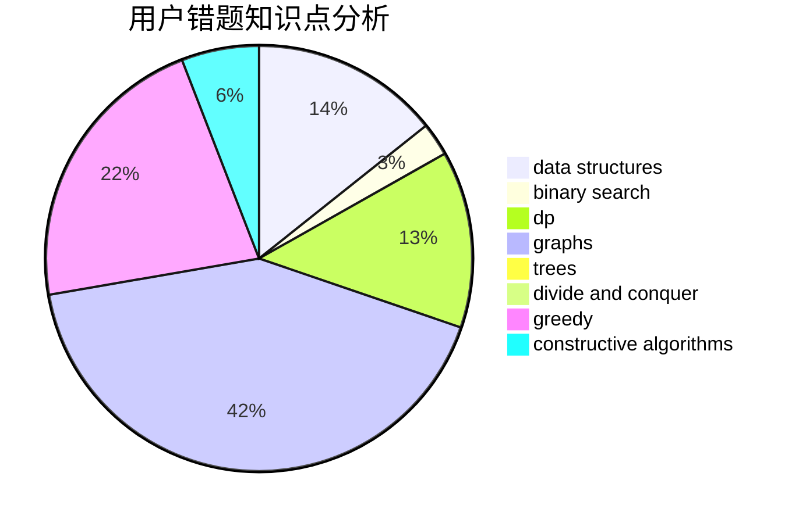

# liuyubobobo

<!-- tabs:start -->

#### **用户提交结果分析**

#### **用户做题类型偏好分析**

#### **用户错题知识点分析**

<!-- tabs:end -->
# 推荐题目
[691C](https://codeforces.com/contest/691/problem/C)		implementation,
                        strings		  
[716B](https://codeforces.com/contest/716/problem/B)		greedy,
                        two pointers		  
[750H](https://codeforces.com/contest/750/problem/H)		dfs and similar,
                        dsu,
                        graphs,
                        interactive		  
[631A](https://codeforces.com/contest/631/problem/A)		brute force,
                        implementation		  
[740D](https://codeforces.com/contest/740/problem/D)		dsu,graphs,sortings,trees		  
[1336D](https://codeforces.com/contest/1336/problem/D)		constructive algorithms,
                        interactive		  
[626F](https://codeforces.com/contest/626/problem/F)		dp		  
[956A](https://codeforces.com/contest/956/problem/A)		dsu,graphs,sortings,trees		  
[1325B](https://codeforces.com/contest/1325/problem/B)		greedy,
                        implementation		  
[1093G](https://codeforces.com/contest/1093/problem/G)		bitmasks,
                        data structures		  
