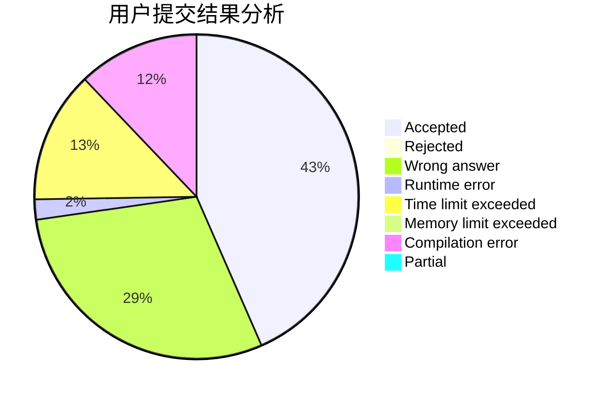
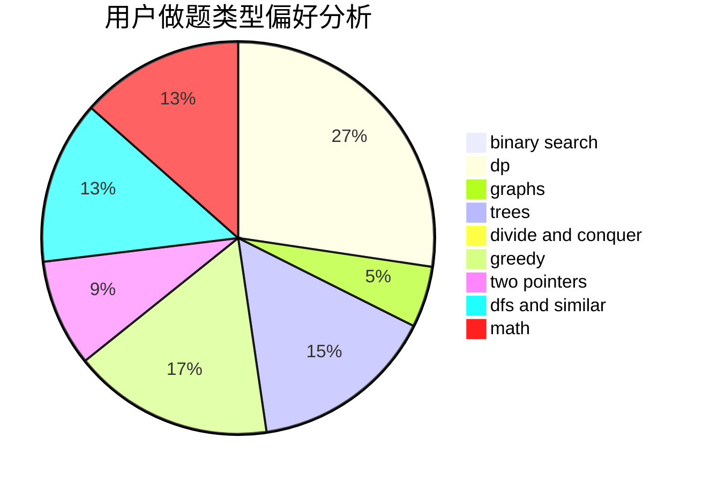

# liuyubobobo

<!-- tabs:start -->

#### **用户提交结果分析**

#### **用户做题类型偏好分析**

<!-- tabs:end -->
# 推荐题目
[691C](https://codeforces.com/contest/691/problem/C)
[716B](https://codeforces.com/contest/716/problem/B)
[750H](https://codeforces.com/contest/750/problem/H)
[631A](https://codeforces.com/contest/631/problem/A)
[740D](https://codeforces.com/contest/740/problem/D)
[1336D](https://codeforces.com/contest/1336/problem/D)
[626F](https://codeforces.com/contest/626/problem/F)
[956A](https://codeforces.com/contest/956/problem/A)
[1325B](https://codeforces.com/contest/1325/problem/B)
[1093G](https://codeforces.com/contest/1093/problem/G)
