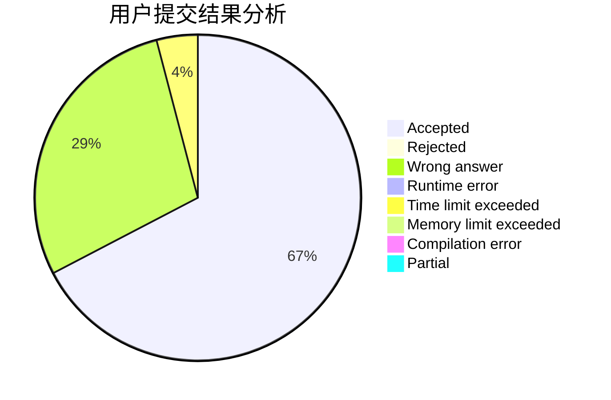
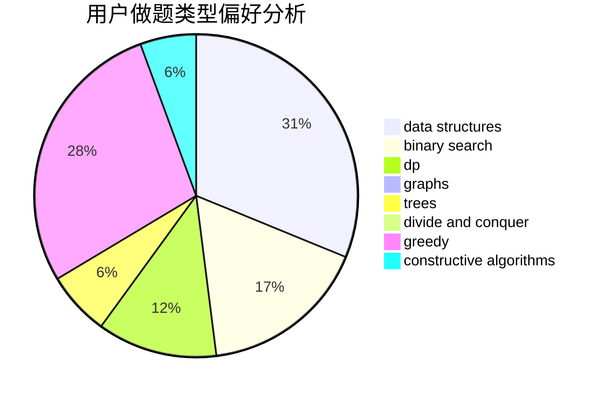
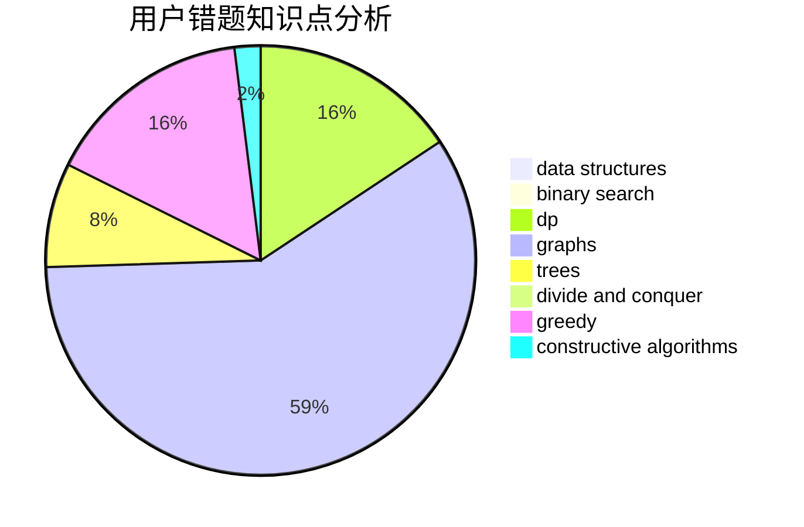

# living_for_nothing

<!-- tabs:start -->

#### **用户提交结果分析**

#### **用户做题类型偏好分析**

#### **用户错题知识点分析**

<!-- tabs:end -->
# 推荐题目
[1061F](https://codeforces.com/contest/1061/problem/F)		interactive,
                        probabilities		  
[1059A](https://codeforces.com/contest/1059/problem/A)		implementation		  
[519B](https://codeforces.com/contest/519/problem/B)		data structures,
                        implementation,
                        sortings		  
[1053B](https://codeforces.com/contest/1053/problem/B)		dsu,graphs,sortings,trees		  
[127A](https://codeforces.com/contest/127/problem/A)		geometry		  
[175B](https://codeforces.com/contest/175/problem/B)		implementation		  
[1228E](https://codeforces.com/contest/1228/problem/E)		combinatorics,
                        dp,
                        math		  
[1121B](https://codeforces.com/contest/1121/problem/B)		brute force,
                        implementation		  
[1256F](https://codeforces.com/contest/1256/problem/F)		constructive algorithms,
                        sortings,
                        strings		  
[13711](https://codeforces.com/contest/1371/problem/1)		dsu,graphs,sortings,trees		  
