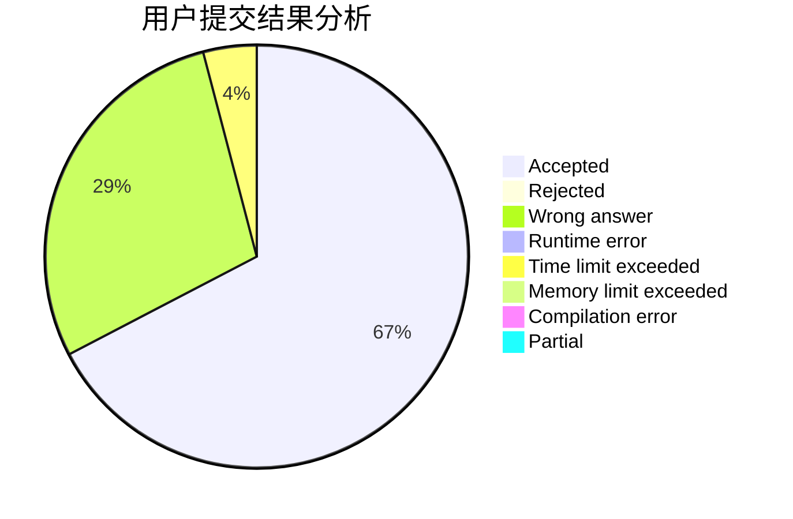
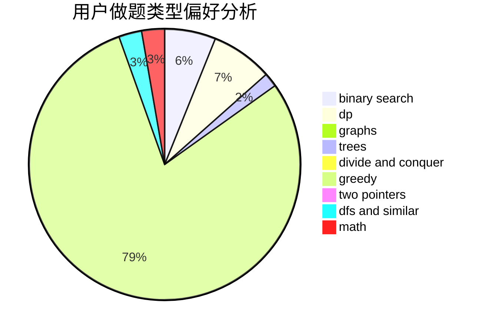

# living_for_nothing

<!-- tabs:start -->

#### **用户提交结果分析**

#### **用户做题类型偏好分析**

<!-- tabs:end -->
# 推荐题目
[1061F](https://codeforces.com/contest/1061/problem/F)
[1059A](https://codeforces.com/contest/1059/problem/A)
[519B](https://codeforces.com/contest/519/problem/B)
[1053B](https://codeforces.com/contest/1053/problem/B)
[127A](https://codeforces.com/contest/127/problem/A)
[175B](https://codeforces.com/contest/175/problem/B)
[1228E](https://codeforces.com/contest/1228/problem/E)
[1121B](https://codeforces.com/contest/1121/problem/B)
[1256F](https://codeforces.com/contest/1256/problem/F)
[13711](https://codeforces.com/contest/1371/problem/1)
