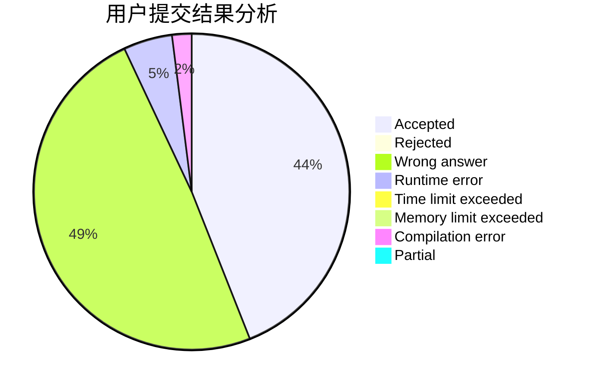
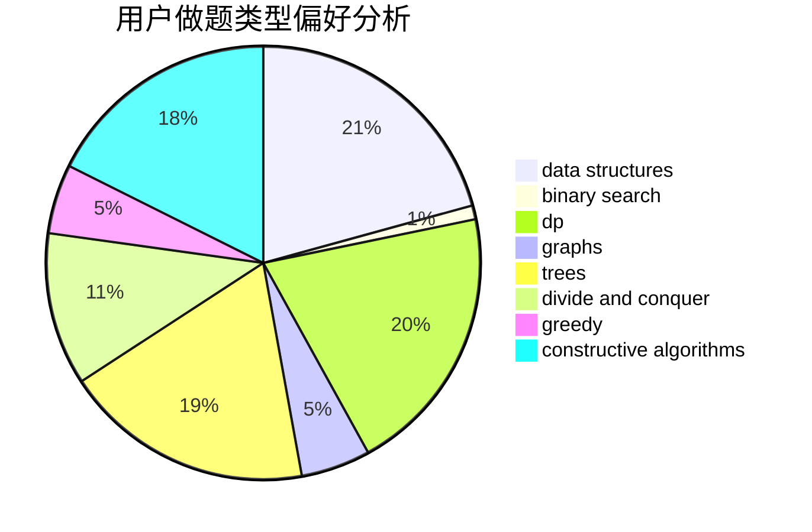
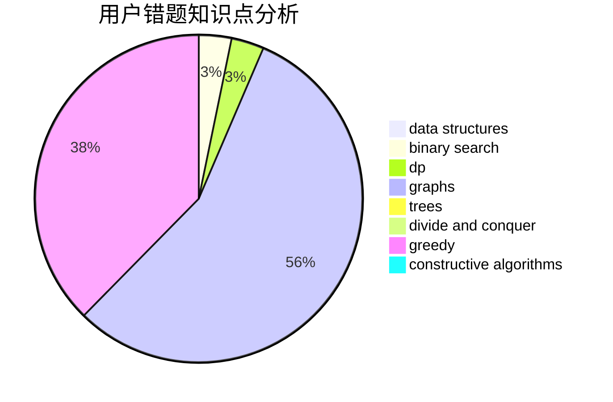

# lixingrui

<!-- tabs:start -->

#### **用户提交结果分析**

#### **用户做题类型偏好分析**

#### **用户错题知识点分析**

<!-- tabs:end -->
# 推荐题目
[1087C](https://codeforces.com/contest/1087/problem/C)		dsu,graphs,sortings,trees		  
[898C](https://codeforces.com/contest/898/problem/C)		implementation,
                        strings		  
[1063F](https://codeforces.com/contest/1063/problem/F)		data structures,
                        dp,
                        string suffix structures		  
[218C](https://codeforces.com/contest/218/problem/C)		dsu,graphs,sortings,trees		  
[712C](https://codeforces.com/contest/712/problem/C)		greedy,
                        math		  
[300B](https://codeforces.com/contest/300/problem/B)		brute force,
                        dfs and similar,
                        graphs		  
[761F](https://codeforces.com/contest/761/problem/F)		brute force,
                        data structures,
                        dp,
                        implementation		  
[833B](https://codeforces.com/contest/833/problem/B)		binary search,
                        data structures,
                        divide and conquer,
                        dp,
                        two pointers		  
[994A](https://codeforces.com/contest/994/problem/A)		implementation		  
[702F](https://codeforces.com/contest/702/problem/F)		data structures		  
