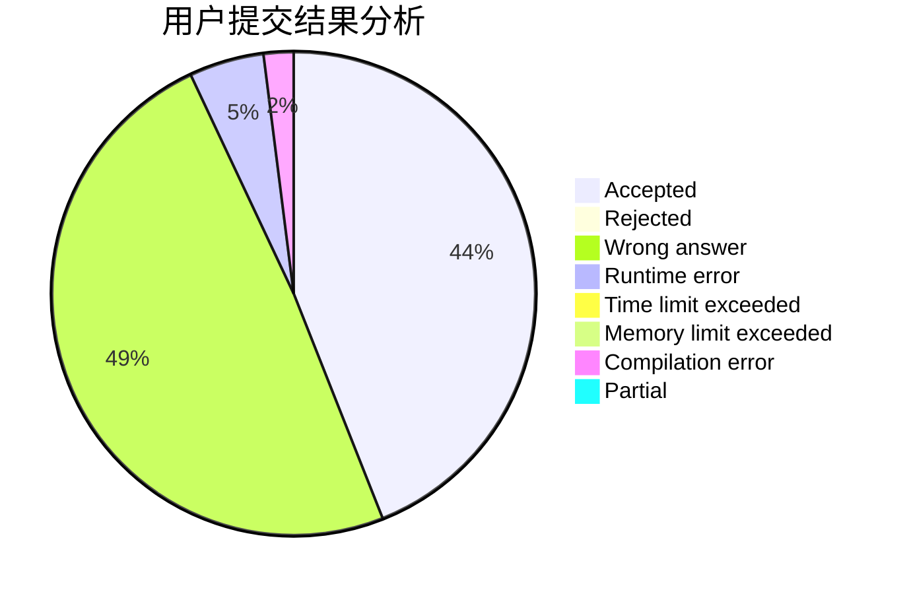
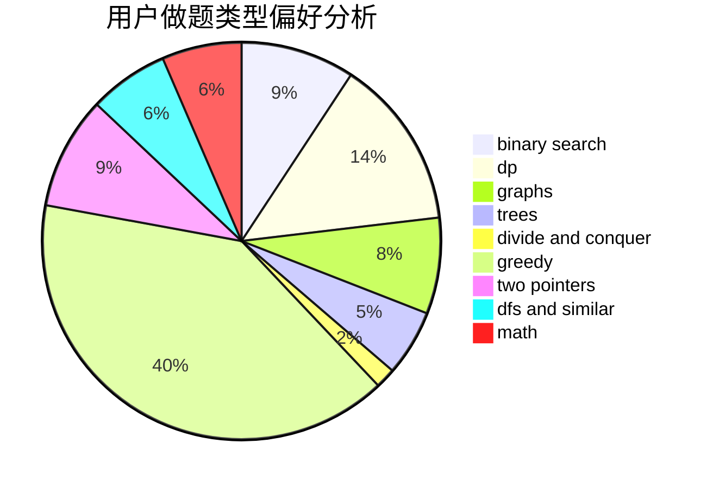

# lixingrui

<!-- tabs:start -->

#### **用户提交结果分析**

#### **用户做题类型偏好分析**

<!-- tabs:end -->
# 推荐题目
[1087C](https://codeforces.com/contest/1087/problem/C)
[898C](https://codeforces.com/contest/898/problem/C)
[1063F](https://codeforces.com/contest/1063/problem/F)
[218C](https://codeforces.com/contest/218/problem/C)
[712C](https://codeforces.com/contest/712/problem/C)
[300B](https://codeforces.com/contest/300/problem/B)
[761F](https://codeforces.com/contest/761/problem/F)
[833B](https://codeforces.com/contest/833/problem/B)
[994A](https://codeforces.com/contest/994/problem/A)
[702F](https://codeforces.com/contest/702/problem/F)
