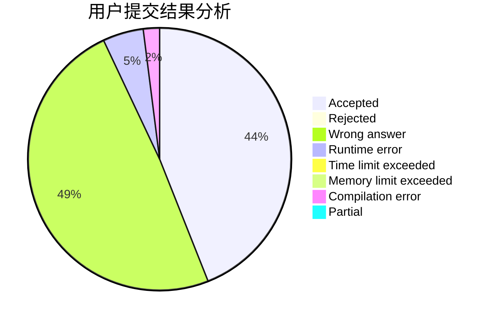
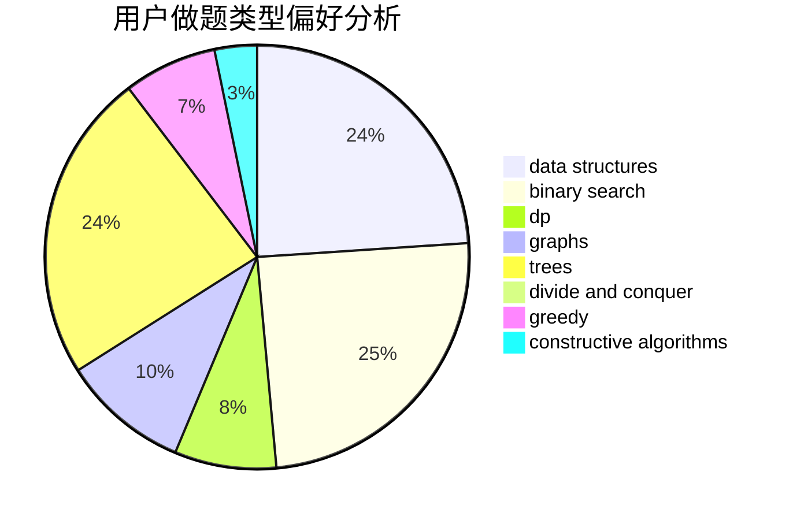
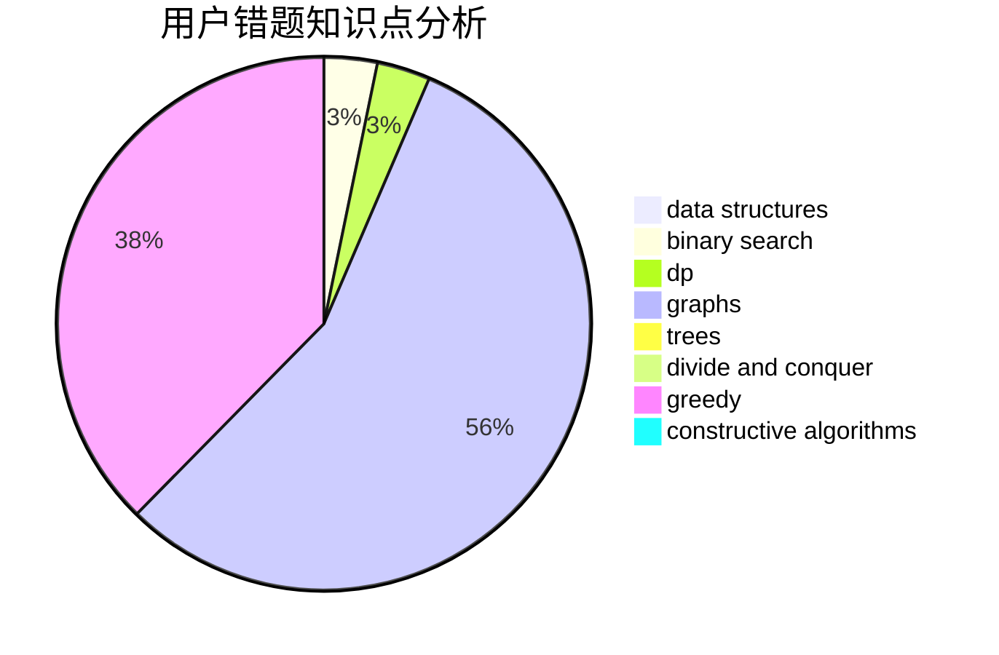

# lixingrui

<!-- tabs:start -->

#### **用户提交结果分析**

#### **用户做题类型偏好分析**

#### **用户错题知识点分析**

<!-- tabs:end -->
# 推荐题目
[1086E](https://codeforces.com/contest/1086/problem/E)		dsu,graphs,sortings,trees		  
[877D](https://codeforces.com/contest/877/problem/D)		data structures,
                        dfs and similar,
                        graphs,
                        shortest paths		  
[1063C](https://codeforces.com/contest/1063/problem/C)		binary search,
                        constructive algorithms,
                        geometry,
                        interactive		  
[195C](https://codeforces.com/contest/195/problem/C)		expression parsing,
                        implementation		  
[696A](https://codeforces.com/contest/696/problem/A)		brute force,
                        data structures,
                        implementation,
                        trees		  
[286A](https://codeforces.com/contest/286/problem/A)		constructive algorithms,
                        math		  
[740D](https://codeforces.com/contest/740/problem/D)		dsu,graphs,sortings,trees		  
[814D](https://codeforces.com/contest/814/problem/D)		dfs and similar,
                        dp,
                        geometry,
                        greedy,
                        trees		  
[97A](https://codeforces.com/contest/97/problem/A)		brute force,
                        implementation		  
[679A](https://codeforces.com/contest/679/problem/A)		constructive algorithms,
                        interactive,
                        math		  
