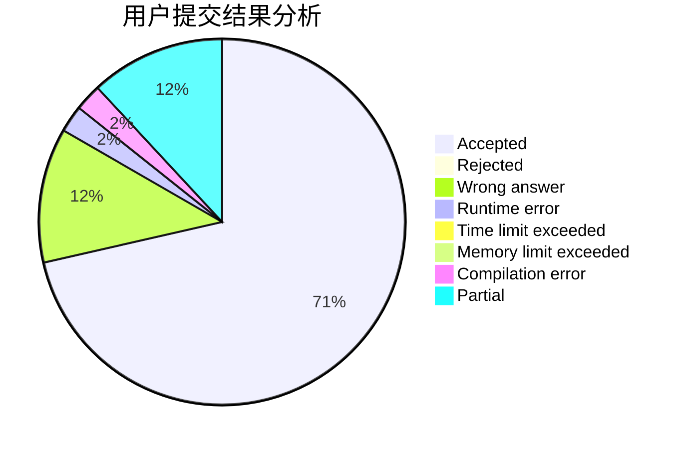
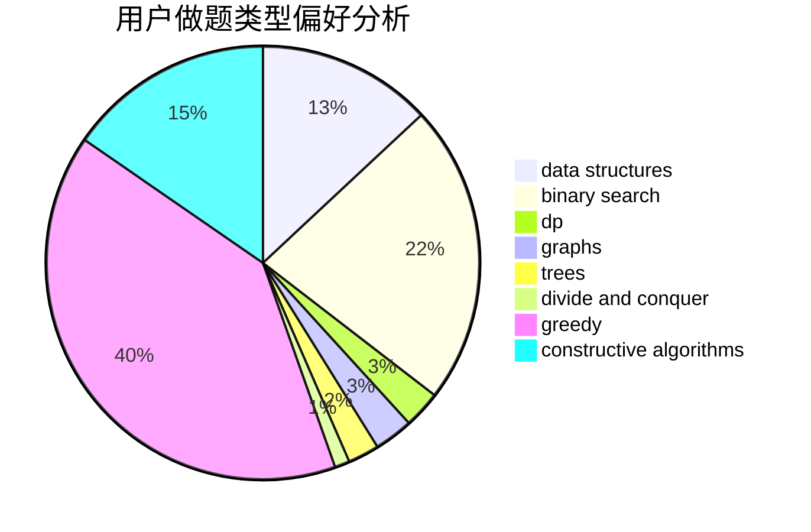

# BilyHurington2

<!-- tabs:start -->

#### **用户提交结果分析**

#### **用户做题类型偏好分析**

#### **用户错题知识点分析**

<!-- tabs:end -->
# 推荐题目
[1426F](https://codeforces.com/contest/1426/problem/F)		combinatorics,
                        dp,
                        strings		  
[53E](https://codeforces.com/contest/53/problem/E)		bitmasks,
                        dp		  
[1295F](https://codeforces.com/contest/1295/problem/F)		combinatorics,
                        dp,
                        probabilities		  
[1007A](https://codeforces.com/contest/1007/problem/A)		combinatorics,
                        data structures,
                        math,
                        sortings,
                        two pointers		  
[101D](https://codeforces.com/contest/101/problem/D)		dp,
                        greedy,
                        probabilities,
                        sortings,
                        trees		  
[538C](https://codeforces.com/contest/538/problem/C)		binary search,
                        brute force,
                        greedy,
                        implementation,
                        math		  
[538H](https://codeforces.com/contest/538/problem/H)		2-sat,
                        data structures,
                        dfs and similar,
                        greedy		  
[53D](https://codeforces.com/contest/53/problem/D)		sortings		  
[1009F](https://codeforces.com/contest/1009/problem/F)		data structures,
                        dsu,
                        trees		  
[1006A](https://codeforces.com/contest/1006/problem/A)		implementation		  
