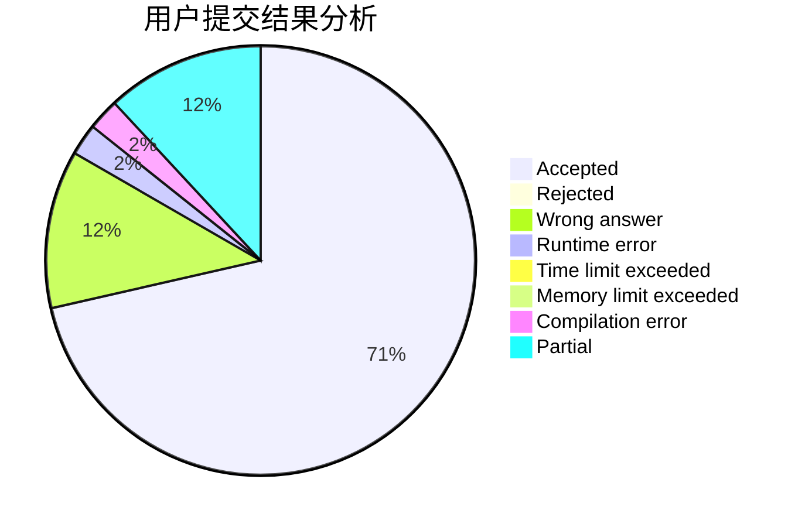
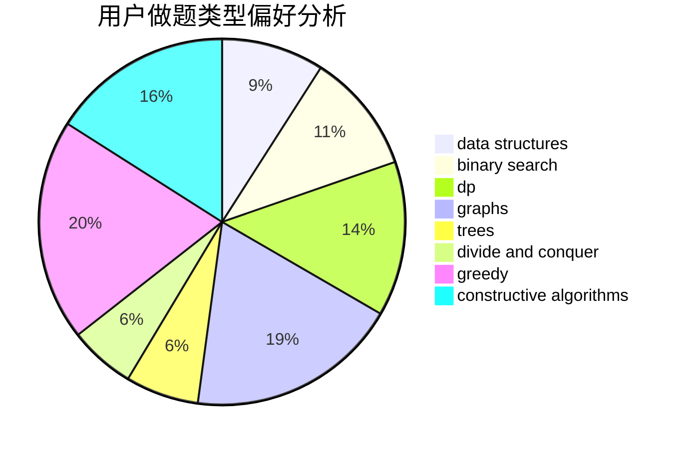

# BilyHurington2

<!-- tabs:start -->

#### **用户提交结果分析**

#### **用户做题类型偏好分析**

#### **用户错题知识点分析**

<!-- tabs:end -->
# 推荐题目
[1435C](https://codeforces.com/contest/1435/problem/C)		dsu,graphs,sortings,trees		  
[560E](https://codeforces.com/contest/560/problem/E)		dsu,graphs,sortings,trees		  
[1303B](https://codeforces.com/contest/1303/problem/B)		math		  
[1007E](https://codeforces.com/contest/1007/problem/E)		dp		  
[1020C](https://codeforces.com/contest/1020/problem/C)		dsu,graphs,sortings,trees		  
[559D](https://codeforces.com/contest/559/problem/D)		combinatorics,
                        geometry,
                        probabilities		  
[55C](https://codeforces.com/contest/55/problem/C)		games		  
[560A](https://codeforces.com/contest/560/problem/A)		implementation,
                        sortings		  
[1010A](https://codeforces.com/contest/1010/problem/A)		binary search,
                        math		  
[1006D](https://codeforces.com/contest/1006/problem/D)		implementation		  
