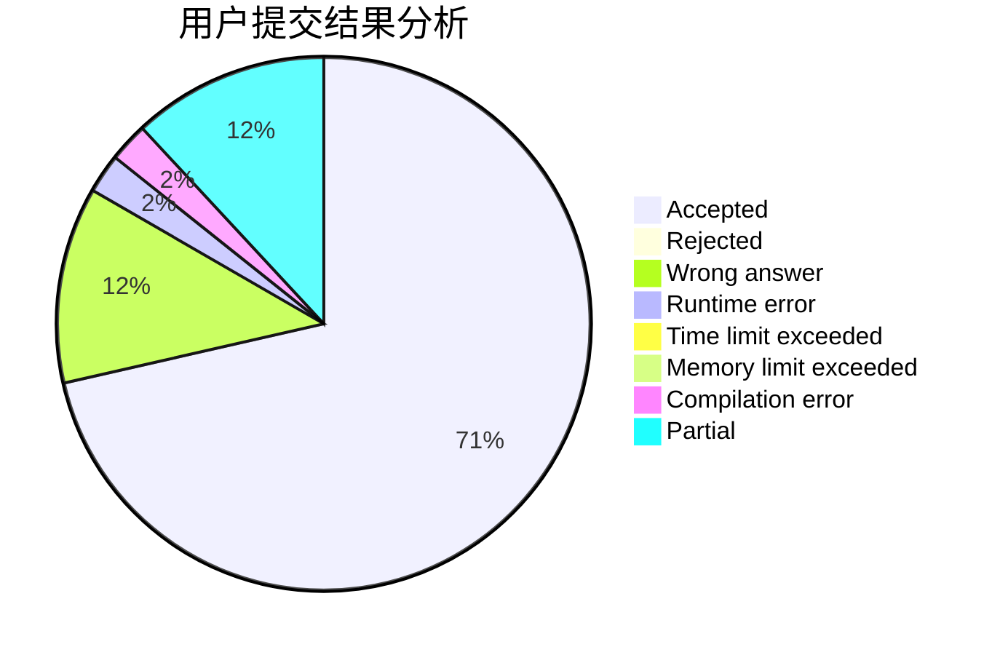
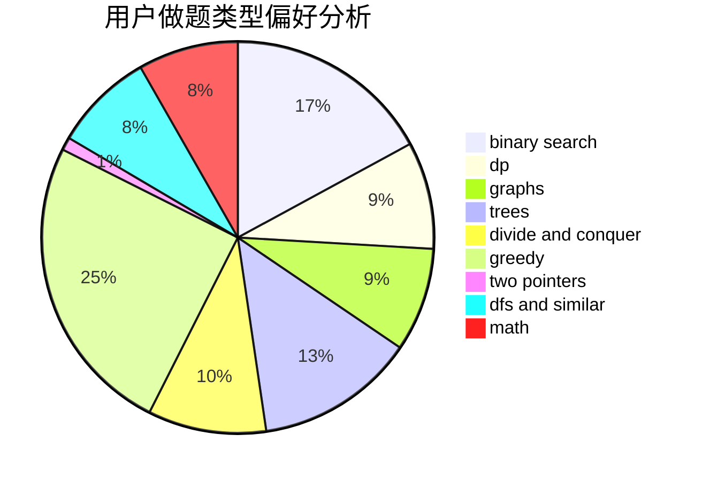

# BilyHurington2

<!-- tabs:start -->

#### **用户提交结果分析**

#### **用户做题类型偏好分析**

<!-- tabs:end -->
# 推荐题目
[1435C](https://codeforces.com/contest/1435/problem/C)
[560E](https://codeforces.com/contest/560/problem/E)
[1303B](https://codeforces.com/contest/1303/problem/B)
[1007E](https://codeforces.com/contest/1007/problem/E)
[1020C](https://codeforces.com/contest/1020/problem/C)
[559D](https://codeforces.com/contest/559/problem/D)
[55C](https://codeforces.com/contest/55/problem/C)
[560A](https://codeforces.com/contest/560/problem/A)
[1010A](https://codeforces.com/contest/1010/problem/A)
[1006D](https://codeforces.com/contest/1006/problem/D)
