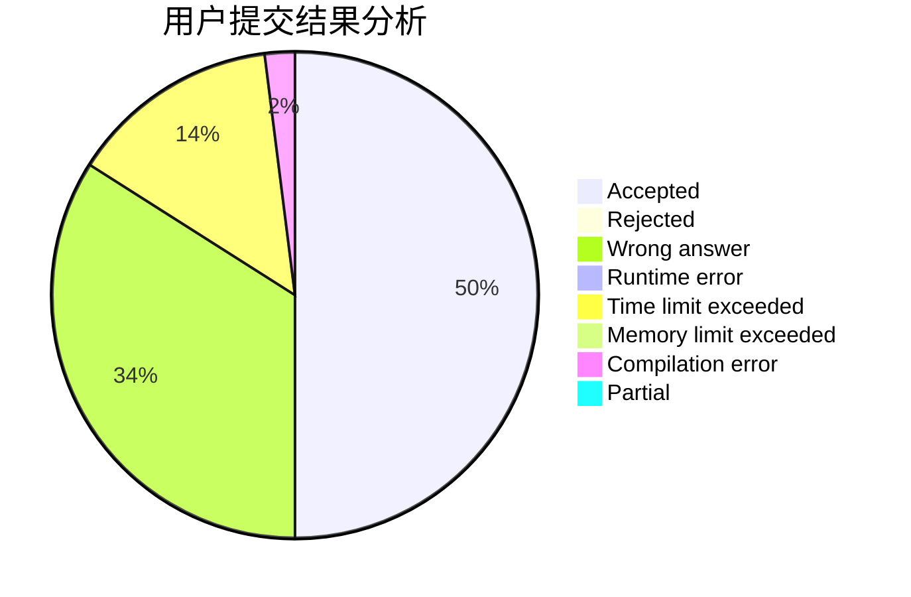
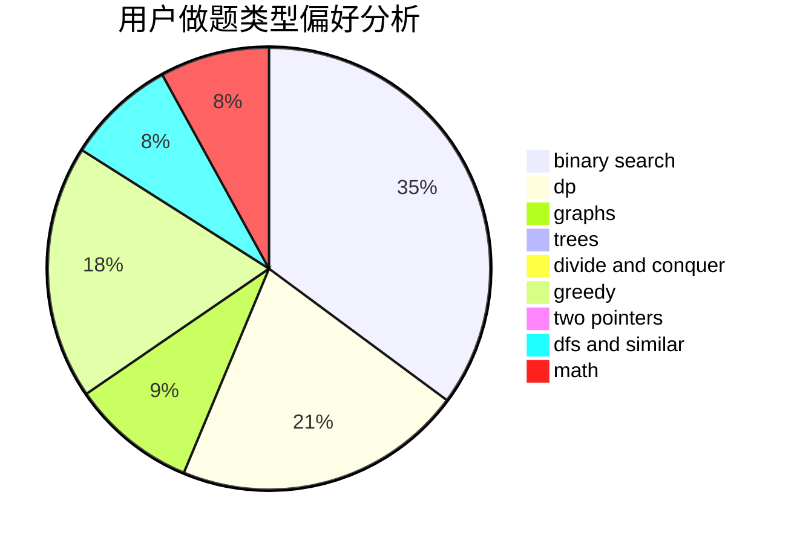

# liyuankai

<!-- tabs:start -->

#### **用户提交结果分析**

#### **用户做题类型偏好分析**

<!-- tabs:end -->
# 推荐题目
[1298D](https://codeforces.com/contest/1298/problem/D)
[353D](https://codeforces.com/contest/353/problem/D)
[63C](https://codeforces.com/contest/63/problem/C)
[975A](https://codeforces.com/contest/975/problem/A)
[348A](https://codeforces.com/contest/348/problem/A)
[1510H](https://codeforces.com/contest/1510/problem/H)
[1280E](https://codeforces.com/contest/1280/problem/E)
[822E](https://codeforces.com/contest/822/problem/E)
[788C](https://codeforces.com/contest/788/problem/C)
[1242B](https://codeforces.com/contest/1242/problem/B)
