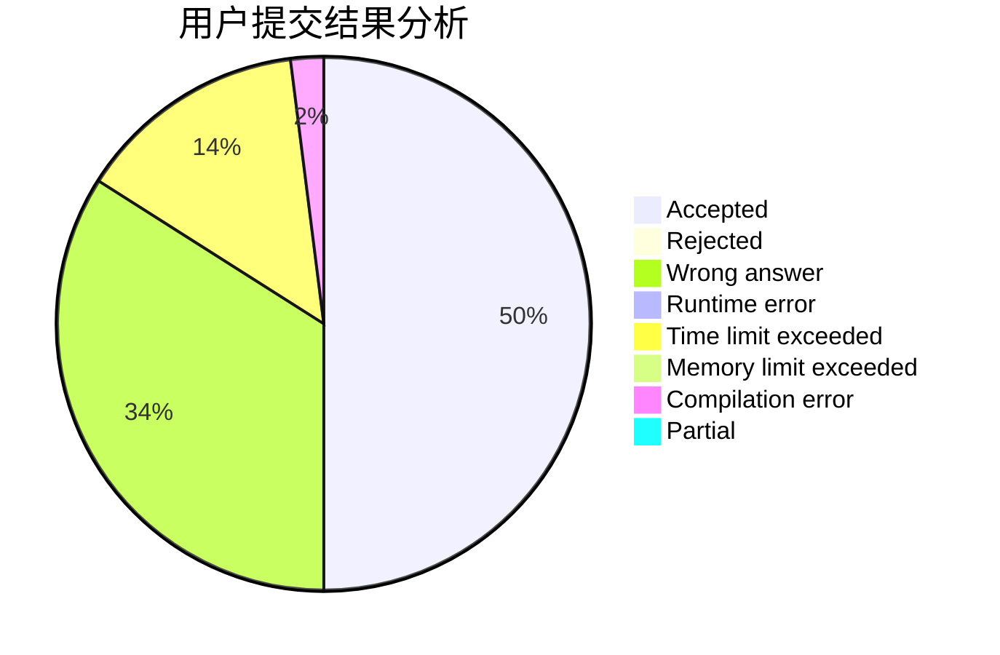
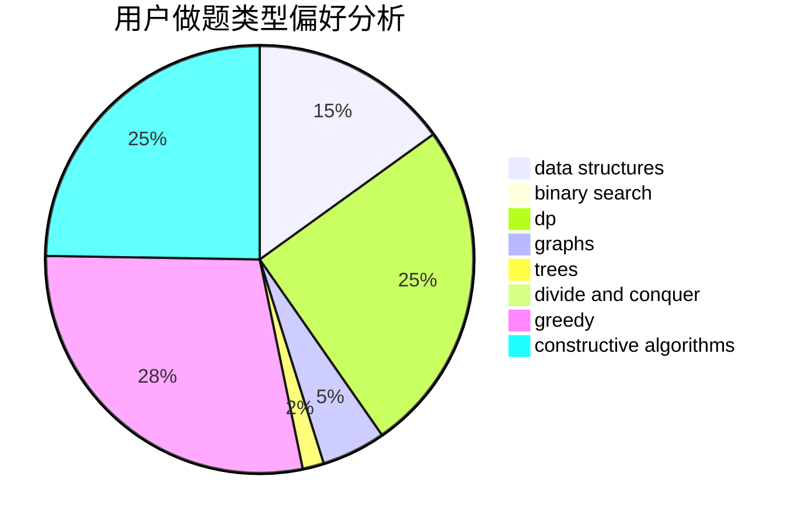
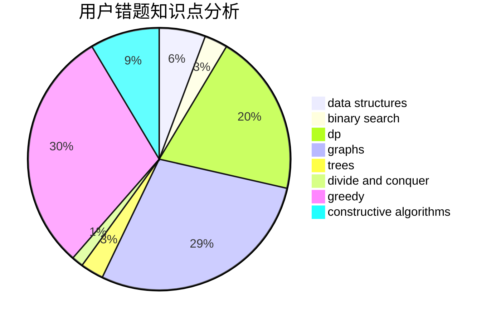

# liyuankai

<!-- tabs:start -->

#### **用户提交结果分析**

#### **用户做题类型偏好分析**

#### **用户错题知识点分析**

<!-- tabs:end -->
# 推荐题目
[1298D](https://codeforces.com/contest/1298/problem/D)		dsu,graphs,sortings,trees		  
[353D](https://codeforces.com/contest/353/problem/D)		constructive algorithms,
                        dp		  
[63C](https://codeforces.com/contest/63/problem/C)		brute force,
                        implementation		  
[975A](https://codeforces.com/contest/975/problem/A)		implementation,
                        strings		  
[348A](https://codeforces.com/contest/348/problem/A)		binary search,
                        math,
                        sortings		  
[1510H](https://codeforces.com/contest/1510/problem/H)		dp		  
[1280E](https://codeforces.com/contest/1280/problem/E)		math		  
[822E](https://codeforces.com/contest/822/problem/E)		binary search,
                        dp,
                        hashing,
                        string suffix structures		  
[788C](https://codeforces.com/contest/788/problem/C)		dfs and similar,
                        graphs,
                        shortest paths		  
[1242B](https://codeforces.com/contest/1242/problem/B)		dfs and similar,
                        dsu,
                        graphs,
                        sortings		  
