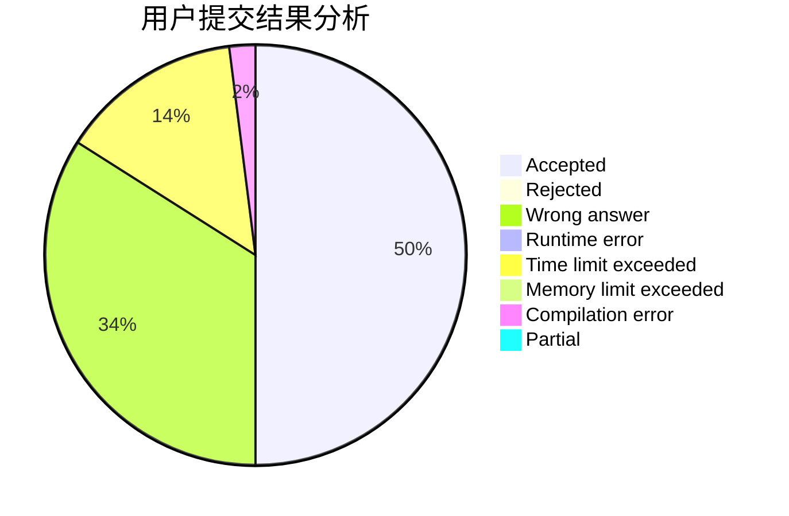
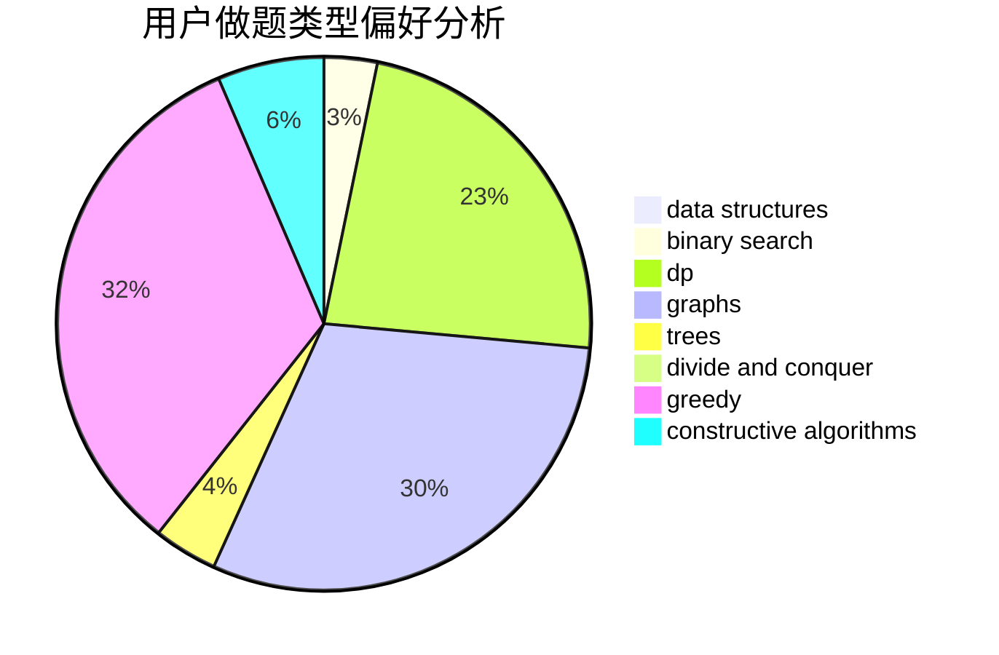
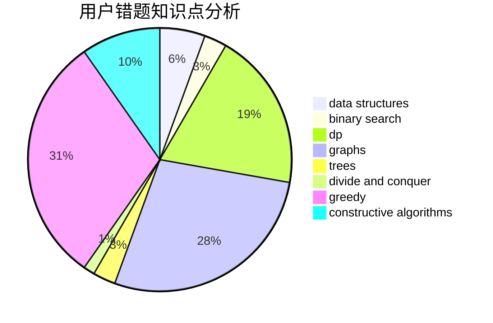

# liyuankai

<!-- tabs:start -->

#### **用户提交结果分析**

#### **用户做题类型偏好分析**

#### **用户错题知识点分析**

<!-- tabs:end -->
# 推荐题目
[1291E](https://codeforces.com/contest/1291/problem/E)		dsu,graphs,sortings,trees		  
[321E](https://codeforces.com/contest/321/problem/E)		data structures,
                        divide and conquer,
                        dp		  
[61A](https://codeforces.com/contest/61/problem/A)		implementation		  
[952B](https://codeforces.com/contest/952/problem/B)		brute force,
                        interactive		  
[317E](https://codeforces.com/contest/317/problem/E)		constructive algorithms,
                        shortest paths		  
[1500B](https://codeforces.com/contest/1500/problem/B)		binary search,
                        brute force,
                        chinese remainder theorem,
                        math,
                        number theory		  
[1271C](https://codeforces.com/contest/1271/problem/C)		brute force,
                        geometry,
                        greedy,
                        implementation		  
[807E](https://codeforces.com/contest/807/problem/E)		dsu,graphs,sortings,trees		  
[768D](https://codeforces.com/contest/768/problem/D)		dp,
                        math,
                        probabilities		  
[1237D](https://codeforces.com/contest/1237/problem/D)		binary search,
                        data structures,
                        implementation		  
