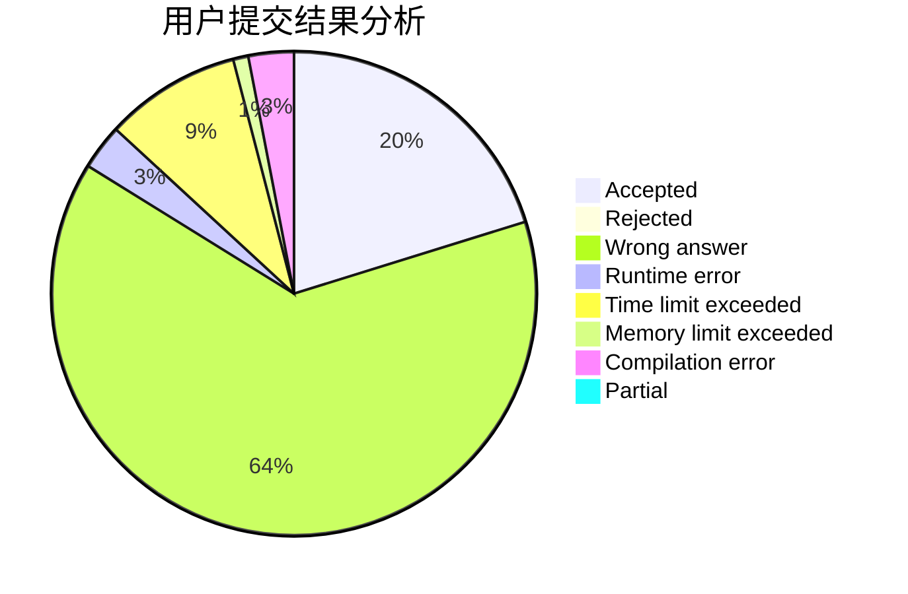
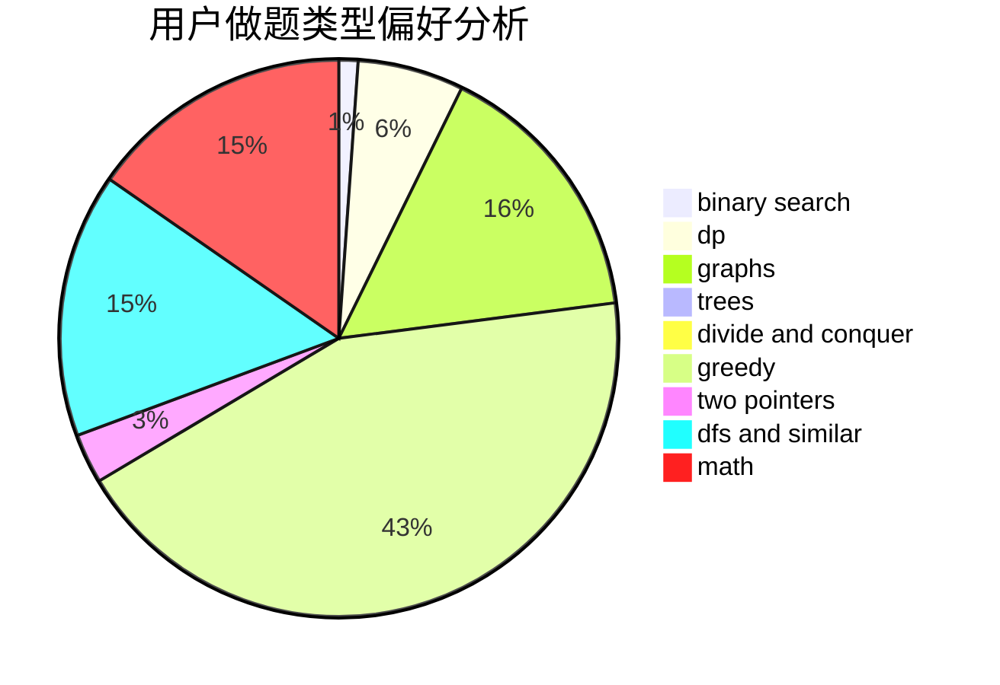

# liyunfan1223

<!-- tabs:start -->

#### **用户提交结果分析**

#### **用户做题类型偏好分析**

<!-- tabs:end -->
# 推荐题目
[709E](https://codeforces.com/contest/709/problem/E)
[962A](https://codeforces.com/contest/962/problem/A)
[749C](https://codeforces.com/contest/749/problem/C)
[1147A](https://codeforces.com/contest/1147/problem/A)
[925C](https://codeforces.com/contest/925/problem/C)
[1423C](https://codeforces.com/contest/1423/problem/C)
[424B](https://codeforces.com/contest/424/problem/B)
[445C](https://codeforces.com/contest/445/problem/C)
[1147E](https://codeforces.com/contest/1147/problem/E)
[662E](https://codeforces.com/contest/662/problem/E)
