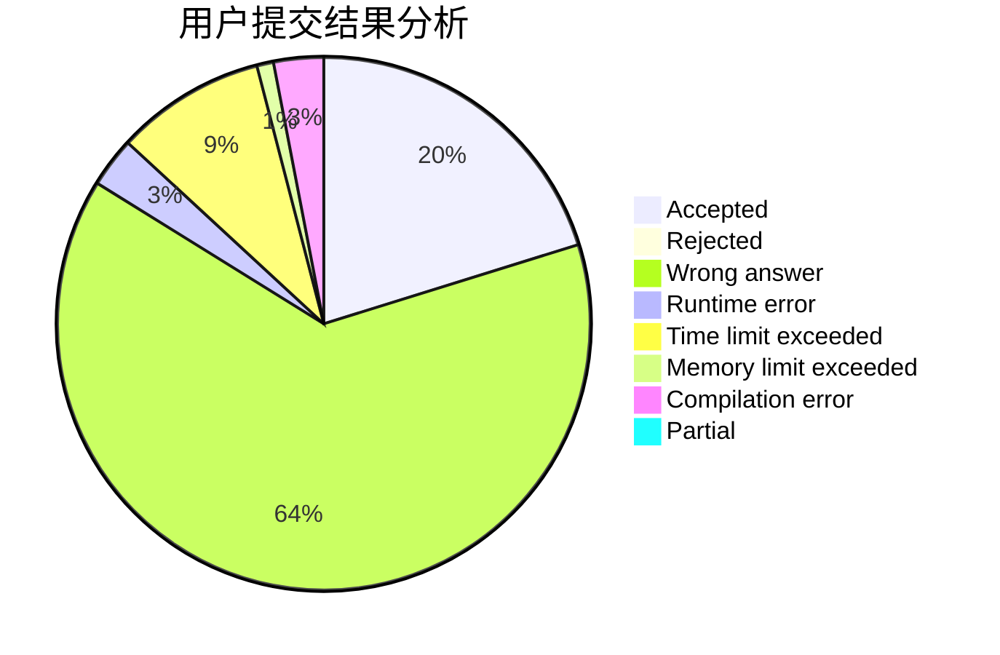
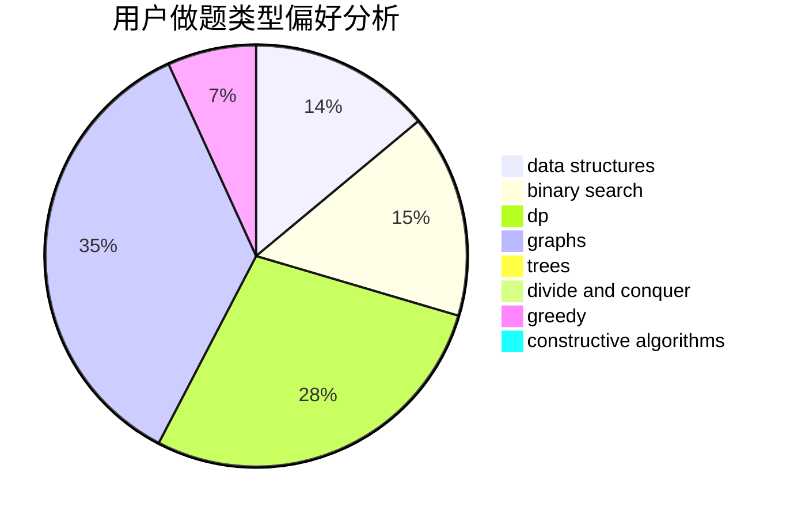
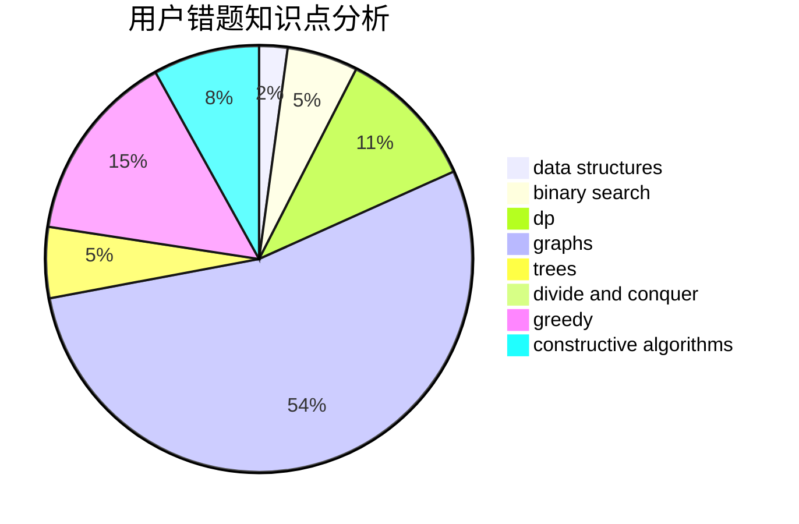

# liyunfan1223

<!-- tabs:start -->

#### **用户提交结果分析**

#### **用户做题类型偏好分析**

#### **用户错题知识点分析**

<!-- tabs:end -->
# 推荐题目
[689A](https://codeforces.com/contest/689/problem/A)		brute force,
                        constructive algorithms,
                        implementation		  
[940D](https://codeforces.com/contest/940/problem/D)		binary search,
                        implementation		  
[731B](https://codeforces.com/contest/731/problem/B)		constructive algorithms,
                        greedy		  
[1144G](https://codeforces.com/contest/1144/problem/G)		dp,
                        greedy		  
[910A](https://codeforces.com/contest/910/problem/A)		dfs and similar,
                        dp,
                        greedy,
                        implementation		  
[1413F](https://codeforces.com/contest/1413/problem/F)		data structures,
                        trees		  
[396C](https://codeforces.com/contest/396/problem/C)		data structures,
                        graphs,
                        trees		  
[41E](https://codeforces.com/contest/41/problem/E)		constructive algorithms,
                        graphs,
                        greedy		  
[1145D](https://codeforces.com/contest/1145/problem/D)		implementation		  
[632B](https://codeforces.com/contest/632/problem/B)		brute force,
                        constructive algorithms		  
