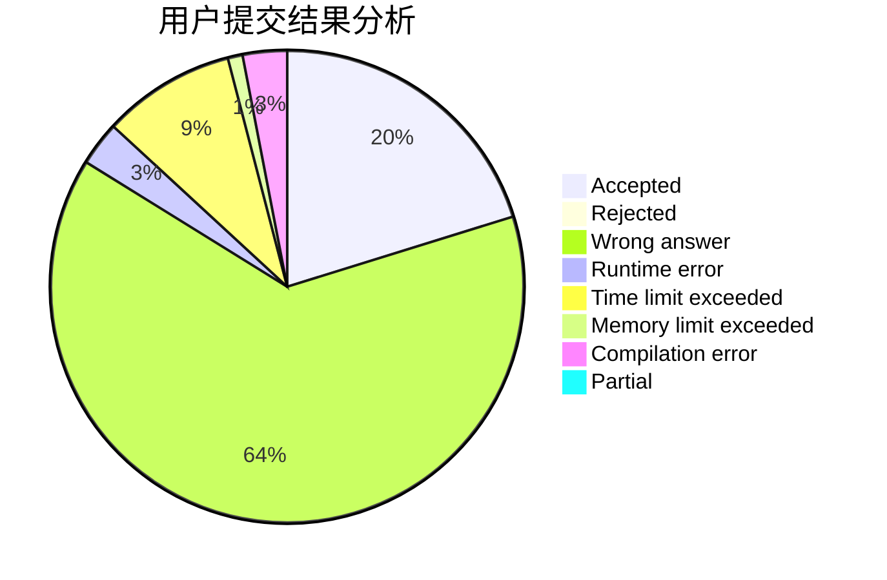
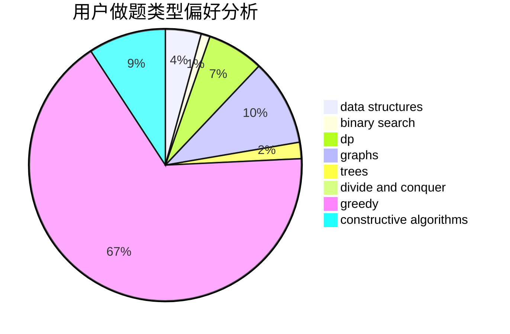
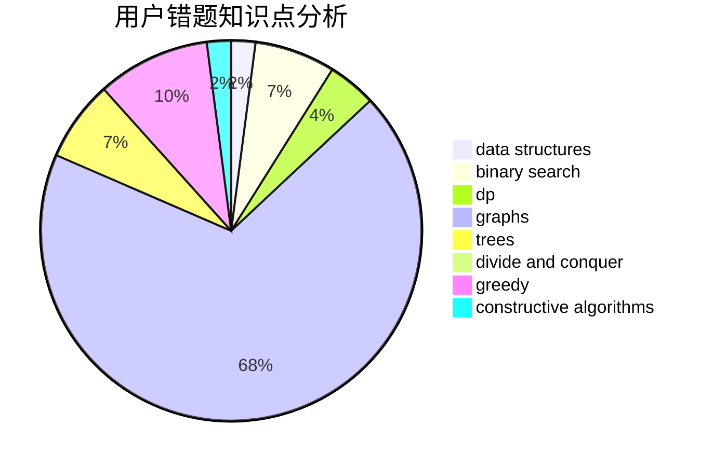

# liyunfan1223

<!-- tabs:start -->

#### **用户提交结果分析**

#### **用户做题类型偏好分析**

#### **用户错题知识点分析**

<!-- tabs:end -->
# 推荐题目
[709E](https://codeforces.com/contest/709/problem/E)		dsu,graphs,sortings,trees		  
[962A](https://codeforces.com/contest/962/problem/A)		implementation		  
[749C](https://codeforces.com/contest/749/problem/C)		greedy,
                        implementation,
                        two pointers		  
[1147A](https://codeforces.com/contest/1147/problem/A)		graphs		  
[925C](https://codeforces.com/contest/925/problem/C)		constructive algorithms,
                        math		  
[1423C](https://codeforces.com/contest/1423/problem/C)		divide and conquer,
                        graphs,
                        trees		  
[424B](https://codeforces.com/contest/424/problem/B)		binary search,
                        greedy,
                        implementation,
                        sortings		  
[445C](https://codeforces.com/contest/445/problem/C)		dsu,graphs,sortings,trees		  
[1147E](https://codeforces.com/contest/1147/problem/E)		interactive		  
[662E](https://codeforces.com/contest/662/problem/E)		brute force,
                        dp,
                        greedy		  
