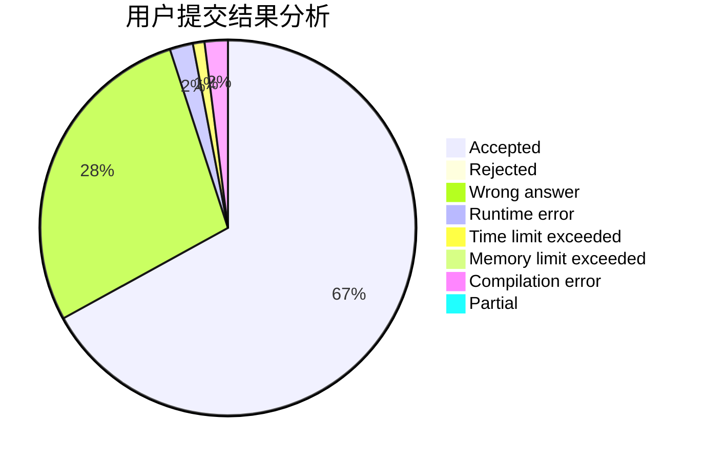
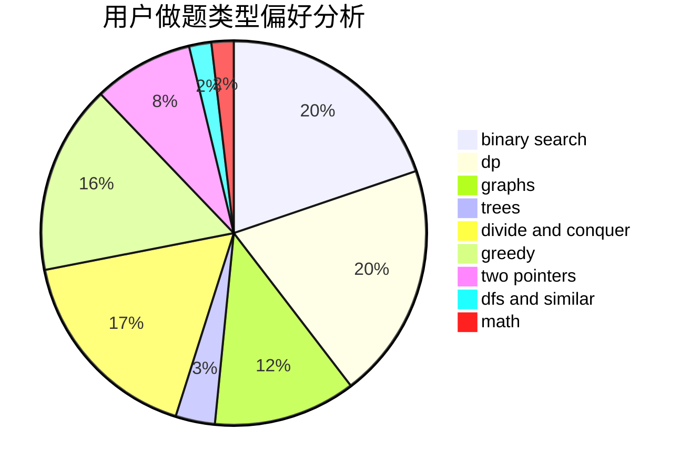

# lizhijian

<!-- tabs:start -->

#### **用户提交结果分析**

#### **用户做题类型偏好分析**

<!-- tabs:end -->
# 推荐题目
[555C](https://codeforces.com/contest/555/problem/C)
[1500D](https://codeforces.com/contest/1500/problem/D)
[671A](https://codeforces.com/contest/671/problem/A)
[1291B](https://codeforces.com/contest/1291/problem/B)
[840D](https://codeforces.com/contest/840/problem/D)
[755G](https://codeforces.com/contest/755/problem/G)
[434B](https://codeforces.com/contest/434/problem/B)
[1161A](https://codeforces.com/contest/1161/problem/A)
[851C](https://codeforces.com/contest/851/problem/C)
[721D](https://codeforces.com/contest/721/problem/D)
