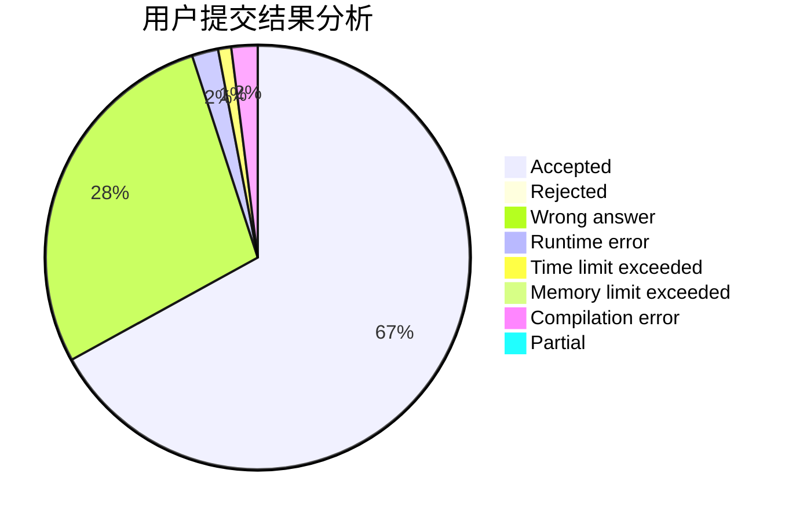
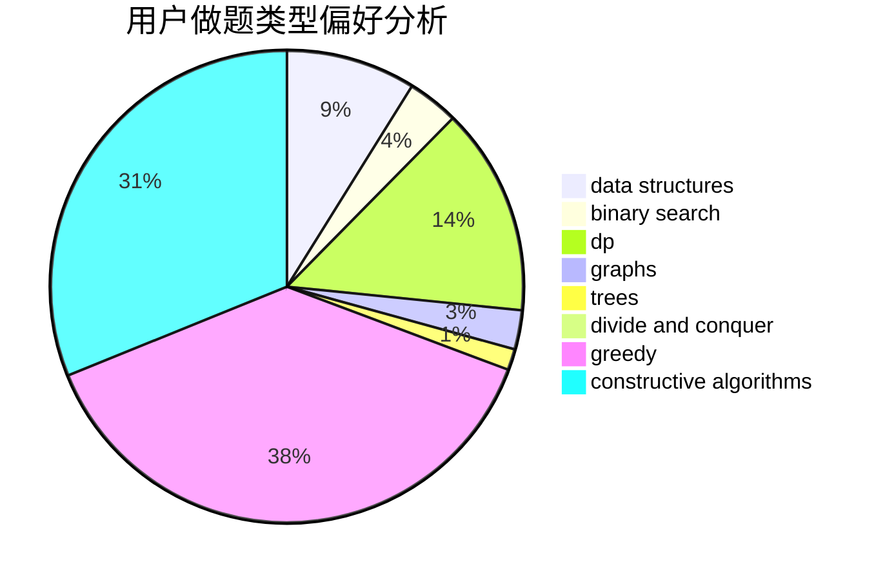
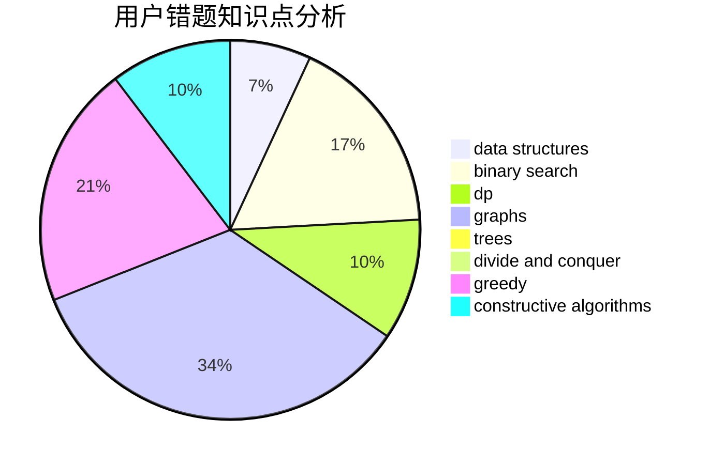

# lizhijian

<!-- tabs:start -->

#### **用户提交结果分析**

#### **用户做题类型偏好分析**

#### **用户错题知识点分析**

<!-- tabs:end -->
# 推荐题目
[533E](https://codeforces.com/contest/533/problem/E)		constructive algorithms,
                        dp,
                        greedy,
                        hashing,
                        strings,
                        two pointers		  
[1492C](https://codeforces.com/contest/1492/problem/C)		binary search,
                        data structures,
                        dp,
                        greedy,
                        two pointers		  
[643G](https://codeforces.com/contest/643/problem/G)		data structures		  
[1284B](https://codeforces.com/contest/1284/problem/B)		binary search,
                        combinatorics,
                        data structures,
                        dp,
                        implementation,
                        sortings		  
[820D](https://codeforces.com/contest/820/problem/D)		dsu,graphs,sortings,trees		  
[735A](https://codeforces.com/contest/735/problem/A)		implementation,
                        strings		  
[405B](https://codeforces.com/contest/405/problem/B)		nan		  
[1158B](https://codeforces.com/contest/1158/problem/B)		constructive algorithms,
                        math,
                        strings		  
[833C](https://codeforces.com/contest/833/problem/C)		brute force,
                        combinatorics,
                        greedy,
                        math		  
[702F](https://codeforces.com/contest/702/problem/F)		data structures		  
