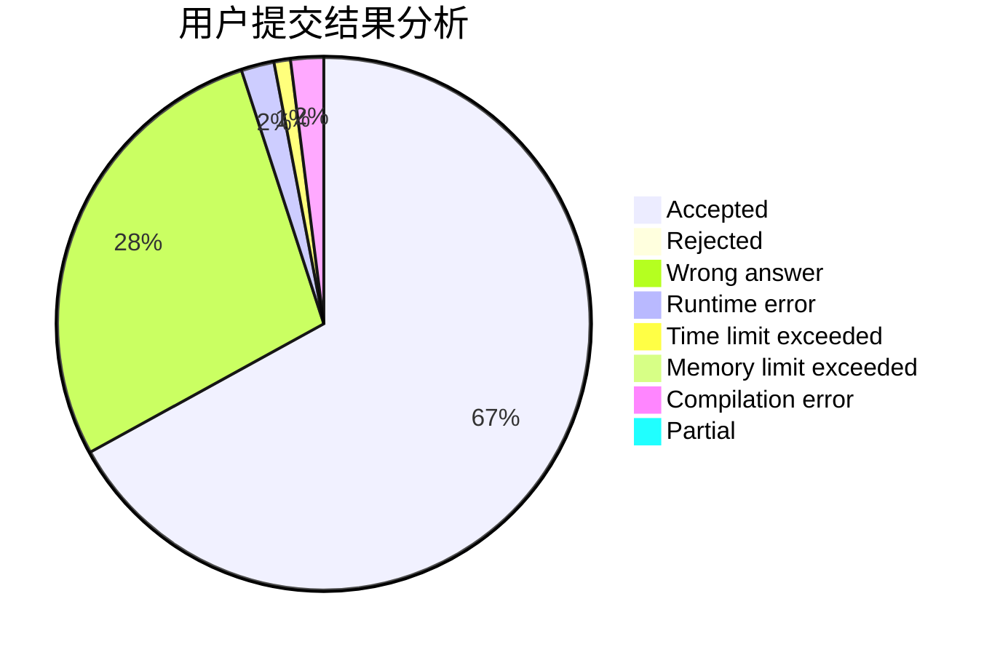
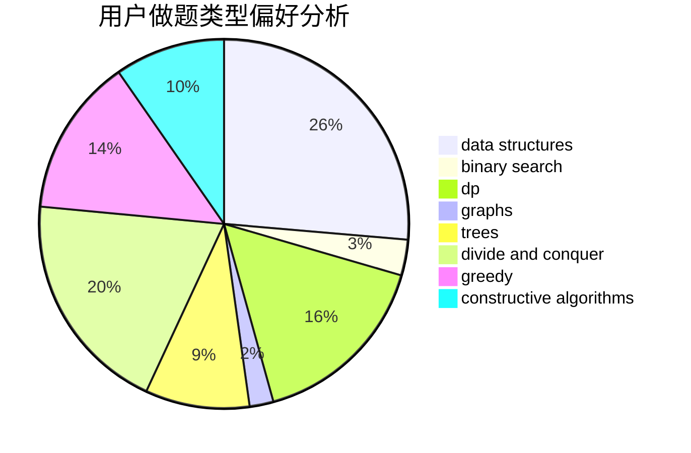

# lizhijian

<!-- tabs:start -->

#### **用户提交结果分析**

#### **用户做题类型偏好分析**

#### **用户错题知识点分析**

<!-- tabs:end -->
# 推荐题目
[555C](https://codeforces.com/contest/555/problem/C)		data structures		  
[1500D](https://codeforces.com/contest/1500/problem/D)		data structures,
                        sortings,
                        two pointers		  
[671A](https://codeforces.com/contest/671/problem/A)		dp,
                        geometry,
                        greedy,
                        implementation		  
[1291B](https://codeforces.com/contest/1291/problem/B)		greedy,
                        implementation		  
[840D](https://codeforces.com/contest/840/problem/D)		data structures,
                        probabilities		  
[755G](https://codeforces.com/contest/755/problem/G)		combinatorics,
                        divide and conquer,
                        dp,
                        fft,
                        math,
                        number theory		  
[434B](https://codeforces.com/contest/434/problem/B)		dsu,graphs,sortings,trees		  
[1161A](https://codeforces.com/contest/1161/problem/A)		dsu,graphs,sortings,trees		  
[851C](https://codeforces.com/contest/851/problem/C)		dsu,graphs,sortings,trees		  
[721D](https://codeforces.com/contest/721/problem/D)		constructive algorithms,
                        data structures,
                        greedy,
                        math		  
