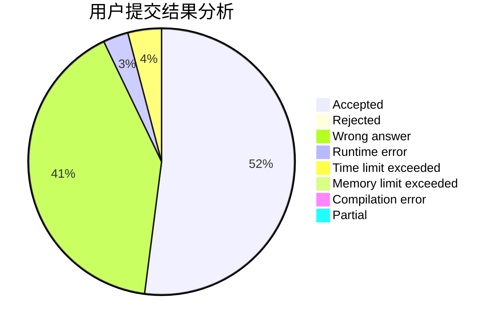
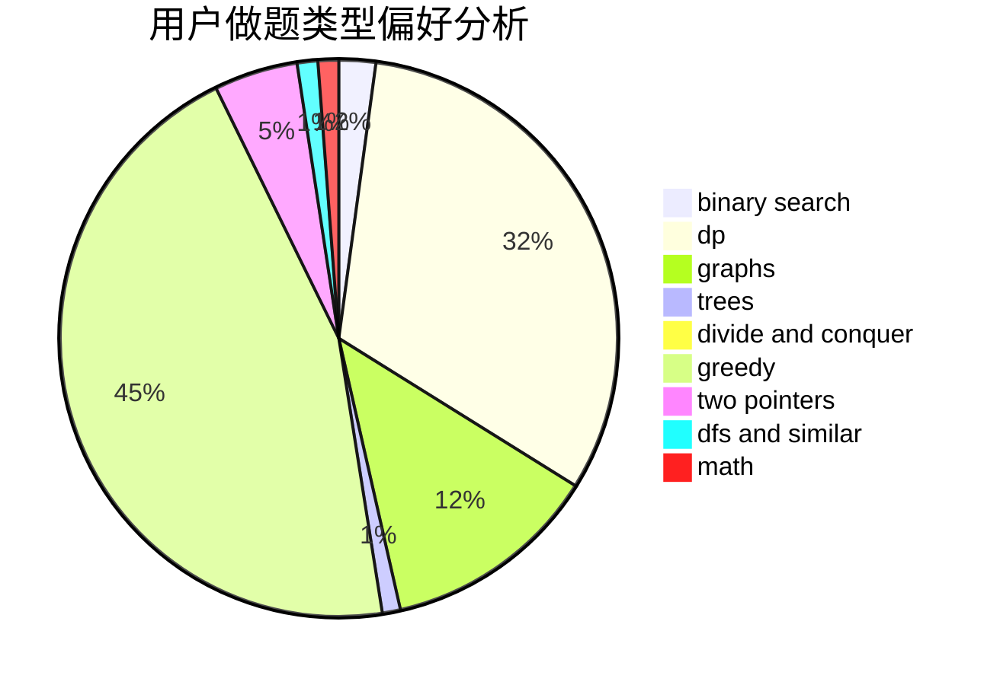

# lizzzzzzzzzz

<!-- tabs:start -->

#### **用户提交结果分析**

#### **用户做题类型偏好分析**

<!-- tabs:end -->
# 推荐题目
[1399F](https://codeforces.com/contest/1399/problem/F)
[543C](https://codeforces.com/contest/543/problem/C)
[877C](https://codeforces.com/contest/877/problem/C)
[1350D](https://codeforces.com/contest/1350/problem/D)
[838F](https://codeforces.com/contest/838/problem/F)
[1023A](https://codeforces.com/contest/1023/problem/A)
[906A](https://codeforces.com/contest/906/problem/A)
[1060D](https://codeforces.com/contest/1060/problem/D)
[856C](https://codeforces.com/contest/856/problem/C)
[722F](https://codeforces.com/contest/722/problem/F)
