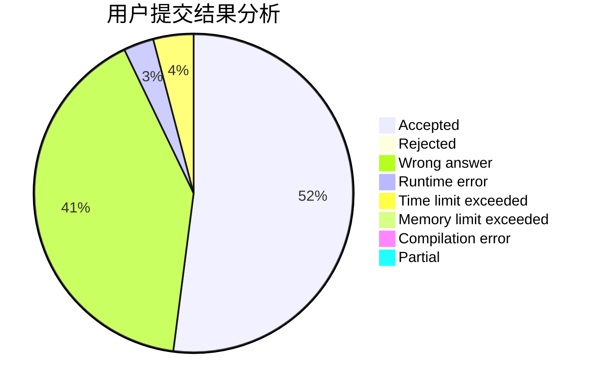
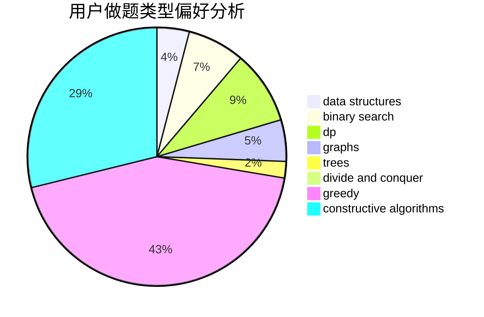
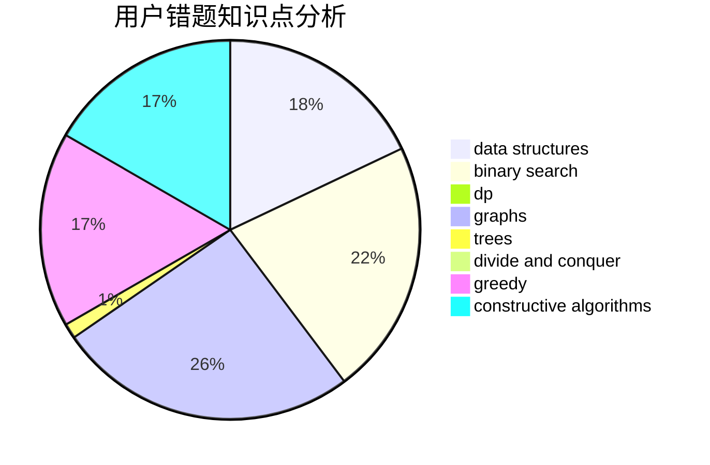

# lizzzzzzzzzz

<!-- tabs:start -->

#### **用户提交结果分析**

#### **用户做题类型偏好分析**

#### **用户错题知识点分析**

<!-- tabs:end -->
# 推荐题目
[1391B](https://codeforces.com/contest/1391/problem/B)		brute force,
                        greedy,
                        implementation		  
[516C](https://codeforces.com/contest/516/problem/C)		dsu,graphs,sortings,trees		  
[859F](https://codeforces.com/contest/859/problem/F)		greedy		  
[1343F](https://codeforces.com/contest/1343/problem/F)		brute force,
                        constructive algorithms,
                        data structures,
                        greedy,
                        implementation		  
[818G](https://codeforces.com/contest/818/problem/G)		flows,
                        graphs		  
[1020C](https://codeforces.com/contest/1020/problem/C)		dsu,graphs,sortings,trees		  
[886F](https://codeforces.com/contest/886/problem/F)		geometry		  
[1060A](https://codeforces.com/contest/1060/problem/A)		brute force		  
[838C](https://codeforces.com/contest/838/problem/C)		dp,
                        games		  
[703D](https://codeforces.com/contest/703/problem/D)		data structures		  
